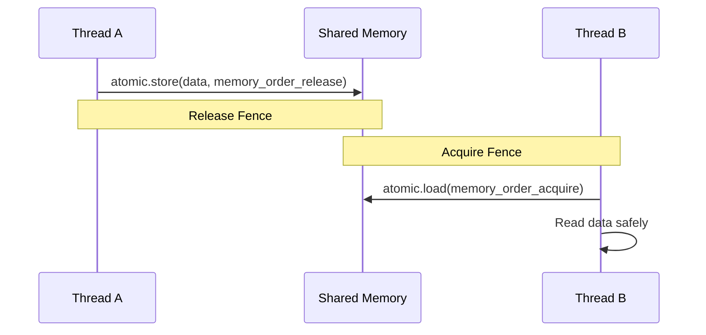

# C++ Concurrency in Action (Anthony Williams)

## 1. Thread Management
C++11 introduced `std::thread`, providing a cross-platform API for OS threads.
- **Joining/Detaching**: `t.join()` waits for completion. `t.detach()` runs the thread independently (daemon).
- **`std::jthread` (C++20)**: Automatically joins on destruction and supports cooperative interruption.

## 2. Synchronization Primitives
- **Mutexes**: `std::mutex`, `std::shared_mutex` (Reader-Writer lock).
- **Locks**: `std::lock_guard` (scoped RAII lock), `std::unique_lock` (movable, deferrable).
- **Condition Variables**: `std::condition_variable` allows threads to wait for state changes.

```cpp
std::mutex mtx;
std::condition_variable cv;
bool ready = false;

// Consumer
std::unique_lock<std::mutex> lck(mtx);
cv.wait(lck, []{ return ready; }); 

// Producer
{
    std::lock_guard<std::mutex> lck(mtx);
    ready = true;
}
cv.notify_one();
```

## 3. The C++ Memory Model & Atomics
At the lowest level, concurrency requires reasoning about memory visibility across cores (Cache Coherence and Memory Order).

### Memory Ordering
- `memory_order_relaxed`: No synchronization, only atomicity.
- `memory_order_acquire` / `memory_order_release`: Establishes a happens-before relationship between threads.
- `memory_order_seq_cst`: Sequential consistency (default). The strongest, most expensive ordering.

### Lock-Free Data Structures
Using `std::atomic` and Compare-And-Swap (CAS) loops to build scalable structures.



### The ABA Problem
A common pitfall in lock-free programming where a value is read as `A`, changed to `B`, then back to `A`. Solved via hazard pointers or double-width CAS with version tags.
