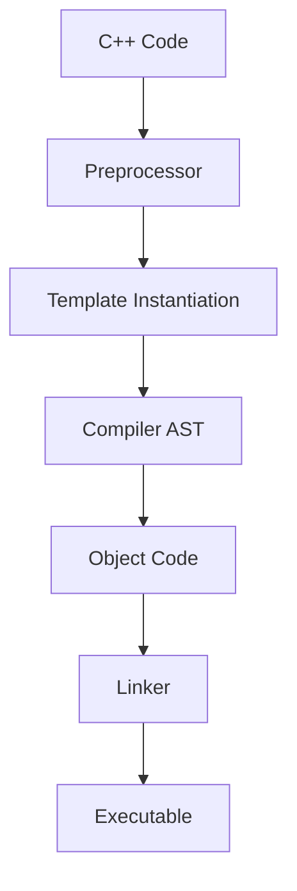

# The C++ Programming Language (Bjarne Stroustrup)

## 1. Core Mechanics & The C++ Memory Model

### RAII (Resource Acquisition Is Initialization)
C++ ties resource lifecycle to object lifetime via block scope. 
- **Acquisition**: Constructor allocates memory, opens files, acquires locks.
- **Release**: Destructor cleans up automatically when the object goes out of scope (even during exceptions).

### Move Semantics & Rvalue References (`&&`)
- Avoids deep copies by "stealing" resources from temporary objects.
- `std::move` casts an lvalue to an rvalue reference, enabling the move constructor/assignment operator.

```cpp
class Buffer {
    int* data;
    size_t size;
public:
    // Move Constructor
    Buffer(Buffer&& other) noexcept : data(other.data), size(other.size) {
        other.data = nullptr; // Nullify source
        other.size = 0;
    }
};
```

### Pointers vs References
- **Pointers**: Reassignable, can be `nullptr`, support arithmetic.
- **References**: Must be initialized, cannot be reseated, never null. Represent an alias to an existing object.

### `constexpr` & Template Metaprogramming
- `constexpr` forces expression evaluation at compile-time.
- Templates enable generic programming and static polymorphism (CRTP).



## 2. Advanced Object-Oriented Features
- **Virtual Functions & vtables**: Dynamic dispatch mechanism. Every class with virtual functions has a `vtable`, and objects carry a hidden `vptr`.
- **Multiple Inheritance**: Supported, but can lead to the "Diamond Problem", resolved via `virtual` inheritance.
- **Exceptions**: Unwind the stack, destroying local objects in reverse order of creation.
