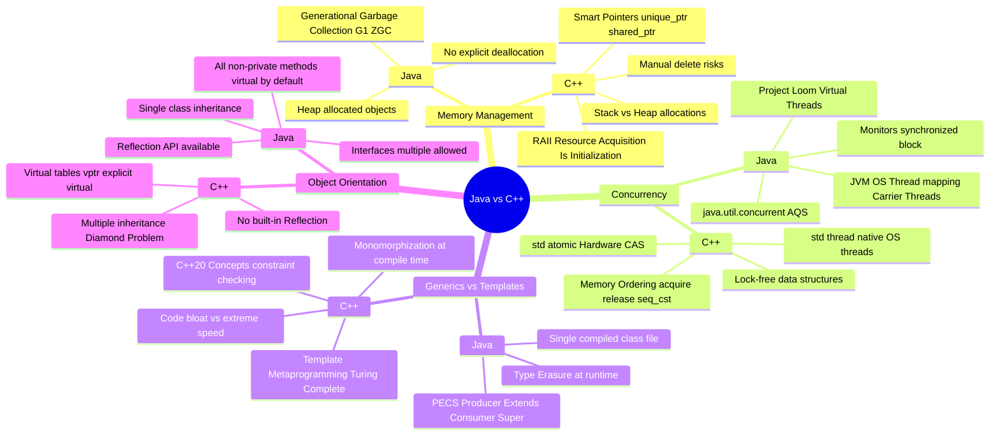

# Java vs C++ Architectures: A Systems Engineering Mind Map

## Executive Summary
Java and C++ took diverging paths to solve systems problems. C++ relies on deterministic compile-time decisions and manual memory layouts for zero-overhead abstractions. Java relies on dynamic runtime optimizations (JIT), garbage collection, and a robust standard library to prioritize developer velocity and safety.

## 1. Architectural Mind Map

## 2. Low-Level Mechanics Comparison

### Memory Layout & Padding
- **Java**: Object headers contain mark words and class pointers (12-16 bytes overhead). Padding aligns objects to 8-byte boundaries. Arrays are distinct objects with length fields.
- **C++**: Structs/Classes are laid out exactly as defined, subject only to hardware alignment padding (`alignof`). No hidden object headers unless `virtual` functions are used (adding an 8-byte `vptr`).

### Dispatch Mechanisms
- **Java**: Method calls invoke `invokevirtual` by default. The JVM uses Inline Caches (Monomorphic/Polymorphic) to optimize dispatch dynamically.
- **C++**: `virtual` functions resolve via a static jump to a `vtable` at runtime. The compiler attempts devirtualization aggressively if the exact type is known.

### Ecosystem & Build
- **Java**: Maven/Gradle dependency resolution is centralized (Maven Central). JAR files contain platform-agnostic bytecode.
- **C++**: Decentralized builds (CMake, Make, Ninja, vcpkg, Conan). Compiles directly to OS-specific, architecture-specific machine code (ELF/PE/Mach-O).
