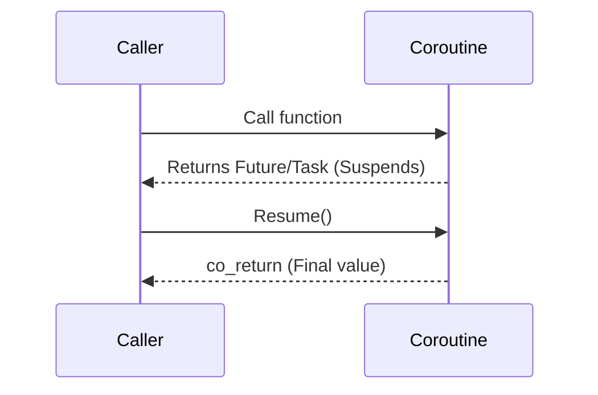

# A Tour of C++ (Bjarne Stroustrup)

## Modern C++ Landscape

This module provides a rapid overview of modern C++ features (C++11 through C++20).

### 1. Concepts (C++20)
Concepts provide semantic constraints on template arguments, drastically improving error messages and code clarity compared to `std::enable_if` SFINAE hacks.

```cpp
template<typename T>
concept Integral = std::is_integral_v<T>;

template<Integral T>
T add(T a, T b) {
    return a + b;
}
```

### 2. Ranges (C++20)
Ranges abstract iterators and provide composable pipeline operations for algorithms.

```cpp
#include <ranges>
#include <vector>

std::vector<int> ints = {0, 1, 2, 3, 4, 5};
auto even = [](int i) { return 0 == i % 2; };
auto square = [](int i) { return i * i; };

// Pipeline composition
for (int i : ints | std::views::filter(even) | std::views::transform(square)) {
    // i will be 0, 4, 16
}
```

### 3. Modules (C++20)
Modules replace the archaic `#include` header-file mechanism, solving ODR (One Definition Rule) violations and vastly improving compilation speed.
- `export module M;`
- `import M;`

### 4. Coroutines (C++20)
Coroutines are functions that can suspend execution to be resumed later. They introduce `co_await`, `co_yield`, and `co_return`.


