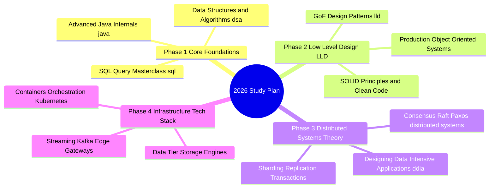

# Master Study Plan 2026: Staff & Principal Software Engineer Preparation

Welcome to the **2026 Master Study Plan**. This comprehensive preparation roadmap synthesizes all technical modules across this repository into a structured **12-Week Intensive Curriculum** designed for Staff Software Engineers, Senior Systems Architects, and Tech Leads preparing for top-tier system design, algorithms, and infrastructure engineering interviews.

---

## 1. Curriculum Architecture & Overview



---

## 2. Weekly Curriculum Schedule

### Phase 1: Core Foundations — Algorithms, Languages & SQL (Weeks 1–3)

#### Week 1: Data Structures & Algorithms Core Patterns
* **Target Modules:** [`dsa/`](dsa/README.md), [`dsa/Linear-Data-Structures-Masterclass`](dsa/Linear-Data-Structures-Masterclass), [`interviewbit/`](interviewbit/)
* **Focus Topics:**
  * Arrays, Two Pointers, & Sliding Window techniques (`dsa/array`, `dsa/twopointers`, `dsa/sliding_window`).
  * Linked Lists, Stacks, Queues, & Hashing mechanics (`dsa/linkedlist`, `dsa/stack`, `dsa/queue`, `dsa/hashing`).
  * Monotonic Stack & Queue applications.
* **Deliverable:** Solve 15 classic medium/hard problem patterns from `dsa/` and `interviewbit/`.

#### Week 2: Advanced Graph Algorithms & Dynamic Programming
* **Target Modules:** [`dsa/Graph-Algorithms-Masterclass`](dsa/Graph-Algorithms-Masterclass), [`dsa/graph`](dsa/graph), [`dsa/dynamicprogramming`](dsa/dynamicprogramming), [`dsa/linesweep`](dsa/linesweep)
* **Focus Topics:**
  * BFS, DFS, Topological Sort (Kahn's algorithm), Dijkstra, Bellman-Ford, & Union-Find / Disjoint Set Union (DSU).
  * 1D/2D Dynamic Programming (Knapsack, LCS, LIS, Interval DP).
  * Line Sweep algorithms for interval overlap and geometry problems (`dsa/linesweep`).
* **Deliverable:** Complete graph traversal & DP state formulation exercises.

#### Week 3: Java Core Internals, Concurrency & Advanced SQL
* **Target Modules:** [`java/`](java/), [`concurrency/`](concurrency/), [`sql/`](sql/)
* **Focus Topics:**
  * Java Memory Model (`java/memorymodel`), Garbage Collection tuning, Reflection (`java/reflection`), Generics (`java/generics`), & Collections (`java/collections`).
  * Threading primitives: Locks, ReentrantLock, CAS, Volatile, & Producer-Consumer patterns (`java/producerconsumer`, `concurrency/`).
  * Advanced SQL syntax (`sql/00_syntax_cheatsheet.md`), Window Functions (`ROW_NUMBER`, `DENSE_RANK`), CTEs, & Google-level query patterns (`sql/01_easy.sql` to `sql/04_google_level.sql`).
* **Deliverable:** Master Java concurrency primitives and solve all 4 levels of SQL benchmark queries.

---

### Phase 2: Low-Level System Design (LLD) & Design Patterns (Weeks 4–6)

#### Week 4: Object-Oriented Analysis, Design Principles & SOLID
* **Target Modules:** [`lld/README.md`](lld/README.md), [`lld/01_foundations`](lld/01_foundations)
* **Focus Topics:**
  * SOLID Principles (Single Responsibility, Open/Closed, Liskov Substitution, Interface Segregation, Dependency Inversion).
  * Encapsulation, Abstraction, Polymorphism, & Composition vs Inheritance trade-offs.
  * Class Diagrams, Sequence Diagrams, & Object-Oriented Domain Modeling.
* **Deliverable:** Diagram and code domain models for complex real-world entities.

#### Week 5: Gang of Four (GoF) Design Patterns in Practice
* **Target Modules:** [`lld/02_design_patterns`](lld/02_design_patterns)
* **Focus Topics:**
  * **Creational Patterns:** Singleton, Factory Method, Abstract Factory, Builder, Prototype.
  * **Structural Patterns:** Adapter, Composite, Proxy, Decorator, Facade, Bridge, Flyweight.
  * **Behavioral Patterns:** Strategy, Observer, Command, State, Chain of Responsibility, Iterator, Mediator, Template Method.
* **Deliverable:** Implement GoF design patterns in production-grade Java code without boilerplate.

#### Week 6: Production LLD Case Studies & Interactive Systems
* **Target Modules:** [`lld/03_system_designs`](lld/03_system_designs)
* **Focus Topics:**
  * Elevator System Design, LRU Cache, Parking Lot, Vending Machine, ATM System, Rate Limiter, & Logging Framework.
  * Concurrency safety, thread-safe data structures, lock granularities, and error handling in LLD implementations.
* **Deliverable:** End-to-end implementation of 5 full LLD interview systems.

---

### Phase 3: Distributed Systems Theory & Data-Intensive Architecture (Weeks 7–9)

#### Week 7: Foundations of Data-Intensive Applications (DDIA Part 1 & 2)
* **Target Modules:** [`ddia_book_study/`](ddia_book_study/README.md), [`ddia_book_study/part1_foundations`](ddia_book_study/part1_foundations), [`ddia_book_study/part2_distributed_data`](ddia_book_study/part2_distributed_data)
* **Focus Topics:**
  * Data Models & Query Languages (Relational, Document, Graph).
  * Storage Engines: B-Trees vs LSM-Trees (WAL, Memtable, SSTable).
  * Encoding Formats: Protocol Buffers, Avro, Thrift, JSON/BSON.
  * Single-Leader, Multi-Leader, & Leaderless Replication (Dynamo-style quorums).
* **Deliverable:** Complete reading and notes for DDIA Parts 1 & 2.

#### Week 8: Distributed Systems Consensus, Coordination & Partitioning
* **Target Modules:** [`distributed-systems/`](distributed-systems/README.md), [`distributed-systems/01_foundations`](distributed-systems/01_foundations), [`distributed-systems/02_consensus_and_coordination`](distributed-systems/02_consensus_and_coordination), [`distributed-systems/03_partitioning_and_sharding`](distributed-systems/03_partitioning_and_sharding)
* **Focus Topics:**
  * CAP Theorem, PACELC, Vector Clocks, & Logical vs Physical Time (Lamport Timestamps, TrueTime).
  * Distributed Consensus: Raft Protocol (Leader Election, Log Replication) & Paxos.
  * Partitioning & Sharding: Range-based vs Hash-based (Consistent Hashing, Murmur3, Token Rings, vnodes).
* **Deliverable:** Master Raft state transitions and consistent hashing algorithm mechanics.

#### Week 9: Distributed Transactions & Derived Data (DDIA Part 3)
* **Target Modules:** [`distributed-systems/04_replication_and_storage`](distributed-systems/04_replication_and_storage), [`distributed-systems/05_distributed_transactions`](distributed-systems/05_distributed_transactions), [`ddia_book_study/part3_derived_data`](ddia_book_study/part3_derived_data)
* **Focus Topics:**
  * Two-Phase Commit (2PC) & Three-Phase Commit (3PC) Protocols.
  * Saga Pattern (Choreography vs Orchestration) for microservices.
  * Batch Processing (MapReduce, Spark) & Stream Processing (Kafka Streams, Flink).
* **Deliverable:** Compare 2PC vs Saga trade-offs across microservices boundaries.

---

### Phase 4: Staff-Level Infrastructure & Tech-Stack Mastery (Weeks 10–12)

#### Week 10: In-Memory, Relational & Document Data Engines
* **Target Modules:** [`tech-stack/redis/`](tech-stack/redis/README.md), [`tech-stack/relational-databases/`](tech-stack/relational-databases/README.md), [`tech-stack/jdbc/`](tech-stack/jdbc/README.md), [`tech-stack/hibernate/`](tech-stack/hibernate/README.md), [`tech-stack/mongodb/`](tech-stack/mongodb/README.md)
* **Focus Topics:**
  * Redis single-threaded event loop, RESP protocol, data structures, sentinel, cluster sharding.
  * PostgreSQL/MySQL MVCC, WAL, B-Tree indexes, query optimization (`EXPLAIN ANALYZE`).
  * JDBC Driver Types 1–4, HikariCP `ConcurrentBag`, `PreparedStatement` compilation, `ResultSet` streaming.
  * Hibernate/JPA N+1 select problem, first/second-level caching, dirty checking.
  * MongoDB WiredTiger B-Tree/cache, Replica Set Raft consensus, Oplog, Sharding balancer.
* **Deliverable:** Deep-dive operational mastery of relational and document databases.

#### Week 11: NoSQL Wide-Column, Search, Storage & Messaging
* **Target Modules:** [`tech-stack/cassandra/`](tech-stack/cassandra/README.md), [`tech-stack/elasticsearch/`](tech-stack/elasticsearch/README.md), [`tech-stack/object-storage/`](tech-stack/object-storage/README.md), [`tech-stack/kafka/`](tech-stack/kafka/README.md), [`tech-stack/gateways-proxies-loadbalancers/`](tech-stack/gateways-proxies-loadbalancers/README.md)
* **Focus Topics:**
  * Cassandra masterless P2P ring, Gossip, $\Phi$ Accrual, LSM engine, SSTables, Bloom filters, $R+W>N$ quorums.
  * Elasticsearch Lucene inverted index, FST, FOR/Roaring posting lists, 2-phase search, DocValues vs Fielddata, 32GB JVM heap limit.
  * Object Storage (S3/Ceph/MinIO) flat namespace, CRUSH algorithm, Reed-Solomon Erasure Coding ($K+M$), Multipart uploads, WORM locks.
  * Kafka distributed log segments, Zero-Copy transfer, consumer group rebalancing, ISR replicas.
  * Gateways & Proxies: NGINX, HAProxy, Envoy, Layer 4 vs Layer 7 load balancing algorithms, TLS termination.
* **Deliverable:** Master wide-column stores, full-text search, object storage, & messaging backbones.

#### Week 12: Containers, Orchestration, Observability & Frameworks
* **Target Modules:** [`tech-stack/docker/`](tech-stack/docker/README.md), [`tech-stack/kubernetes/`](tech-stack/kubernetes/README.md), [`tech-stack/grafana/`](tech-stack/grafana/README.md), [`tech-stack/splunk/`](tech-stack/splunk/README.md), [`tech-stack/spring-boot/`](tech-stack/spring-boot/README.md), [`tech-stack/git/`](tech-stack/git/README.md)
* **Focus Topics:**
  * Docker Linux namespaces, cgroups, Overlay2 storage driver, multi-stage builds.
  * Kubernetes Control Plane (kube-apiserver, etcd, kube-scheduler, kube-controller-manager), Pods, Deployments, Services, CNI networking, Ingress.
  * Grafana & Prometheus metrics dashboarding, TSDB storage engine, Alertmanager.
  * Splunk log indexing pipeline, SPL search processing language.
  * Spring Boot auto-configuration mechanics, IoC container, Bean lifecycle, Actuator diagnostics.
  * Git Directed Acyclic Graph (DAG), Object Store (blob, tree, commit, tag), Packfiles, Rebase vs Merge mechanics.
* **Deliverable:** Complete full-stack infrastructure review and final mock preparation.

---

## 3. Recommended Daily Routine & Study SLA

* **Target Commitment:** 15 – 20 hours per week (2.5 – 3 hours per day).

```
 Daily Routine Breakdown (3 Hours):
 +-----------------------------------------------------------------------------------+
 | Duration | Focus Activity                                                         |
 +----------+------------------------------------------------------------------------+
 | 45 Mins  | Theory & Architecture Reading (Module Chapters / Whitepapers)          |
 | 75 Mins  | Hands-on Coding / Problem Solving / Diagramming (DSA / LLD / SQL)      |
 | 40 Mins  | Operational Diagnostics & System Trade-off Analysis                   |
 | 20 Mins  | Review & Flashcard / Notes Consolidation                               |
 +-----------------------------------------------------------------------------------+
```

---

## 4. Master Module Directory Map

| Domain Folder | Description | Key Modules Included |
| :--- | :--- | :--- |
| **[`dsa/`](dsa/README.md)** | Algorithms & Data Structures | Graph/Linear Masterclasses, Arrays, DP, Line Sweep, Trees, Hashing |
| **[`java/`](java/) & [`concurrency/`](concurrency/)** | Java Core & Concurrency | Collections, Memory Model, Reflection, Generics, Locks, Producer-Consumer |
| **[`sql/`](sql/)** | SQL Query Benchmark | Easy, Medium, Hard, Google-level query problems & Syntax Cheatsheet |
| **[`lld/`](lld/README.md)** | Low-Level System Design | SOLID Foundations, GoF Design Patterns, 5 Production Systems |
| **[`ddia_book_study/`](ddia_book_study/README.md)** | Data-Intensive Applications | Storage Engines, Replication, Sharding, Batch/Stream Processing |
| **[`distributed-systems/`](distributed-systems/README.md)** | Distributed Systems Theory | Raft/Paxos Consensus, Consistent Hashing, 2PC Transactions, CAP |
| **[`tech-stack/`](tech-stack/README.md)** | Infrastructure Tech-Stack | 16 Modules (Redis, Postgres, JDBC, Mongo, Cassandra, ES, S3, Kafka, K8s, etc.) |
| **[`interviewbit/`](interviewbit/)** | Problem Practice Sets | Real-world interview coding problem collections |
