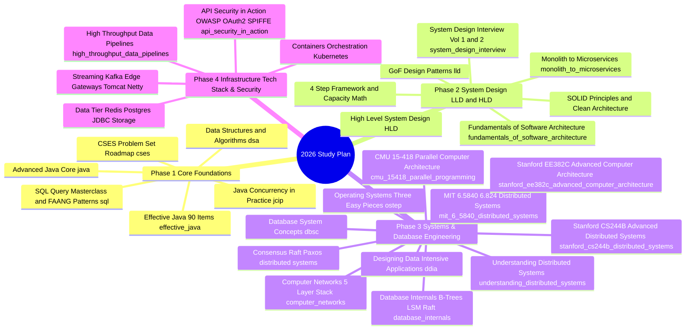

# Master Study Plan 2026: Staff & Principal Software Engineer Preparation

Welcome to the **2026 Master Study Plan**. This comprehensive preparation roadmap synthesizes all technical modules across this repository into a structured **12-Week Intensive Curriculum** designed for Staff Software Engineers, Senior Systems Architects, and Tech Leads preparing for top-tier system design, algorithms, infrastructure, database engineering, and operating systems interviews.

---

## 1. Curriculum Architecture & Overview



---

## 2. Weekly Curriculum Schedule

### Phase 1: Core Foundations — Algorithms, Languages, Books & SQL (Weeks 1–3)

#### Week 1: Data Structures, Algorithms & CSES Problem Set Foundations
* **Target Modules:** [`dsa/`](dsa/README.md), [`dsa/greedy`](dsa/greedy/00_theory.md), [`dsa/trie`](dsa/trie/00_theory.md), [`dsa/backtracking`](dsa/backtracking/00_theory.md), [`cses/`](cses/README.md), [`interviewbit/`](interviewbit/)
* **Focus Topics:**
  * Arrays, Two Pointers, & Sliding Window techniques (`dsa/array`, `dsa/twopointers`, `dsa/sliding_window`).
  * Linked Lists, Stacks, Queues, & Hashing mechanics (`dsa/linkedlist`, `dsa/stack`, `dsa/queue`, `dsa/hashing`).
  * Greedy Algorithms & Formal Proofs: Exchange Arguments, Stays Ahead Proofs, Interval Scheduling, Heap Greedy, & Monotonic Stack (`dsa/greedy`, `interviewbit/greedy`).
  * Trie (Prefix Trees): Array vs HashMap Node Layouts, Bitwise XOR Tries, Reverse Suffix Tries, & Autocomplete Engine Design (`dsa/trie`).
  * Recursion & Backtracking (`dsa/backtracking`): State-Space Tree search, Choose-Explore-Unchoose 3-step paradigm, Branch-and-Bound pruning, duplicate handling, N-Queens, Sudoku, & CSES Grid Paths (48-step path counting).
  * CSES Problem Set introductory, sorting, and searching modules (`cses/01_introductory`, `cses/02_sorting_and_searching`).
* **Deliverable:** Solve 20 classic medium/hard problem patterns from `dsa/` and track CSES progress in `cses/00_progress_tracker.md`.

#### Week 2: Advanced Graph Algorithms, Dynamic Programming & CSES Mastery
* **Target Modules:** [`dsa/Graph-Algorithms-Masterclass`](dsa/Graph-Algorithms-Masterclass), [`dsa/graph`](dsa/graph), [`dsa/dynamicprogramming`](dsa/dynamicprogramming), [`dsa/linesweep`](dsa/linesweep), [`cses/`](cses/README.md)
* **Focus Topics:**
  * BFS, DFS, Topological Sort (Kahn's algorithm), Dijkstra, Bellman-Ford, & Union-Find / Disjoint Set Union (DSU).
  * 1D/2D Dynamic Programming (Knapsack, LCS, LIS, Interval DP).
  * Line Sweep algorithms for interval overlap and geometry problems (`dsa/linesweep`).
  * Advanced CSES modules: Dynamic Programming, Graph Algorithms, Range Queries, & Tree Algorithms (`cses/03_dynamic_programming`, `cses/04_graph_algorithms`, `cses/05_range_queries`, `cses/06_tree_algorithms`).
* **Deliverable:** Complete graph traversal & DP state formulation exercises across DSA and CSES problem sets.

#### Week 3: Java Internals, Effective Java (90 Items), Java Concurrency in Practice & FAANG SQL Masterclass
* **Target Modules:** [`java/`](java/), [`effective_java/`](effective_java/README.md), [`java_concurrency_in_practice/`](java_concurrency_in_practice/README.md), [`sql/`](sql/README.md)
* **Focus Topics:**
  * **Effective Java (3rd Edition)** [`effective_java/`](effective_java/README.md): Master all 12 Chapters and 90 Items:
    * Static Factory Methods, Builder Pattern, Enum Singletons, Try-With-Resources (Items 1–9).
    * `equals()`, `hashCode()`, `toString()`, Copy Constructors over `clone()`, `Comparable` (Items 10–14).
    * Encapsulation, Immutability & Java 17 Records, Composition over Inheritance, Sealed Classes, Static Member Classes (Items 15–25).
    * Raw Types avoidance, Lists vs Arrays, PECS Rule (`Producer Extends Consumer Super`), `@SafeVarargs`, Typesafe Heterogeneous Containers (Items 26–33).
    * Enums, `EnumSet`, `EnumMap`, Functional Interfaces, Streams Best Practices, Side-Effect Free Collectors (Items 34–48).
    * Parameter Validation, Defensive Copies, Method Signatures, Optionals, `BigDecimal`, Exceptions, Serialization (Items 49–90).
  * **Java Concurrency in Practice** [`java_concurrency_in_practice/`](java_concurrency_in_practice/README.md):
    * Thread Safety, Atomicity, Race Conditions, Reentrancy, Volatile Memory Barriers, `ThreadLocal`, Java Monitor Pattern (`01_fundamentals/`).
    * Executor Framework, Thread Pools, Futures, Interruption Policy, Thread Pool Sizing ($N_{\text{CPU}} \times U_{\text{CPU}} \times (1 + W/C)$), Saturation Policies (`02_structuring_applications/`).
    * Deadlocks, Open Calls, Lock Scope Narrowing, Lock Striping, JMH Microbenchmarking (`03_liveness_performance_testing/`).
    * `ReentrantLock`, `ReadWriteLock`, `StampedLock` Optimistic Reading, Condition Queues, AbstractQueuedSynchronizer (AQS) internal state & CLH queue, Hardware CAS, Treiber Stack, Java Memory Model (JMM) Happens-Before Rules (`04_advanced_topics/`).
    * Modern Java 21 Concurrency: Project Loom Virtual Threads, Carrier OS Threads, Carrier Thread Pinning hazards, `StructuredTaskScope` (`05_modern_java_concurrency/`).
  * **FAANG Staff SQL Masterclass** [`sql/`](sql/README.md): Window Functions (`ROW_NUMBER`, `DENSE_RANK`, `ROWS BETWEEN`), Gaps & Islands, User Sessionization, Cohort Retention, Recursive CTE Org Trees, & Exact Medians (`sql/05_faang_staff_interview_patterns.sql`).
* **Deliverable:** Review all 90 Effective Java items, master AQS & JMM mechanics, and solve all 6 FAANG Staff SQL interview patterns.

---

### Phase 2: System Design — Low-Level (LLD) & High-Level (HLD) (Weeks 4–7)

#### Week 4: Object-Oriented Analysis, Design Principles & SOLID
* **Target Modules:** [`lld/README.md`](lld/README.md), [`lld/01_foundations`](lld/01_foundations)
* **Focus Topics:**
  * SOLID Principles (Single Responsibility, Open/Closed, Liskov Substitution, Interface Segregation, Dependency Inversion).
  * Encapsulation, Abstraction, Polymorphism, & Composition vs Inheritance trade-offs.
  * Class Diagrams, Sequence Diagrams, & Object-Oriented Domain Modeling.
* **Deliverable:** Diagram and code domain models for complex real-world entities.

#### Week 5: Gang of Four (GoF) Design Patterns in Practice
* **Target Modules:** [`lld/02_design_patterns`](lld/02_design_patterns)
* **Focus Topics:**
  * **Creational:** Singleton, Factory Method, Abstract Factory, Builder, Prototype.
  * **Structural:** Adapter, Composite, Proxy, Decorator, Facade, Bridge, Flyweight.
  * **Behavioral:** Strategy, Observer, Command, State, Chain of Responsibility, Iterator, Mediator, Template Method.
* **Deliverable:** Implement GoF design patterns in production-grade Java code without boilerplate.

#### Week 6: Low-Level System Design (LLD) Production Systems
* **Target Modules:** [`lld/03_system_designs`](lld/03_system_designs)
* **Focus Topics:**
  * Elevator System Design, LRU Cache, Parking Lot, Vending Machine, ATM System, Rate Limiter, & Logging Framework.
  * Concurrency safety, thread-safe data structures, lock granularities, and error handling in LLD implementations.
* **Deliverable:** End-to-end implementation of 5 full LLD interview systems.

#### Week 7: High-Level System Design (HLD), Alex Xu (Vol 1 & 2), Software Architecture & Microservices Refactoring
* **Target Modules:** [`hld/`](hld/README.md), [`system_design_interview/`](system_design_interview/README.md), [`fundamentals_of_software_architecture/`](fundamentals_of_software_architecture/README.md), [`monolith_to_microservices/`](monolith_to_microservices/README.md)
* **Focus Topics:**
  * **The 4-Step System Design Interview Framework:** Scope clarification, 99.99% availability math, QPS, 5-year storage capacity math, and 80/20 RAM cache sizing.
  * **System Design Interview – An Insider's Guide (Vol 1 & 2)** [`system_design_interview/`](system_design_interview/README.md):
    * Rate Limiter, Consistent Hashing with V-Nodes, Dynamo-Style Quorum KV Store, Twitter Snowflake 64-bit ID, TinyURL, Web Crawler URL Frontier, Trie Autocomplete, Real-Time WebSocket Chat, YouTube Transcoding DAG, Google Drive Chunking.
    * Proximity Service (Geohash / Quadtree / S2), Google Maps Routing A*, Distributed Message Queue (Kafka Broker & Zero-Copy), Metrics Monitoring (Prometheus TSDB), Ad Click Aggregation (MapReduce), Hotel Reservation Optimistic Locking, Payment Double-Entry Ledger, Digital Wallet, Stock Exchange Matching Engine (LMAX Disruptor Ring Buffer).
  * **Fundamentals of Software Architecture** [`fundamentals_of_software_architecture/`](fundamentals_of_software_architecture/README.md):
    * Architecture vs Design, 4 Expectations of an Architect, Measuring Characteristics ("-ilities"), Afferent ($C_a$) / Efferent ($C_e$) Coupling & Instability ($I = \frac{C_e}{C_a + C_e}$), Distance from Main Sequence ($D = |A + I - 1|$).
    * Architecture Styles: Monolithic (Layered, Pipeline, Microkernel/Plugin) vs Distributed (Service-Based, Event-Driven Broker vs Mediator, Space-Based, Microservices).
    * Governance & Techniques: Architectural Decision Records (ADR format), Automated Architectural Fitness Functions (ArchUnit CI/CD gates), Risk Analysis Matrix.
  * **Monolith to Microservices (Sam Newman)** [`monolith_to_microservices/`](monolith_to_microservices/README.md):
    * Strangler Fig pattern, Branch by Abstraction, Parallel Run verification, UI Micro Frontends.
    * 5-Step Database Split Pattern, Transactional Outbox Pattern, Change Data Capture (CDC / Debezium), Saga pattern.
    * API Gateway Canary Traffic Routing, Protobuf/Avro schema evolution, Cross-boundary distributed tracing context propagation.
* **Deliverable:** Master back-of-the-envelope calculations, architect all 28 Alex Xu systems, implement ArchUnit fitness functions, and execute non-breaking monolithic database refactoring strategies.

---

### Phase 3: Systems, Networking, Database Engineering & Distributed Systems (Weeks 8–9)

#### Week 8: Operating Systems (OSTEP) & Computer Networks (5-Layer Stack)
* **Target Modules:** [`ostep/`](ostep/README.md), [`computer_networks/`](computer_networks/README.md)
* **Focus Topics:**
  * **Operating Systems: Three Easy Pieces (OSTEP)** [`ostep/`](ostep/README.md):
    * **Virtualization**: Process API (`fork`, `exec`, `wait`), PCB (`struct proc`), Context Switching, Limited Direct Execution (LDE) Protocol, FIFO, SJF, STCF, Round Robin, Multi-Level Feedback Queue (MLFQ) 5 rules, Stride Scheduling, Base & Bound, Multi-Level Page Tables, Hardware TLB, Swap Space, Page Fault Handler, Clock Second-Chance Algorithm, Thrashing (`01_virtualization/`).
    * **Concurrency**: POSIX Threads (`pthread`), Mutual Exclusion, Hardware TAS/CAS, Linux Futex (`sys_futex`) two-phase locks, Condition Variables (`pthread_cond_wait`), Bounded Buffer Producer-Consumer, Semaphores (`sem_t`), Reader-Writer Locks, Concurrency Bugs (Atomicity/Order violations, Deadlock 4 conditions), Event-Based Concurrency & Linux `epoll` (`02_concurrency/`).
    * **Persistence**: I/O Controllers, Polling vs Interrupts, DMA (Direct Memory Access), HDD Scheduling (SSTF, SCAN, C-SCAN), SSD NAND Flash, Flash Translation Layer (FTL), Wear Leveling, File APIs (`open`, `read`, `write`, `fsync`), Inode Structure, Slotted-Page Layout, Very Simple File System (VSFS), Crash Consistency, Write-Ahead Logging (WAL / Journaling), Log-Structured File Systems (LFS) (`03_persistence/`).
  * **Computer Networks (Top-Down Approach)** [`computer_networks/`](computer_networks/README.md):
    * **Application Layer**: HTTP/1.1 Pipelining vs HTTP/2 Binary Streams vs HTTP/3 QUIC (UDP), DNS Hierarchy & Iterative/Recursive Resolution, CDN Edge Networks, Socket Programming in C & Python (TCP Concurrent Server vs UDP Echo Server) (`01_application_layer/`).
    * **Transport Layer**: UDP Checksum, Reliable Data Transfer (RDT 3.0, Go-Back-N, Selective Repeat), TCP Header Specs, 3-Way Handshake & 4-Way Teardown State Machine, Flow Control (`rwnd`), Congestion Control (Slow Start, Congestion Avoidance, Fast Retransmit, Fast Recovery, AIMD, TCP Tahoe vs Reno vs BBR) (`02_transport_layer/`).
    * **Network Layer Data Plane**: Router Architecture, Longest Prefix Match (LPM) Trie, IPv4/IPv6 Headers, CIDR Subnetting Math, NAT Traversal, DHCP, ICMP (`03_network_layer_data_plane/`).
    * **Network Layer Control Plane**: Link-State Routing (Dijkstra), Distance-Vector Routing (Bellman-Ford & Poison Reverse), Hierarchical AS Routing, Intra-AS (OSPF), Inter-AS (BGP Path Vector, AS-PATH, Next-Hop), Software-Defined Networking (SDN OpenFlow) (`04_network_layer_control_plane/`).
    * **Link & Physical Layer**: Framing, Error Detection (CRC Modulo-2 Math), Multiple Access (CSMA/CD Ethernet Exponential Backoff, CSMA/CA WiFi 802.11 RTS/CTS), Address Resolution Protocol (ARP), L2 Self-Learning Switches vs L3 Routers, VLANs (`05_link_and_physical_layer/`).
* **Deliverable:** Master kernel syscalls, LDE protocol, Linux `epoll`, TCP state transitions, CIDR subnetting, and BGP routing mechanics.

#### Week 9: Database System Concepts, Database Internals, Distributed Systems, UDS, MIT 6.5840, Stanford CS244B, CMU 15-418 & Stanford EE382C
* **Target Modules:** [`database_system_concepts/`](database_system_concepts/README.md), [`database_internals/`](database_internals/README.md), [`ddia_book_study/`](ddia_book_study/README.md), [`distributed-systems/`](distributed-systems/README.md), [`understanding_distributed_systems/`](understanding_distributed_systems/README.md), [`mit_6_5840_distributed_systems/`](mit_6_5840_distributed_systems/README.md), [`stanford_cs244b_distributed_systems/`](stanford_cs244b_distributed_systems/README.md), [`cmu_15418_parallel_programming/`](cmu_15418_parallel_programming/README.md), [`stanford_ee382c_advanced_computer_architecture/`](stanford_ee382c_advanced_computer_architecture/README.md)
* **Focus Topics:**
  * **Database System Concepts (DBSC)** [`database_system_concepts/`](database_system_concepts/README.md):
    * **Relational Model & SQL**: Relational Algebra ($\sigma, \pi, \bowtie, \div$), SQL AST Parsing, Logical & Physical Execution Tree, Triggers, Views (`01_relational_model_and_sql/`).
    * **Database Normalization**: Functional Dependencies ($F^+$), Canonical Cover, 1NF, 2NF, 3NF, BCNF, 4NF, Lossless-Join Decomposition Proofs (`02_database_design_and_normalization/`).
    * **Storage & Indexing**: Slotted-Page Page Architecture, Buffer Pool Manager (LRU/Clock, Pin Count, Dirty Pages), B+ Tree Search/Insert/Delete & Node Splitting, Dynamic Hash Indexing (`03_storage_and_indexing/`).
    * **Query Execution & Optimization**: Volcano Iterator Model (`open`/`next`/`close`), External Merge Sort, Join Algorithms (Nested Loop, Hash Join, Grace Hash Join, Sort-Merge Join), System R Cost-Based Dynamic Programming Optimizer (`04_query_processing_and_optimization/`).
    * **Concurrency Control**: ACID Properties, Conflict Serializability, Precedence Graphs, Lock-Based Protocols (Shared/Exclusive Locks, 2PL, Strict 2PL, Rigorous 2PL), Multiple Granularity Intent Locks (IS, IX, SIX), Multiversion Concurrency Control (MVCC) Version Chains, Deadlocks & Wait-For Graphs (`05_transactions_and_concurrency/`).
    * **Recovery System**: Write-Ahead Logging (WAL), Steal/No-Force Policies, ARIES 3-Phase Recovery (Analysis, Redo / Repeating History, Undo / CLRs), Fuzzy Checkpointing (`06_recovery_system/`).
  * **Database Internals (Alex Petrov)** [`database_internals/`](database_internals/README.md):
    * **Storage Engines**: $B^{\text{link}}$ Trees with right-sibling pointers, Latching Crabbing (Coupled Latching), LSM-Tree Architecture, MemTable SkipList, WAL, SSTable Binary Format (Data, Index, Bloom, Summary, Footer), Bloom Filter Math ($k = \frac{m}{n} \ln 2$), Size-Tiered vs Leveled Compaction (LCS), Read/Write/Space Amplification trade-offs (`01_storage_engines/`).
    * **Distributed Storage & Consensus**: Leader/Leaderless Replication, Quorum Consistency ($R + W > N$, Read Repair, Hinted Handoff), Vector Clocks, Hybrid Logical Clocks (HLC), Raft Consensus Deep Dive (Leader Election, RequestVote, AppendEntries, Log Matching Property, Safety Invariants) (`02_distributed_storage/`).
    * **Distributed Transactions & Isolation**: Two-Phase Commit (2PC), Three-Phase Commit (3PC), Distributed Snapshot Isolation, Google Spanner Architecture & TrueTime API ($\epsilon$ uncertainty, Commit Wait Rule), Deterministic Transaction Engines (Calvin Architecture) (`03_distributed_transactions/`).
  * **Understanding Distributed Systems (Roberto Vitillo)** [`understanding_distributed_systems/`](understanding_distributed_systems/README.md):
    * TCP/UDP, HTTP/2 multiplexing, gRPC & Protobuf vs JSON serialization.
    * Physical Clocks (NTP, TrueTime) vs Logical Clocks (Lamport Timestamps, Vector Clocks).
    * Consistent Hashing with Virtual Nodes & Rendezvous Hashing.
    * Replication topologies, Raft Consensus state machine & log matching invariants.
    * Resiliency patterns: Circuit Breakers (CLOSED, OPEN, HALF_OPEN), Exponential Backoff with Decorrelated Jitter, Bulkheads, Idempotency keys.
    * Distributed Transactions (2PC vs Saga Orchestration/Choreography), Distributed Observability (Prometheus Metrics, W3C `traceparent` tracing context).
  * **MIT 6.5840 (6.824) Distributed Systems (Robert Morris)** [`mit_6_5840_distributed_systems/`](mit_6_5840_distributed_systems/README.md):
    * MapReduce Coordinator/Worker architecture, VMware FT Primary-Backup Deterministic Replay & Output Rule.
    * Raft Consensus State Machine (Labs 2 & 3: Leader Election, Log Replication, Persistence, Snapshots).
    * Fault-Tolerant Key-Value Service with Duplicate Request Table (`ClientId` + `SeqNum`).
    * Sharded KV Service (Lab 4: Shard Controller Reconfigurations & Cross-Group Data Migration).
    * Apache ZooKeeper (Zab protocol, Linearizable writes, FIFO client order) & Google Spanner (TrueTime, 2PC + Paxos).
  * **Stanford CS244B Advanced Distributed Systems** [`stanford_cs244b_distributed_systems/`](stanford_cs244b_distributed_systems/README.md):
    * Chord DHT Finger Tables ($O(\log N)$ routing, stabilize, fix_fingers) & Kademlia XOR metric routing ($d(x,y) = x \oplus y$, k-buckets, parallel $\alpha=3$ lookups).
    * Practical Byzantine Fault Tolerance (PBFT: Pre-Prepare, Prepare, Commit 3-phase algorithm, $f < \frac{N-1}{3}$) & Stellar Federated Byzantine Agreement (FBA: Quorum Slices, Quorum Intersection).
    * Total Order Broadcast via Vector Clocks & Shamir's Secret Sharing ($(k,n)$ threshold scheme, Lagrange Polynomial Interpolation).
  * **CMU 15-418 / 618 Parallel Computer Architecture** [`cmu_15418_parallel_programming/`](cmu_15418_parallel_programming/README.md):
    * Multi-core SIMD vectorization, CUDA GPU SIMT execution model (Warp Divergence, Shared Memory Bank Conflicts), Work-Stealing schedulers (Cilk deque, C++ engine).
    * Hardware Cache Coherence Protocols: MESI & MOESI 4/5-state machines, Invalidating vs Updating, Bus Snooping vs Directory-Based Coherence, Memory Consistency Models (Sequential Consistency, Total Store Order / TSO, Relaxed Consistency, Memory Barriers).
    * Interconnect Topologies (Crossbar, 2D Torus, Hypercube, Fat-Tree bisection bandwidth) & Lock-Free Data Structures (Michael-Scott Lock-Free Queue with CAS & ABA prevention via generational pointers).
  * **Stanford EE382C Advanced Computer Architecture** [`stanford_ee382c_advanced_computer_architecture/`](stanford_ee382c_advanced_computer_architecture/README.md):
    * Out-of-order superscalar microarchitecture: Tomasulo's Algorithm with Register Alias Table (RAT), Reorder Buffer (ROB) in-order commit, Load-Store Queue (LSQ) memory disambiguation, TAGE Branch Predictor.
    * Memory hierarchy & coherence: Non-blocking caches with Miss Status Holding Registers (MSHRs), Stride/Markov hardware prefetching, Scalable Directory-based Cache Coherence protocols.
    * Interconnects & AI Accelerators: William Dally Wormhole Routing, Virtual Channels (VCs), Credit-based Flow Control, Systolic Arrays (Output vs Weight Stationary GEMM), TPU matrix units, HBM3/CXL/NVLink.
  * **Distributed Systems Theory & DDIA** [`distributed-systems/`](distributed-systems/README.md), [`ddia_book_study/`](ddia_book_study/README.md): CAP Theorem, PACELC Theorem, Consistent Hashing (Murmur3, Token Rings, vnodes), 2PC vs Saga Pattern, Batch Processing (MapReduce, Spark) & Stream Processing (Kafka Streams, Flink).
* **Deliverable:** Master B+ Tree vs LSM-Tree trade-offs, Volcano execution, ARIES recovery, Raft consensus, Spanner TrueTime, PBFT phase transitions, Kademlia XOR routing, MESI/MOESI cache coherence, Tomasulo OoO ROB commit, Wormhole VC routing, Systolic Array MAC throughput, and complete MIT 6.5840 Labs 1–4 implementations.

---

### Phase 4: Staff-Level Infrastructure & Tech-Stack Mastery (Weeks 10–12)

#### Week 10: In-Memory, Relational, Driver & Document Data Engines
* **Target Modules:** [`tech-stack/redis/`](tech-stack/redis/README.md), [`tech-stack/relational-databases/`](tech-stack/relational-databases/README.md), [`tech-stack/jdbc/`](tech-stack/jdbc/README.md), [`tech-stack/hibernate/`](tech-stack/hibernate/README.md), [`tech-stack/mongodb/`](tech-stack/mongodb/README.md)
* **Focus Topics:**
  * Redis single-threaded event loop, RESP protocol, data structures, sentinel, cluster sharding.
  * PostgreSQL/MySQL MVCC, WAL, B-Tree indexes, query optimization (`EXPLAIN ANALYZE`).
  * JDBC Driver Types 1–4, HikariCP `ConcurrentBag` & `FastList`, `PreparedStatement` compilation, `ResultSet` streaming.
  * Hibernate/JPA N+1 select problem, first/second-level caching, dirty checking.
  * MongoDB WiredTiger B-Tree/cache, Replica Set Raft consensus, Oplog, Sharding balancer.
* **Deliverable:** Deep-dive operational mastery of relational, driver, and document databases.

#### Week 11: NoSQL Wide-Column, Search, Object Storage, Messaging & High-Throughput Pipelines
* **Target Modules:** [`tech-stack/cassandra/`](tech-stack/cassandra/README.md), [`tech-stack/elasticsearch/`](tech-stack/elasticsearch/README.md), [`tech-stack/object-storage/`](tech-stack/object-storage/README.md), [`tech-stack/kafka/`](tech-stack/kafka/README.md), [`tech-stack/gateways-proxies-loadbalancers/`](tech-stack/gateways-proxies-loadbalancers/README.md), [`high_throughput_data_pipelines/`](high_throughput_data_pipelines/README.md)
* **Focus Topics:**
  * Cassandra masterless P2P ring, Gossip, $\Phi$ Accrual, LSM engine, SSTables, Bloom filters, $R+W>N$ quorums.
  * Elasticsearch Lucene inverted index, FST, FOR/Roaring posting lists, 2-phase search, DocValues vs Fielddata, 32GB JVM heap limit.
  * Distributed Object Storage (S3/Ceph/MinIO) flat namespace, CRUSH algorithm, Reed-Solomon Erasure Coding ($K+M$), Multipart uploads, WORM locks.
  * Kafka distributed log segments, Zero-Copy transfer, consumer group rebalancing, ISR replicas.
  * Gateways & Proxies: NGINX, HAProxy, Envoy, Layer 4 vs Layer 7 load balancing algorithms, TLS termination.
  * High-Throughput Data Pipelines: Lambda vs Kappa Architecture, Kafka producer batch tuning (`batch.size`, `linger.ms`, `snappy`), Flink stream DAG & windowing (Tumbling/Sliding/Session), Parquet columnar storage (Dictionary, RLE, Bit-packing), Linux kernel zero-copy (`sendfile`/`splice`), Chandy-Lamport checkpoint barriers, Flink 2PC sink, and Key Salting for partition skew mitigation.
* **Deliverable:** Master wide-column stores, full-text search, object storage, messaging backbones, and 1M+ QPS data pipeline engineering.

---

#### Week 12: Containers, Orchestration, Observability, Frameworks & API Security
* **Target Modules:** [`tech-stack/docker/`](tech-stack/docker/README.md), [`tech-stack/kubernetes/`](tech-stack/kubernetes/README.md), [`tech-stack/grafana/`](tech-stack/grafana/README.md), [`tech-stack/splunk/`](tech-stack/splunk/README.md), [`tech-stack/spring-boot/`](tech-stack/spring-boot/README.md), [`tech-stack/git/`](tech-stack/git/README.md), [`api_security_in_action/`](api_security_in_action/README.md)
* **Focus Topics:**
  * Docker Linux namespaces, cgroups, Overlay2 storage driver, multi-stage builds.
  * Kubernetes Control Plane (kube-apiserver, etcd, kube-scheduler, kube-controller-manager), Pods, Deployments, Services, CNI networking, Ingress.
  * Grafana & Prometheus metrics dashboarding, TSDB storage engine, Alertmanager.
  * Splunk log indexing pipeline, SPL search processing language.
  * Spring Boot auto-configuration mechanics, IoC container, Bean lifecycle, Actuator diagnostics.
  * Git Directed Acyclic Graph (DAG), Object Store (blob, tree, commit, tag), Packfiles, Rebase vs Merge mechanics.
  * API Security in Action: OWASP API Top 10 (BOLA/BFLA), Sliding Window Redis rate limiting, OAuth 2.1 / PKCE, OIDC, JWT vs Macaroons, TLS 1.3 & mTLS, HTTP Message Signing, RFC 8693 Token Exchange, SPIFFE/SPIRE Zero Trust, Envoy & OPA sidecar authorization.
* **Deliverable:** Complete full-stack infrastructure & API security review and final mock preparation.

---

## 3. Recommended Daily Routine & Study SLA

* **Target Commitment:** 15 – 20 hours per week (2.5 – 3 hours per day).

```
 Daily Routine Breakdown (3 Hours):
 +-----------------------------------------------------------------------------------+
 | Duration | Focus Activity                                                         |
 +----------+------------------------------------------------------------------------+
 | 45 Mins  | Theory & Architecture Reading (Book Modules / System Call Specs)       |
 | 75 Mins  | Hands-on Coding / Problem Solving / Diagramming (DSA / LLD / HLD / SQL)|
 | 40 Mins  | Operational Diagnostics & System Trade-off Analysis                   |
 | 20 Mins  | Review & Flashcard / Notes Consolidation                               |
 +-----------------------------------------------------------------------------------+
```

---

## 4. Master Module Directory Map

| Domain Folder | Description | Key Modules Included |
| :--- | :--- | :--- |
| **[`dsa/`](dsa/README.md)** | Algorithms & Data Structures | Graph/Linear Masterclasses, Arrays, Greedy, Trie, Backtracking, DP, Line Sweep |
| **[`cses/`](cses/README.md)** | Competitive Programming Tracker | CSES Problem Set 300+ problem roadmap & progress tracker (`00_progress_tracker.md`) |
| **[`java/`](java/README.md)** | Advanced Java Core | Collections, Memory Model, ClassLoader, Reflection, Generics, Functional, File I/O, IoC & Servlet Containers, Edge Cases |
| **[`effective_java/`](effective_java/README.md)** | Effective Java (3rd Edition) | 12 Chapters, 90 Item Guides, Modern Java 11-21 updates & 30-Second Cheatsheet |
| **[`java_concurrency_in_practice/`](java_concurrency_in_practice/README.md)** | Java Concurrency in Practice | 16 Chapters across 5 Parts: Thread Safety, Executors, AQS, JMM, Virtual Threads, Mermaid Diagrams |
| **[`ostep/`](ostep/README.md)** | Operating Systems: Three Easy Pieces | Virtualization (LDE, MLFQ, Paging, TLB), Concurrency (Threads, Futex, Epoll), Persistence (DMA, VSFS, WAL) |
| **[`computer_networks/`](computer_networks/README.md)** | Computer Networks | 5 TCP/IP Layers: HTTP/QUIC, TCP/UDP Flow & Congestion Control, IP/CIDR/NAT, OSPF/BGP, Ethernet/WiFi/ARP |
| **[`database_system_concepts/`](database_system_concepts/README.md)** | Database System Concepts | 7 Core DB Pillars: Relational Algebra, Normalization, B+ Trees, Cost Optimizer, 2PL/MVCC, ARIES, 2PC/LSM |
| **[`database_internals/`](database_internals/README.md)** | Database Internals | Storage Engines ($B^{\text{link}}$ Trees, LSM/Compaction), Distributed Consensus (Raft/Paxos), Spanner TrueTime, Calvin |
| **[`sql/`](sql/README.md)** | SQL Query Masterclass | Easy, Medium, Hard, Google-level, & FAANG Staff Interview Patterns (`05_faang_staff_interview_patterns.sql`) |
| **[`lld/`](lld/README.md)** | Low-Level System Design | SOLID Foundations, GoF Design Patterns, 5 Production LLD Systems |
| **[`hld/`](hld/README.md)** | High-Level System Design | 4-Step Framework, Estimation Math, 6 System Design Architectures (Snowflake, Rate Limiter, TinyURL, Web Crawler, Chat, YouTube) |
| **[`system_design_interview/`](system_design_interview/README.md)** | System Design Interview (Vol 1 & 2) | Alex Xu 28 System Designs: Rate Limiter, Snowflake, Geohash, Kafka, Metrics, Payment Ledger, Stock Exchange |
| **[`fundamentals_of_software_architecture/`](fundamentals_of_software_architecture/README.md)** | Fundamentals of Software Architecture | Architecture Characteristics ("-ilities"), Coupling Math, Monolithic vs Distributed Styles, ADRs, ArchUnit |
| **[`monolith_to_microservices/`](monolith_to_microservices/README.md)** | Monolith to Microservices | Strangler Fig, Branch by Abstraction, 5-Step DB Split, Transactional Outbox, CDC, Canary Traffic Routing |
| **[`ddia_book_study/`](ddia_book_study/README.md)** | Data-Intensive Applications | Storage Engines, Replication, Sharding, Batch/Stream Processing |
| **[`distributed-systems/`](distributed-systems/README.md)** | Distributed Systems Theory | Raft/Paxos Consensus, Consistent Hashing, 2PC Transactions, CAP |
| **[`tech-stack/`](tech-stack/README.md)** | Infrastructure Tech-Stack | 18 Modules (Redis, Postgres, JDBC, Tomcat, Netty, Mongo, Cassandra, ES, Object Storage, Kafka, K8s, etc.) |
| **[`api_security_in_action/`](api_security_in_action/README.md)** | API Security in Action | OWASP Top 10, OAuth2/PKCE, OIDC, JWT, TLS 1.3, mTLS, HTTP Signatures, Gateways, SPIFFE/SPIRE |
| **[`understanding_distributed_systems/`](understanding_distributed_systems/README.md)** | Understanding Distributed Systems | PACELC, Vector Clocks, Consistent Hashing, Raft Consensus, Circuit Breakers, Sagas, Tracing |
| **[`high_throughput_data_pipelines/`](high_throughput_data_pipelines/README.md)** | High-Throughput Data Pipelines | Kappa/Lambda, Kafka Batching, Flink Streaming, Parquet Columnar, Zero-Copy, Chandy-Lamport, 2PC Sink |
| **[`mit_6_5840_distributed_systems/`](mit_6_5840_distributed_systems/README.md)** | MIT 6.5840 (6.824) Distributed Systems | Labs 1-4: MapReduce, VMware FT, Raft Consensus, Fault-Tolerant KV, Sharded KV, ZooKeeper, Spanner |
| **[`stanford_cs244b_distributed_systems/`](stanford_cs244b_distributed_systems/README.md)** | Stanford CS244B Advanced Distributed Systems | P2P DHTs (Chord/Kademlia), BFT & Stellar FBA (PBFT/FBA), Atomic Broadcast & Shamir Secret Sharing |
| **[`cmu_15418_parallel_programming/`](cmu_15418_parallel_programming/README.md)** | CMU 15-418/618 Parallel Programming | SIMD/GPU SIMT/Work-Stealing, MESI/MOESI Cache Coherence & Memory Models, Interconnects & Lock-Free Queues |
| **[`stanford_ee382c_advanced_computer_architecture/`](stanford_ee382c_advanced_computer_architecture/README.md)** | Stanford EE382C Advanced Computer Architecture | Tomasulo OoO & ROB, TAGE Predictor, MSHR Non-blocking Caches, Directory Coherence, Dally Wormhole VC Router, Systolic Arrays |
| **[`interviewbit/`](interviewbit/)** | Problem Practice Sets | Array, Greedy (Gas Station, Majority Element) & real-world interview problem collections |
