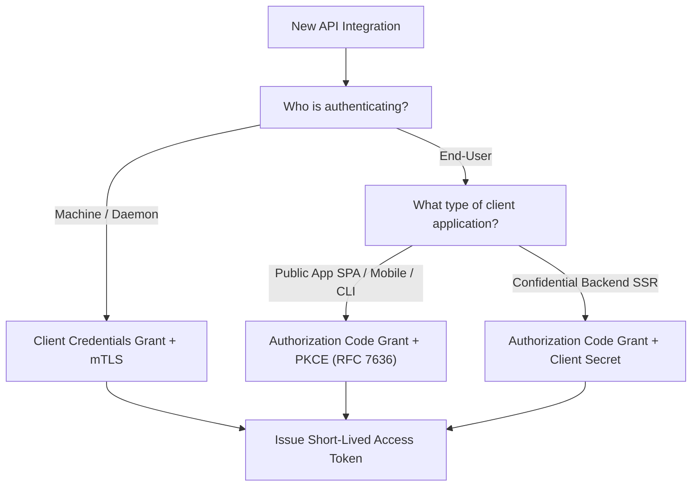
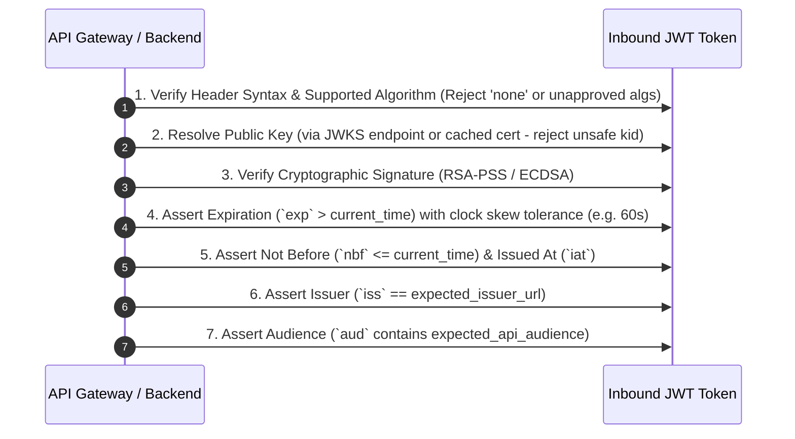

# 00. API Security Cheatsheet & Vulnerability Matrix

A concise, high-density reference guide for API security auditing, defensive engineering, and vulnerability remediation based on OWASP API Top 10 (2023 Edition) and enterprise security standards.

---

## 🚨 OWASP API Security Top 10 (2023) Quick Reference

| Risk Code | Vulnerability Name | Root Cause | Defense & Mitigation |
| :--- | :--- | :--- | :--- |
| **API1:2023** | **Broken Object Level Authorization (BOLA)** | Endpoints expose record IDs without validating if the authenticated subject owns/can access that specific object. | Enforce ABAC/RBAC on every object access check (`user.id == resource.owner_id`). Use UUIDv4 or encrypted tokens instead of sequential integer IDs. |
| **API2:2023** | **Broken Authentication** | Flaws in token validation, weak password recovery, vulnerable JWT signature verification (`alg: none`, algorithm confusion). | Standardize on OAuth 2.1 / OIDC. Enforce strong JWT validation (`RS256`/`ES256`, check `exp`, `nbf`, `iss`, `aud`). Disallow symmetric keys for public clients. |
| **API3:2023** | **Broken Object Property Level Authorization** | Exposing sensitive properties (mass assignment) or allowing client-supplied JSON to overwrite internal fields (`is_admin: true`). | Use strict DTOs (Data Transfer Objects). Explicitly whitelist allowed request parameters and scrub response payloads. |
| **API4:2023** | **Unrestricted Resource Consumption** | Lack of rate limiting, payload size limits, or pagination bounds leads to DoS or high cloud billing costs. | Implement distributed Sliding Window Rate Limiting (Redis), payload size caps (e.g., max 1MB), strict request timeout policies, and max `limit` caps on pagination. |
| **API5:2023** | **Broken Function Level Authorization (BFLA)** | Flaws in administrative access control where non-admin users execute admin endpoints (`POST /api/v1/users/delete`). | Enforce declarative authorization matrix (e.g., Spring Security `@PreAuthorize`, OPA sidecars). Map HTTP methods (`GET` vs `DELETE`) to explicit scopes. |
| **API6:2023** | **Unrestricted Access to Sensitive Business Flows** | Automating sensitive workflows (purchasing limited stock, posting spam reviews, creating fake accounts) without human check or anomaly detection. | Device fingerprinting, CAPTCHA on sensitive triggers, velocity checks, IP threat intelligence integration. |
| **API7:2023** | **Server-Side Request Forgery (SSRF)** | API fetches external URLs provided by user without validating destination host/IP. | Whitelist destination domains. Deny access to internal loopback (`127.0.0.1`, `::1`) and cloud metadata services (`169.254.169.254`). |
| **API8:2023** | **Security Misconfiguration** | Missing HTTP security headers, verbose error stack traces, unpatched API gateways, open CORS origins (`*`). | Enforce security header baselines, scrub error responses in production, lock down CORS origins, disable unused HTTP verbs. |
| **API9:2023** | **Improper Inventory Management** | Exposed deprecated API versions (`v1`), unmapped shadow APIs, exposed staging/debug endpoints. | OpenAPI/Swagger inventory enforcement, automated CI/CD API drift detection, API Gateway routing rules deprecating old versions. |
| **API10:2023** | **Unsafe Consumption of APIs** | Blindly trusting 3rd party APIs (e.g. SQL injection via 3rd party response, unvalidated webhooks). | Treat 3rd party API responses as untrusted user input. Validate webhook signatures (HMAC-SHA256) and sanitize payloads. |

---

## 🔒 Security Headers Checklist for REST APIs

Set the following response headers on all API responses:

```http
Strict-Transport-Security: max-age=63072000; includeSubDomains; preload
X-Content-Type-Options: nosniff
X-Frame-Options: DENY
Content-Security-Policy: default-src 'none'; frame-ancestors 'none'; sandbox
Cache-Control: no-store, max-age=0
Pragma: no-cache
Referrer-Policy: strict-origin-when-cross-origin
Cross-Origin-Resource-Policy: same-site
```

---

## 🔑 OAuth 2.0 / 2.1 Grant Type Selection Decision Tree



> ⚠️ **DEPRECATED & FORBIDDEN GRANTS**:
> - **Implicit Grant** (`response_type=token`): Forbidden due to token leakage in URL hash/browser history.
> - **Resource Owner Password Credentials Grant** (ROPC): Forbidden because it forces users to share raw credentials with the client app.

---

## ✅ JWT Validation Rulebook

Every API backend or gateway verifying a JSON Web Token **MUST** perform the following 7 validation checks in strict sequence:



---

## 🔐 TLS 1.3 Recommended Cipher Suites & Config

```nginx
# Modern TLS Configuration for NGINX / API Gateway
ssl_protocols TLSv1.3;
ssl_ciphers TLS_AES_256_GCM_SHA384:TLS_CHACHA20_POLY1305_SHA256:TLS_AES_128_GCM_SHA256;
ssl_prefer_server_ciphers off;
ssl_session_timeout 1d;
ssl_session_cache shared:SSL:10m;
ssl_session_tickets off;
```
