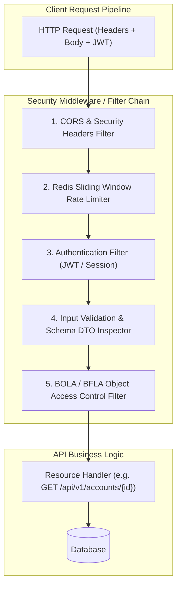
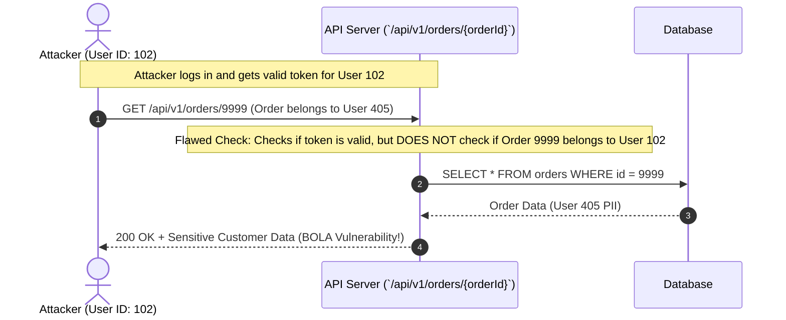

# 01. Securing API Endpoints & Rate Limiting

This chapter delves into fundamental API access control mechanisms, protection against object-level and function-level authorization flaws (BOLA/BFLA), distributed rate limiting patterns, CORS/CSRF defenses, and input validation strategies.

---

## 🎯 Threat Model & Architecture Overview



---

## 1. Broken Object-Level Authorization (BOLA) & Remediation

**BOLA** (formerly known as IDOR - Insecure Direct Object Reference) occurs when an API endpoint uses an identifier to retrieve or mutate a resource, but fails to check whether the authenticated user has permission to access that specific instance.

### 🛑 BOLA Attack Sequence



### ✅ Production Solution: Attribute-Based Access Control (ABAC) in Java / Spring Security

Instead of checking permissions in ad-hoc controller methods, construct an explicit domain authorization service or interceptor.

```java
package com.example.security.authorization;

import org.springframework.stereotype.Service;
import org.springframework.security.core.Authentication;
import org.springframework.security.access.AccessDeniedException;

import java.util.Objects;
import java.util.UUID;

/**
 * Access Control Evaluator enforcing BOLA checks.
 */
@Service("bolaEvaluator")
public class SecurityAccessEvaluator {

    private final AccountRepository accountRepository;

    public SecurityAccessEvaluator(AccountRepository accountRepository) {
        this.accountRepository = accountRepository;
    }

    /**
     * Checks if the current authenticated principal owns or has explicit permission on the given account ID.
     */
    public boolean canAccessAccount(Authentication authentication, UUID accountId) {
        if (authentication == null || !authentication.isAuthenticated()) {
            return false;
        }

        String currentUserId = authentication.getName(); // Extracted from JWT subject ('sub')
        
        // System Admins bypass object ownership checks
        boolean isAdmin = authentication.getAuthorities().stream()
                .anyMatch(a -> a.getAuthority().equals("ROLE_ADMIN"));
        if (isAdmin) {
            return true;
        }

        Account account = accountRepository.findById(accountId)
                .orElseThrow(() -> new ResourceNotFoundException("Account not found: " + accountId));

        // Enforce Object Owner Ownership Match
        return Objects.equals(account.getOwnerUserId(), currentUserId);
    }
}
```

#### Declarative Endpoint Protection

```java
package com.example.api.controller;

import com.example.security.authorization.SecurityAccessEvaluator;
import org.springframework.security.access.prepost.PreAuthorize;
import org.springframework.web.bind.annotation.*;

import java.util.UUID;

@RestController
@RequestMapping("/api/v1/accounts")
public class AccountController {

    private final AccountService accountService;

    public AccountController(AccountService accountService) {
        this.accountService = accountService;
    }

    @GetMapping("/{accountId}")
    @PreAuthorize("@bolaEvaluator.canAccessAccount(authentication, #accountId)")
    public AccountResponse getAccountDetails(@PathVariable UUID accountId) {
        return accountService.getAccountResponse(accountId);
    }
}
```

---

## 2. Distributed Rate Limiting (Sliding Window Log via Redis Lua)

To prevent resource exhaustion (API4:2023) and brute force attacks, a simple fixed-window counter is susceptible to traffic bursts at window boundaries. The **Sliding Window Log** algorithm stored in Redis provides smooth, burst-resistant rate limiting.

### 📊 Sliding Window Log Mechanics

```mermaid
gantt
    title Sliding Window Rate Limiting (60-Second Window, Max 5 Requests)
    dateFormat ss
    axisFormat %S

    section Window Timeline
    Expired Logs (< T-60s) :done, req1, 00, 10
    Valid Request 1        :active, req2, 15, 16
    Valid Request 2        :active, req3, 30, 31
    Valid Request 3        :active, req4, 45, 46
    Valid Request 4        :active, req5, 50, 51
    Current Time (T)       :crit,   req6, 60, 61
```



### 📜 Redis Lua Script for Atomic Sliding Window Execution

Save this script as `sliding_window_rate_limiter.lua`:

```lua
-- KEYS[1]: Rate limit key (e.g. ratelimit:user123:api_endpoint)
-- ARGV[1]: Current timestamp in milliseconds
-- ARGV[2]: Window size in milliseconds (e.g. 60000 for 1 minute)
-- ARGV[3]: Maximum permitted requests per window (e.g. 100)

local key = KEYS[1]
local now = tonumber(ARGV[1])
local window = tonumber(ARGV[2])
local max_limit = tonumber(ARGV[3])

local clear_before = now - window

-- 1. Remove timestamps older than the sliding window boundary
redis.call('ZREMRANGEBYSCORE', key, '-inf', clear_before)

-- 2. Count current entries in the sliding window
local current_requests = redis.call('ZCARD', key)

if current_requests < max_limit then
    -- 3. Add current request timestamp to the sorted set with unique score/member
    redis.call('ZADD', key, now, now .. '-' .. redis.call('INCR', key .. ':member_seq'))
    -- Set TTL on the sorted set key to auto-expire idle keys
    redis.call('PEXPIRE', key, window)
    return {1, max_limit - current_requests - 1} -- Allowed (1), Remaining Quota
else
    return {0, 0} -- Blocked (0), 0 Remaining Quota
end
```

### ☕ Production Java Redis Rate Limiter Middleware

```java
package com.example.security.ratelimit;

import redis.clients.jedis.JedisPool;
import redis.clients.jedis.Jedis;
import java.util.Collections;
import java.util.List;

public class RedisSlidingWindowRateLimiter {

    private final JedisPool jedisPool;
    private final String luaScriptSha;

    private static final String LUA_SCRIPT = 
        "local key = KEYS[1] " +
        "local now = tonumber(ARGV[1]) " +
        "local window = tonumber(ARGV[2]) " +
        "local max_limit = tonumber(ARGV[3]) " +
        "local clear_before = now - window " +
        "redis.call('ZREMRANGEBYSCORE', key, '-inf', clear_before) " +
        "local current_requests = redis.call('ZCARD', key) " +
        "if current_requests < max_limit then " +
        "  redis.call('ZADD', key, now, now .. '-' .. redis.call('INCR', key .. ':seq')) " +
        "  redis.call('PEXPIRE', key, window) " +
        "  return {1, max_limit - current_requests - 1} " +
        "else " +
        "  return {0, 0} " +
        "end";

    public RedisSlidingWindowRateLimiter(JedisPool jedisPool) {
        this.jedisPool = jedisPool;
        try (Jedis jedis = jedisPool.getResource()) {
            this.luaScriptSha = jedis.scriptLoad(LUA_SCRIPT);
        }
    }

    public RateLimitResult isAllowed(String apiKeyOrIp, int maxRequests, long windowMillis) {
        String key = "ratelimit:" + apiKeyOrIp;
        long now = System.currentTimeMillis();

        try (Jedis jedis = jedisPool.getResource()) {
            Object result = jedis.evalsha(
                luaScriptSha, 
                Collections.singletonList(key), 
                List.of(String.valueOf(now), String.valueOf(windowMillis), String.valueOf(maxRequests))
            );

            List<Long> resList = (List<Long>) result;
            boolean allowed = resList.get(0) == 1L;
            long remaining = resList.get(1);

            return new RateLimitResult(allowed, remaining);
        }
    }

    public record RateLimitResult(boolean allowed, long remainingQuota) {}
}
```

---

## 3. CORS & CSRF Defenses in Modern Stateless APIs

### 🌐 Cross-Origin Resource Sharing (CORS) Configuration

Never use `Access-Control-Allow-Origin: *` alongside `Access-Control-Allow-Credentials: true`.

```java
package com.example.security.config;

import org.springframework.context.annotation.Bean;
import org.springframework.context.annotation.Configuration;
import org.springframework.web.cors.CorsConfiguration;
import org.springframework.web.cors.UrlBasedCorsConfigurationSource;
import org.springframework.web.filter.CorsFilter;

import java.util.List;

@Configuration
public class SecurityCorsConfig {

    @Bean
    public CorsFilter corsFilter() {
        CorsConfiguration config = new CorsConfiguration();
        
        // Strict explicit origins (NO wildcards in production!)
        config.setAllowedOrigins(List.of("https://app.company.com", "https://admin.company.com"));
        config.setAllowedMethods(List.of("GET", "POST", "PUT", "DELETE", "OPTIONS"));
        config.setAllowedHeaders(List.of("Authorization", "Content-Type", "X-Correlation-ID"));
        config.setExposedHeaders(List.of("X-RateLimit-Remaining", "X-RateLimit-Reset"));
        config.setAllowCredentials(true); // Permit Cookies / Authorization Headers
        config.setMaxAge(3600L); // Preflight cache duration in seconds

        UrlBasedCorsConfigurationSource source = new UrlBasedCorsConfigurationSource();
        source.registerCorsConfiguration("/api/**", config);

        return new CorsFilter(source);
    }
}
```

### 🛡️ CSRF (Cross-Site Request Forgery) Defense for Cookie-Based Token Storage

When authorization tokens are stored in browser cookies (`HttpOnly; Secure; SameSite=Strict`), state-changing operations (`POST`, `PUT`, `DELETE`) are vulnerable to CSRF unless protected by an anti-CSRF token or custom header requirement.

#### Anti-CSRF Synchronizer Token Pattern (Java Interceptor)

```java
package com.example.security.csrf;

import jakarta.servlet.http.HttpServletRequest;
import jakarta.servlet.http.HttpServletResponse;
import org.springframework.web.servlet.HandlerInterceptor;
import java.security.MessageDigest;

public class CsrfHeaderInterceptor implements HandlerInterceptor {

    private static final String CSRF_COOKIE_NAME = "XSRF-TOKEN";
    private static final String CSRF_HEADER_NAME = "X-XSRF-TOKEN";

    @Override
    public boolean preHandle(HttpServletRequest request, HttpServletResponse response, Object handler) throws Exception {
        String method = request.getMethod();
        
        // Safe HTTP methods do not mutate state
        if ("GET".equalsIgnoreCase(method) || "HEAD".equalsIgnoreCase(method) || "OPTIONS".equalsIgnoreCase(method)) {
            return true;
        }

        String cookieToken = null;
        if (request.getCookies() != null) {
            for (var cookie : request.getCookies()) {
                if (CSRF_COOKIE_NAME.equals(cookie.getName())) {
                    cookieToken = cookie.getValue();
                    break;
                }
            }
        }

        String headerToken = request.getHeader(CSRF_HEADER_NAME);

        if (cookieToken == null || headerToken == null || !MessageDigest.isEqual(cookieToken.getBytes(), headerToken.getBytes())) {
            response.sendError(HttpServletResponse.SC_FORBIDDEN, "CSRF Token Validation Failed");
            return false;
        }

        return true;
    }
}
```

---

## 4. Input Validation & Mass Assignment Prevention

Exposing raw database entities directly as controller parameters allows attackers to bind unexpected properties (e.g. `is_admin`, `balance`). Always map incoming JSON to isolated Data Transfer Objects (DTOs) with strict Jakarta Validation constraints.

```java
package com.example.api.dto;

import jakarta.validation.constraints.*;
import java.math.BigDecimal;

public record CreateUserRequest(
    
    @NotBlank(message = "Username is required")
    @Size(min = 3, max = 50, message = "Username must be between 3 and 50 characters")
    @Pattern(regexp = "^[a-zA-Z0-9_.-]+$", message = "Username contains invalid characters")
    String username,

    @NotBlank(message = "Email is required")
    @Email(message = "Must be a valid email address")
    String email,

    @NotBlank
    @Size(min = 12, max = 100, message = "Password must be at least 12 characters long")
    String password
    
    // NOTE: 'isAdmin', 'roles', 'accountBalance' are deliberately excluded from this DTO
) {}
```
