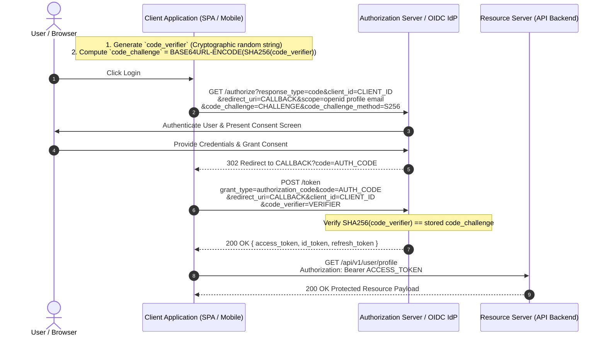
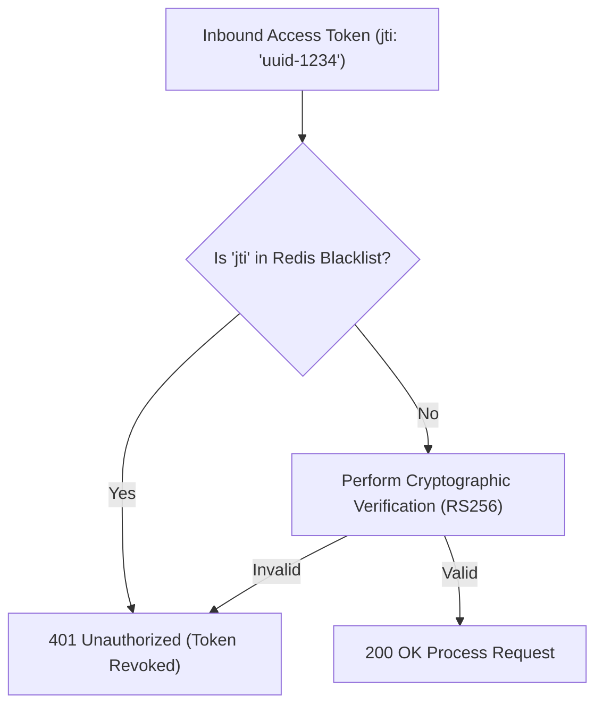

# 02. JWT, OAuth 2.1, PKCE & OpenID Connect

This chapter explores modern token-based security architectures, comparing JSON Web Tokens (JWT), Macaroons, and Open Policy Agent (OPA), followed by an implementation of OAuth 2.1 with Proof Key for Code Exchange (PKCE) and OpenID Connect (OIDC).

---

## 🏗️ Token Architecture Comparison

| Dimension | JWT (RFC 7519) | Macaroons (Google Research) | OPA (Open Policy Agent) |
| :--- | :--- | :--- | :--- |
| **Primary Purpose** | Identity Assertion & Bearer Claims | Delegated Authorization & Caveats | Decoupled Policy Enforcement |
| **Attestation** | Cryptographic Signature (RSA/ECDSA/HMAC) | Nested HMAC Chaining | Centralized / Distributed Engine Evaluation |
| **Contextual Attenuation** | Rigid (Cannot append claims without re-signing) | Dynamic (Any entity can add third-party caveats) | Real-time Context Integration (IP, Time, Risk) |
| **Verification Cost** | Asymmetric signature verification ($O(1)$) | Symmetric key hash chain evaluation ($O(N)$) | Policy evaluation execution against JSON input |

---

## 🔐 OAuth 2.1 Authorization Code Grant + PKCE Flow

OAuth 2.1 strictly mandates **PKCE (RFC 7636)** for all public and confidential clients to eliminate authorization code interception attacks.



---

## 🐍 Python Production Implementation: OAuth2 / PKCE Helpers & JWT Verifier

Below is a complete, production-grade Python module using `cryptography`, `python-jose`, and `requests` to handle PKCE generation, JWKS public key resolution, and zero-trust JWT verification.

```python
import base64
import hashlib
import os
import time
import requests
from typing import Dict, Any, Optional
from jose import jwt, jwk, JWTError
from jose.utils import format_base64url

class OAuth2PKCEHelper:
    """Helper utility for generating RFC 7636 PKCE Code Verifier and Code Challenge."""

    @staticmethod
    public_code_verifier_length: int = 64

    @classmethod
    def generate_code_verifier(cls) -> str:
        """Generates a high-entropy cryptographically secure code verifier string."""
        raw_bytes = os.urandom(32)
        return format_base64url(raw_bytes).decode("utf-8")

    @classmethod
    def derive_code_challenge(cls, code_verifier: str) -> str:
        """Derives the S256 Code Challenge from the code verifier."""
        digest = hashlib.sha256(code_verifier.encode("utf-8")).digest()
        return base64.urlsafe_b64encode(digest).decode("utf-8").replace("=", "")


class JWKSJwtVerifier:
    """Production JWT Verifier supporting dynamic JWKS key rotation and strict claim validation."""

    def __init__(self, jwks_url: str, expected_issuer: str, expected_audience: str):
        self.jwks_url = jwks_url
        self.expected_issuer = expected_issuer
        self.expected_audience = expected_audience
        self._jwks_cache: Optional[Dict[str, Any]] = None
        self._cache_exp: float = 0.0

    def _get_jwks((self) -> Dict[str, Any]:
        """Fetches and caches the JSON Web Key Set (JWKS) for 1 hour."""
        now = time.time()
        if not self._jwks_cache or now > self._cache_exp:
            resp = requests.get(self.jwks_url, timeout=5)
            resp.raise_for_status()
            self._jwks_cache = resp.json()
            self._cache_exp = now + 3600 # Cache for 3600 seconds
        return self._jwks_cache

    def verify_token(self, token: str) -> Dict[str, Any]:
        """
        Validates the cryptographic signature, algorithm (RS256/ES256), expiration,
        issuer, and audience of an inbound JWT.
        """
        try:
            unverified_header = jwt.get_unverified_header(token)
        except JWTError as e:
            raise ValueError(f"Malformed JWT Header: {str(e)}")

        alg = unverified_header.get("alg")
        if alg not in ["RS256", "ES256"]:
            raise ValueError(f"Disallowed algorithm: {alg}. Only RS256/ES256 permitted.")

        kid = unverified_header.get("kid")
        if not kid:
            raise ValueError("JWT Header missing Key ID ('kid') parameter.")

        jwks = self._get_jwks()
        matching_key = None
        for key in jwks.get("keys", []):
            if key.get("kid") == kid:
                matching_key = key
                break

        if not matching_key:
            # Invalidate cache and retry once in case of recent key rotation
            self._cache_exp = 0.0
            jwks = self._get_jwks()
            for key in jwks.get("keys", []):
                if key.get("kid") == kid:
                    matching_key = key
                    break

        if not matching_key:
            raise ValueError(f"Public key with kid '{kid}' not found in IdP JWKS endpoint.")

        # Construct public RSA/ECDSA key object
        public_key = jwk.construct(matching_key)

        try:
            payload = jwt.decode(
                token,
                public_key.to_pem(),
                algorithms=[alg],
                audience=self.expected_audience,
                issuer=self.expected_issuer,
                options={
                    "verify_signature": True,
                    "verify_aud": True,
                    "verify_iss": True,
                    "verify_exp": True,
                    "verify_nbf": True,
                    "leeway": 60 # 60 seconds clock skew tolerance
                }
            )
            return payload
        except JWTError as e:
            raise ValueError(f"JWT Validation Failure: {str(e)}")
```

---

## 🚫 Token Revocation Strategy: Redis Token Blacklist vs RFC 7662 Introspection

While stateless JWT verification provides low latency, handling instant logout or compromise requires token revocation.



### Redis Revocation Implementation (Java Jedis)

```java
package com.example.security.token;

import redis.clients.jedis.JedisPool;
import redis.clients.jedis.Jedis;

public class TokenRevocationService {

    private final JedisPool jedisPool;

    public TokenRevocationService(JedisPool jedisPool) {
        this.jedisPool = jedisPool;
    }

    /**
     * Revokes a token by adding its unique 'jti' (JWT ID) to Redis with a TTL equal to remaining lifetime.
     */
    public void revokeToken(String jti, long expirationTimestampSec) {
        long currentSec = System.currentTimeMillis() / 1000;
        long ttlSec = expirationTimestampSec - currentSec;

        if (ttlSec > 0) {
            try (Jedis jedis = jedisPool.getResource()) {
                jedis.setex("revoked_jti:" + jti, (int) ttlSec, "revoked");
            }
        }
    }

    /**
     * Checks if the given token JTI is revoked.
     */
    public boolean isRevoked(String jti) {
        try (Jedis jedis = jedisPool.getResource()) {
            return jedis.exists("revoked_jti:" + jti);
        }
    }
}
```
