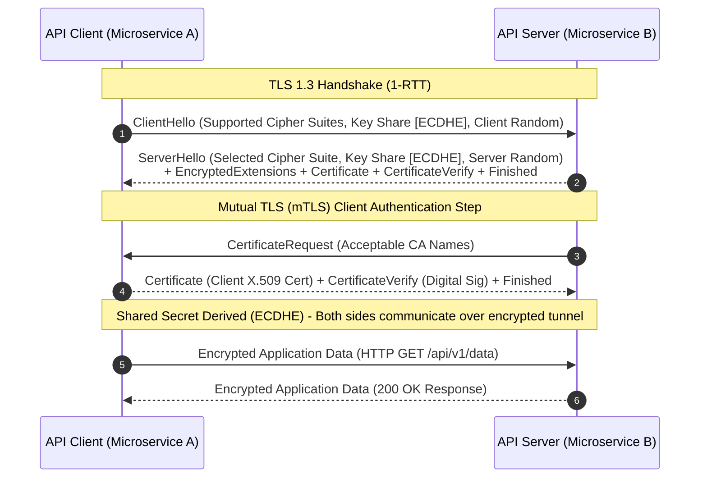
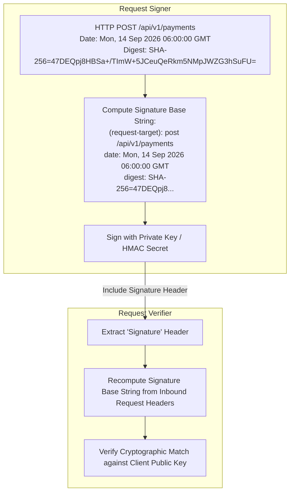

# 03. TLS 1.3, mTLS & Message Signing

This chapter covers transport-layer encryption, peer identity verification via Mutual TLS (mTLS), application-layer payload encryption using AES-256-GCM, and HTTP Message Signing to ensure integrity and non-repudiation across API requests.

---

## 🔒 TLS 1.3 Handshake & Mutual Authentication (mTLS)

TLS 1.3 reduces the handshake latency from 2 round-trip times (RTT) to 1 RTT (or 0-RTT for resumed sessions) while removing vulnerable legacy cipher suites (CBC mode, RSA key exchange) to mandate **Ephemeral Diffie-Hellman (ECDHE)** for Perfect Forward Secrecy (PFS).



---

## ☕ Application-Level Encryption: AES-256-GCM in Java

When transport layer security terminates at the edge (API Gateway / WAF), sensitive payload data stored in logs or transit over internal networks should be encrypted at the application level using **AES-256-GCM** (Galois/Counter Mode), which provides authenticated encryption with associated data (AEAD).

```java
package com.example.security.crypto;

import javax.crypto.Cipher;
import javax.crypto.KeyGenerator;
import javax.crypto.SecretKey;
import javax.crypto.spec.GCMParameterSpec;
import javax.crypto.spec.SecretKeySpec;
import java.security.SecureRandom;
import java.util.Base64;
import java.nio.ByteBuffer;
import java.nio.charset.StandardCharsets;

/**
 * Production-grade AES-256-GCM Payload Encryptor / Decryptor.
 */
public class AesGcmPayloadEncryptor {

    private static final String ALGORITHM = "AES/GCM/NoPadding";
    private static final int AES_KEY_SIZE_BITS = 256;
    private static final int GCM_IV_LENGTH_BYTES = 12; // 96 bits IV recommended for GCM
    private static final int GCM_TAG_LENGTH_BITS = 128;

    private final SecretKey secretKey;
    private final SecureRandom secureRandom;

    public AesGcmPayloadEncryptor(byte[] keyBytes) {
        if (keyBytes.length != 32) { // 256 bits = 32 bytes
            throw new IllegalArgumentException("AES-256 key must be exactly 32 bytes long.");
        }
        this.secretKey = new SecretKeySpec(keyBytes, "AES");
        this.secureRandom = new SecureRandom();
    }

    /**
     * Encrypts plaintext string and returns Base64-encoded payload containing [12 bytes IV || Ciphertext + Tag].
     */
    public String encrypt(String plainText) throws Exception {
        byte[] iv = new byte[GCM_IV_LENGTH_BYTES];
        secureRandom.nextBytes(iv);

        Cipher cipher = Cipher.getInstance(ALGORITHM);
        GCMParameterSpec parameterSpec = new GCMParameterSpec(GCM_TAG_LENGTH_BITS, iv);
        cipher.init(Cipher.ENCRYPT_MODE, secretKey, parameterSpec);

        byte[] cipherText = cipher.doFinal(plainText.getBytes(StandardCharsets.UTF_8));

        // Pack IV and Ciphertext into single payload
        ByteBuffer byteBuffer = ByteBuffer.allocate(iv.length + cipherText.length);
        byteBuffer.put(iv);
        byteBuffer.put(cipherText);

        return Base64.getEncoder().encodeToString(byteBuffer.array());
    }

    /**
     * Decrypts Base64-encoded encrypted payload.
     */
    public String decrypt(String base64EncryptedPayload) throws Exception {
        byte[] decodedBytes = Base64.getDecoder().decode(base64EncryptedPayload);

        if (decodedBytes.length < GCM_IV_LENGTH_BYTES + (GCM_TAG_LENGTH_BITS / 8)) {
            throw new IllegalArgumentException("Invalid encrypted payload length.");
        }

        ByteBuffer byteBuffer = ByteBuffer.wrap(decodedBytes);
        byte[] iv = new byte[GCM_IV_LENGTH_BYTES];
        byteBuffer.get(iv);

        byte[] cipherText = new byte[byteBuffer.remaining()];
        byteBuffer.get(cipherText);

        Cipher cipher = Cipher.getInstance(ALGORITHM);
        GCMParameterSpec parameterSpec = new GCMParameterSpec(GCM_TAG_LENGTH_BITS, iv);
        cipher.init(Cipher.DECRYPT_MODE, secretKey, parameterSpec);

        byte[] plainTextBytes = cipher.doFinal(cipherText);
        return new String(plainTextBytes, StandardCharsets.UTF_8);
    }
}
```

---

## ✍️ HTTP Message Signing (RFC Draft / HTTP Signature Specification)

To prevent payload tampering or replay by intermediaries, financial and enterprise APIs use cryptographic HTTP Message Signatures (e.g. HMAC-SHA256 or RSA-PSS) computed over key request headers and the request body hash.



### 🐍 Python HTTP Signature Generator & Verifier

```python
import base64
import hmac
import hashlib
from typing import Dict

class HttpMessageSigner:
    """Production HTTP HMAC-SHA256 Request Signer and Verifier."""

    def __init__(self, key_id: str, secret_key: bytes):
        self.key_id = key_id
        self.secret_key = secret_key

    def calculate_body_digest(self, body_bytes: bytes) -> str:
        """Computes HTTP Digest Header value (RFC 3230)."""
        digest = hashlib.sha256(body_bytes).digest()
        return "SHA-256=" + base64.b64encode(digest).decode("utf-8")

    def create_signature_header(self, method: str, path: str, date_header: str, digest_header: str) -> str:
        """
        Creates HTTP Signature Header computed over pseudo-headers:
        (request-target), date, digest.
        """
        signature_base = (
            f"(request-target): {method.lower()} {path}\n"
            f"date: {date_header}\n"
            f"digest: {digest_header}"
        )

        signature = hmac.new(
            self.secret_key,
            signature_base.encode("utf-8"),
            hashlib.sha256
        ).digest()

        encoded_sig = base64.b64encode(signature).decode("utf-8")

        return (
            f'keyId="{self.key_id}",'
            f'algorithm="hmac-sha256",'
            f'headers="(request-target) date digest",'
            f'signature="{encoded_sig}"'
        )

    def verify_signature(self, method: str, path: str, date_header: str, digest_header: str, incoming_sig: str) -> bool:
        """Verifies signature header match using constant-time comparison."""
        expected_header = self.create_signature_header(method, path, date_header, digest_header)
        
        # Extract raw signature values
        def parse_sig(h: str) -> str:
            for part in h.split(","):
                if part.strip().startswith("signature="):
                    return part.split("=")[1].strip('"')
            return ""

        expected_sig_val = parse_sig(expected_header)
        incoming_sig_val = parse_sig(incoming_sig)

        return hmac.compare_digest(expected_sig_val.encode("utf-8"), incoming_sig_val.encode("utf-8"))
```
