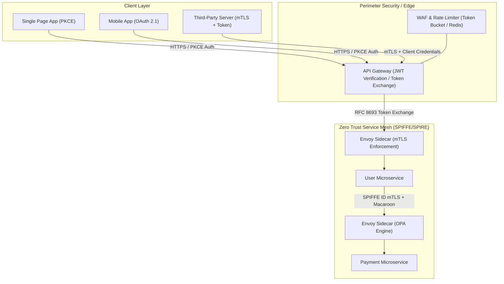

# API Security in Action

A production-grade, end-to-end masterclass on designing, implementing, and maintaining secure REST APIs, microservices, and token-based distributed architectures. Based on principles from Neil Madden's *API Security in Action*, OWASP API Security Top 10, RFC standards (OAuth 2.0, PKCE, OIDC, JWT, JOSE), and modern Zero Trust microservice patterns (SPIFFE/SPIRE, mTLS, API Gateways).

---

## 📐 Table of Contents

| Section | Subject | Key Concepts |
| :--- | :--- | :--- |
| **00. Cheatsheet** | [API Security Cheatsheet](00_api_security_cheatsheet.md) | OWASP API Top 10, Header Security, OAuth2 Grant Selection, JWT Validation Checklist, TLS Cipher Suites |
| **01. Foundations & Access Control** | [Securing Endpoints & Rate Limiting](01_foundations_and_access_control/01_securing_api_endpoints_and_rate_limiting.md) | BOLA/BFLA, Rate Limiting (Token Bucket / Sliding Window Redis), CSRF & CORS, Input Validation & Sanitization |
| **02. Tokens & OAuth2/OIDC** | [JWT, OAuth2, PKCE & OIDC](02_tokens_oauth2_and_oidc/02_jwt_oauth2_pkce_and_oidc.md) | Macaroons vs JWT vs Macaroon/OPA, OAuth 2.1 RFC 7636 PKCE Flow, OpenID Connect 1.0, Token Revocation (Blacklisting vs Introspection) |
| **03. Cryptography & Transport** | [TLS 1.3, mTLS & Message Signing](03_cryptography_and_transport_security/03_tls13_mtls_and_message_signing.md) | TLS 1.3 Handshake, Mutual TLS (mTLS) with X.509 SVIDs, HTTP Message Signing (draft-ietf-httpbis-message-signatures), AES-GCM-256 Payload Encryption |
| **04. Microservices & Zero Trust** | [API Gateway Enforcement & SPIFFE](04_microservices_and_zero_trust/04_api_gateway_enforcement_and_spiffe.md) | Zero Trust Architecture (ZTA), SPIFFE/SPIRE SVID Attestation, API Gateway Token Exchange (RFC 8693), Sidecar Proxy Authz (Envoy/OPA) |

---

## 🛡️ Architecture & Threat Model Overview

---

## 🎯 Core Principles Enforced Throughout

1. **Zero Trust at the Edge and Core**: Never trust the internal network. Every inter-service hop must be mutually authenticated (mTLS) and authorized (ABAC/OPA).
2. **Defense in Depth**: Combine TLS transport encryption, message-level signatures (HTTP Message Signing / MACs), and strict input validation.
3. **Principal of Least Privilege**: Microservices exchange identity tokens via RFC 8693 Token Exchange to scoped downstream tokens, preventing token replay attacks across services.
4. **Resilient Rate Limiting**: Distributed Sliding Window Counter algorithm implemented in Redis to withstand DDoS and brute-force credential stuffing.
