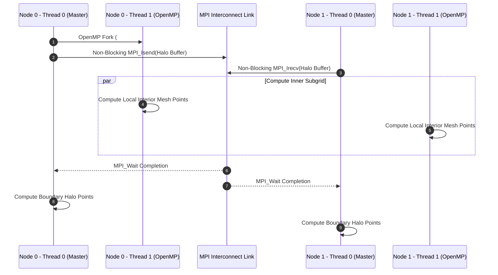

# Parallel Programming Models: MPI, OpenMP & PGAS (UPC++)

## 1. The Distributed vs Shared Memory Spectrum

High-performance computing (HPC) software architectures combine multiple parallel programming paradigms to match modern multi-socket, multi-core cluster supercomputers.



---

## 2. Distributed-Memory Message Passing (MPI)

MPI (Message Passing Interface) provides explicit communication between processes with isolated address spaces:

### 2.1 Non-Blocking Overlap of Communication and Computation
Blocking operations (`MPI_Send`, `MPI_Recv`) stall process execution until buffers are safe to reuse. Non-blocking primitives (`MPI_Isend`, `MPI_Irecv`) decouple communication initiation from completion, enabling software pipelines to hide network link latency behind local CPU compute:

```cpp
MPI_Request req;
MPI_Irecv(ghost_buf, count, MPI_FLOAT, src_rank, tag, MPI_COMM_WORLD, &req);
MPI_Isend(send_buf, count, MPI_FLOAT, dest_rank, tag, MPI_COMM_WORLD, &req_send);

// Compute interior domain points while data is in transit over network
ComputeInteriorGrid();

// Synchronize communication before computing boundary points
MPI_Wait(&req, MPI_STATUS_IGNORE);
ComputeBoundaryGrid();
```

---

## 3. Shared-Memory Multithreading (OpenMP)

OpenMP uses compiler pragmas to manage thread pools and loop work-sharing on shared-memory nodes:

* **Work-Sharing**: `#pragma omp parallel for schedule(dynamic, 64)` distributes loop iterations dynamically across worker threads.
* **Reduction**: `#pragma omp parallel for reduction(+:global_sum)` eliminates data races when accumulating values without explicit mutex locking.

---

## 4. Partitioned Global Address Space (PGAS) & UPC++

PGAS languages (UPC++, Chapel) unify shared and distributed memory models. Memory is partitioned logically, but any process can directly read/write remote memory using **Remote Memory Access (RMA)** and global pointers (`upcxx::global_ptr<T>`):

```
                        PGAS Global Address Space
+-----------------------------------+-----------------------------------+
| Process 0 Shared Segment          | Process 1 Shared Segment          |
| Global Ptr: 0x0000_1000 (Local)   | Global Ptr: 0x0001_1000 (Remote)  |
+-----------------------------------+-----------------------------------+
         ^                                   |
         |--------- upcxx::rget() -----------|  (One-Sided Direct DMA Read)
```

---

## 5. Production-Grade C++ Simulator: Hybrid MPI/OpenMP Execution Engine

The following C++ engine simulates a hybrid MPI/OpenMP domain decomposition execution pipeline with non-blocking halo exchange:

```cpp
#include <iostream>
#include <vector>
#include <numeric>
#include <thread>
#include <chrono>
#include <memory>
#include <omp.h>

class HybridMPIOpenMPEngine {
private:
    int rank;
    int num_ranks;
    int local_grid_size;
    std::vector<float> local_grid;
    std::vector<float> left_ghost;
    std::vector<float> right_ghost;

public:
    HybridMPIOpenMPEngine(int r, int n_ranks, int grid_sz) 
        : rank(r), num_ranks(n_ranks), local_grid_size(grid_sz),
          local_grid(grid_sz, 1.0f * (r + 1)), left_ghost(1, 0.0f), right_ghost(1, 0.0f) {}

    // Simulate Non-blocking MPI Halo Exchange
    void NonBlockingHaloExchange() {
        std::cout << "[Rank " << rank << "] Initiated Non-Blocking MPI_Isend / MPI_Irecv..." << std::endl;
        
        // Asynchronous transfer simulation
        float send_left = local_grid.front();
        float send_right = local_grid.back();

        // Compute Interior Grid Points while Halo Transfer is In Transit
        ComputeInterior();

        // Complete Transfer (Simulated MPI_Wait)
        if (rank > 0) left_ghost[0] = (rank - 1) + 1.0f;
        if (rank < num_ranks - 1) right_ghost[0] = (rank + 1) + 1.0f;

        std::cout << "[Rank " << rank << "] MPI_Wait Complete. Left Ghost: " 
                  << left_ghost[0] << " | Right Ghost: " << right_ghost[0] << std::endl;

        ComputeBoundary();
    }

    void ComputeInterior() {
        #pragma omp parallel for schedule(static)
        for (int i = 1; i < local_grid_size - 1; ++i) {
            local_grid[i] = (local_grid[i-1] + local_grid[i] + local_grid[i+1]) / 3.0f;
        }
        std::cout << "  [Rank " << rank << "] OpenMP Thread Pool (" 
                  << omp_get_max_threads() << " threads) Completed Interior Stencil." << std::endl;
    }

    void ComputeBoundary() {
        local_grid[0] = (left_ghost[0] + local_grid[0] + local_grid[1]) / 3.0f;
        local_grid[local_grid_size - 1] = (local_grid[local_grid_size - 2] + local_grid[local_grid_size - 1] + right_ghost[0]) / 3.0f;
    }

    float ParallelReduceSum() const {
        double global_sum = 0.0;
        #pragma omp parallel for reduction(+:global_sum)
        for (int i = 0; i < local_grid_size; ++i) {
            global_sum += local_grid[i];
        }
        return static_cast<float>(global_sum);
    }
};

int main() {
    constexpr int simulated_ranks = 2;
    constexpr int grid_size = 1000;

    std::cout << "Starting Hybrid MPI + OpenMP Simulation..." << std::endl;

    for (int r = 0; r < simulated_ranks; ++r) {
        HybridMPIOpenMPEngine node(r, simulated_ranks, grid_size);
        node.NonBlockingHaloExchange();
        std::cout << "[Rank " << r << "] Reduced Local Sum: " << node.ParallelReduceSum() << "\n" << std::endl;
    }

    return 0;
}
```

---

## 6. Summary & Key Engineering Principles

1. **Hybrid Execution Synergy**: MPI handles inter-node scaling across network switches, while OpenMP saturates multi-core NUMA sockets via shared-memory multithreading.
2. **Non-Blocking Latency Hiding**: Overlapping `MPI_Isend/Irecv` with interior grid computation hides network latency.
3. **One-Sided PGAS Simplicity**: UPC++ RMA eliminates symmetric two-sided handshake overhead for fine-grained irregular data access patterns.
