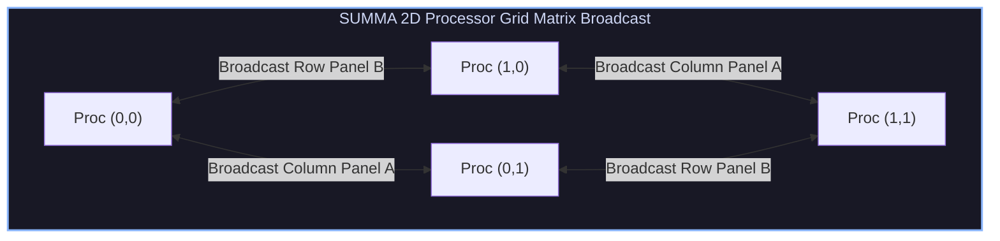

# Communication-Avoiding Linear Algebra, SUMMA & Sparse SpMV

## 1. Communication-Avoiding Dense Linear Algebra

In large distributed systems, inter-node network data movement consumes orders of magnitude more time and energy than floating-point arithmetic. **Communication-Avoiding Algorithms** restructure numerical algorithms to minimize message counts and word transfers to theoretical lower bounds ($\Omega(N^3 / P \sqrt{M})$).



### 1.1 SUMMA (Scalable Universal Matrix Multiplication Algorithm)
SUMMA (van de Geijn et al.) decomposes $N \times N$ matrix multiplication $C = A \times B$ across a $\sqrt{P} \times \sqrt{P}$ 2D processor grid using $k$-panel broadcasts:

1. At step $k$, each processor column holding sub-panel $A_{*, k}$ broadcasts its panel horizontally across its processor row.
2. Simultaneously, each processor row holding sub-panel $B_{k, *}$ broadcasts its panel vertically down its processor column.
3. Every processor computes local rank-$k$ matrix update: $C_{\text{local}} += A_{\text{panel}} \times B_{\text{panel}}$.

Compared to 1D decompositions ($O(N^2)$ words per process), 2D SUMMA reduces per-process communication to $O(N^2 / \sqrt{P})$ words.

---

## 2. Sparse Matrix Formats & SpMV Bottlenecks

Sparse Matrix-Vector Multiplication (**SpMV**: $y = A \cdot x$) dominates iterative solvers (Conjugate Gradient, GMRES).

```
Sparse Matrix A (4x4)           Compressed Sparse Row (CSR) Storage
[ 5  0  0  2 ]                 values:  [ 5, 2, 3, 1, 4 ]
[ 0  3  0  0 ]                 col_ind: [ 0, 3, 1, 3, 2 ]
[ 0  0  0  1 ]                 row_ptr: [ 0, 2, 3, 4, 5 ]
[ 0  0  4  0 ]
```

### 2.1 Compressed Sparse Row (CSR) Layout
* `values`: Array of non-zero entries (Length = $NNZ$).
* `col_ind`: Column indices for each non-zero entry (Length = $NNZ$).
* `row_ptr`: Index pointers indicating the start of each row in `values` (Length = $M + 1$).

### 2.2 Memory Bandwidth Limit
Because SpMV performs only 2 FLOPs per non-zero entry ($y_i += A_{i,j} \cdot x_j$) while loading 12 bytes of data (8-byte `double` + 4-byte `int` column index), its arithmetic intensity is $\approx 0.16 \text{ FLOPs/Byte}$. SpMV performance is completely governed by memory subsystem bandwidth.

---

## 3. Production-Grade C++ Engine: SUMMA & Parallel CSR SpMV Solver

The following C++ engine implements 2D SUMMA Matrix Multiplication and Parallel CSR Sparse Matrix-Vector Multiplication:

```cpp
#include <iostream>
#include <vector>
#include <cmath>
#include <chrono>
#include <omp.h>

class CommunicationAvoidingEngine {
public:
    // 1. Scalable Universal Matrix Multiplication Algorithm (SUMMA) Simulator
    static void SUMMAMultiply(const std::vector<float>& A, const std::vector<float>& B,
                              std::vector<float>& C, int N, int panel_size = 16) {
        // C = A * B using 2D Panel Broadcasts
        for (int k = 0; k < N; k += panel_size) {
            int k_end = std::min(k + panel_size, N);

            #pragma omp parallel for collapse(2) schedule(static)
            for (int i = 0; i < N; ++i) {
                for (int j = 0; j < N; ++j) {
                    float sum = 0.0f;
                    for (int kk = k; kk < k_end; ++kk) {
                        sum += A[i * N + kk] * B[kk * N + j];
                    }
                    C[i * N + j] += sum;
                }
            }
        }
    }

    // 2. Parallel CSR Sparse Matrix-Vector Multiplication (SpMV)
    struct CSRMatrix {
        int rows;
        int cols;
        int nnz;
        std::vector<float> values;
        std::vector<int> col_ind;
        std::vector<int> row_ptr;
    };

    static std::vector<float> ParallelCSRSpMV(const CSRMatrix& A, const std::vector<float>& x) {
        std::vector<float> y(A.rows, 0.0f);

        #pragma omp parallel for schedule(dynamic, 64)
        for (int i = 0; i < A.rows; ++i) {
            float sum = 0.0f;
            int start = A.row_ptr[i];
            int end = A.row_ptr[i + 1];

            for (int idx = start; idx < end; ++idx) {
                sum += A.values[idx] * x[A.col_ind[idx]];
            }
            y[i] = sum;
        }

        return y;
    }
};

int main() {
    constexpr int N = 256;
    std::vector<float> A(N * N, 1.0f);
    std::vector<float> B(N * N, 2.0f);
    std::vector<float> C(N * N, 0.0f);

    std::cout << "Executing 2D SUMMA Dense Matrix Multiplication (N = " << N << ")..." << std::endl;
    CommunicationAvoidingEngine::SUMMAMultiply(A, B, C, N);
    std::cout << "SUMMA Execution Complete. Sample C[0,0] = " << C[0] << std::endl;

    std::cout << "\nExecuting Parallel CSR SpMV Solver..." << std::endl;
    // Construct 4x4 Sparse Tridiagonal Matrix
    CommunicationAvoidingEngine::CSRMatrix sparse_A;
    sparse_A.rows = 4; sparse_A.cols = 4; sparse_A.nnz = 10;
    sparse_A.values  = {2.0f, -1.0f, -1.0f, 2.0f, -1.0f, -1.0f, 2.0f, -1.0f, -1.0f, 2.0f};
    sparse_A.col_ind = {0, 1, 0, 1, 2, 1, 2, 3, 2, 3};
    sparse_A.row_ptr = {0, 2, 5, 8, 10};

    std::vector<float> x = {1.0f, 1.0f, 1.0f, 1.0f};
    std::vector<float> y = CommunicationAvoidingEngine::ParallelCSRSpMV(sparse_A, x);

    std::cout << "SpMV Result Vector y: [ ";
    for (float val : y) std::cout << val << " ";
    std::cout << "]" << std::endl;

    return 0;
}
```

---

## 4. Summary & Engineering Takeaways

1. **Communication Lower Bounds**: 2D SUMMA achieves the optimal $O(N^2 / \sqrt{P})$ communication lower bound, outperforming 1D slicing strategies.
2. **CSR Memory Efficiency**: CSR eliminates zero-element storage while dynamic OpenMP scheduling balances irregular row non-zero distributions.
3. **Krylov Solvers**: Efficient SpMV kernel execution forms the computational foundation for parallel Conjugate Gradient linear system solvers.
