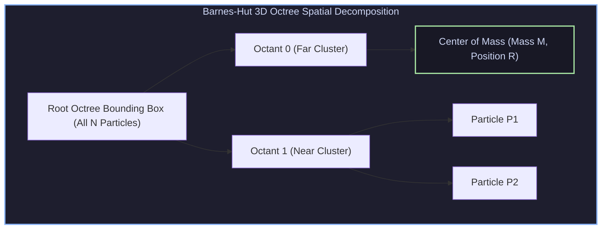

# Hierarchical N-Body Algorithms, Graph 500 BFS & Dynamic Load Balancing

## 1. Hierarchical N-Body Simulation Algorithms

Gravitational and electrostatic $N$-body simulations require computing pairwise interaction forces across $N$ particles:
$$\mathbf{F}_i = G m_i \sum_{j \neq i} \frac{m_j (\mathbf{r}_j - \mathbf{r}_i)}{\|\mathbf{r}_j - \mathbf{r}_i\|^3}$$

* **Direct Summation ($O(N^2)$)**: Evaluates all $N(N-1)/2$ force pairs. Prohibitive for $N > 10^6$.
* **Barnes-Hut Octree ($O(N \log N)$)**: Recursively partitions 3D space into octree nodes. Distant particle clusters are approximated as a single pseudo-particle located at the cluster's Center of Mass (CoM).



### 1.1 Multipole Acceptance Criterion (MAC)
A particle evaluates force from an octree node of diameter $d$ at distance $r$ using the threshold $\theta$:
$$\frac{d}{r} < \theta \quad (\text{typically } \theta \approx 0.5 \dots 1.0)$$
* **If $\frac{d}{r} < \theta$**: Accept approximation! Treat entire subtree as 1 pseudo-particle at Center of Mass.
* **If $\frac{d}{r} \ge \theta$**: Open node and recurse into child octants.

---

## 2. Graph 500 Benchmark & Algebraic BFS ($y = A^T x$)

The Graph 500 benchmark evaluates supercomputer performance on unstructured graph traversal (Breadth-First Search / BFS).

```
Algebraic Formulation of Parallel BFS:
    Step k Frontier Vector x^(k)   x   Adjacency Matrix A^T   =   Step k+1 Frontier Vector x^(k+1)
```

Instead of pointer-chasing queue traversals, modern parallel graph frameworks express BFS as **Sparse Matrix-Vector Multiplication (SpMV)** over the Boolean semiring ($\lor, \land$).

---

## 3. Dynamic Load Balancing & Space-Filling Curves

When particle densities shift or graphs exhibit scale-free power-law degree distributions, static domain decomposition causes computational imbalances:

```
                            Z-Order (Morton Code) vs Hilbert Curve
    +---+---+---+---+                                     +---+---+---+---+
    | 0 | 1 | 4 | 5 |                                     | 0 | 1 | 14| 15|
    +---+---+---+---+                                     +---+---+---+---+
    | 2 | 3 | 6 | 7 |                                     | 3 | 2 | 13| 12|
    +---+---+---+---+                                     +---+---+---+---+
    | 8 | 9 | 12| 13|                                     | 4 | 7 | 8 | 11|
    +---+---+---+---+                                     +---+---+---+---+
    | 10| 11| 14| 15|                                     | 5 | 6 | 9 | 10|
    +---+---+---+---+                                     +---+---+---+---+
     Morton Space-Filling Curve                            Hilbert Space-Filling Curve
```

1. **Space-Filling Curves (Hilbert / Morton Z-Order)**: Map 2D/3D spatial coordinates to 1D integer keys while preserving spatial locality. Processors take equal 1D contiguous slices.
2. **METIS Graph Partitioning**: Partition graph nodes to minimize edge cuts across distributed MPI ranks:
   $$\min \sum_{e \in E_{\text{cut}}} w(e) \quad \text{subject to } \text{Weight}(\text{Rank}_i) \approx \text{Equal}$$

---

## 4. Production-Grade C++ Engine: Barnes-Hut 3D Octree Simulator

The following C++ engine implements a 3D Barnes-Hut Octree builder and Multipole Force Calculation kernel:

```cpp
#include <iostream>
#include <vector>
#include <memory>
#include <cmath>

struct Vector3D {
    float x, y, z;
    Vector3D operator+(const Vector3D& o) const { return {x + o.x, y + o.y, z + o.z}; }
    Vector3D operator-(const Vector3D& o) const { return {x - o.x, y - o.y, z - o.z}; }
    Vector3D operator*(float s) const { return {x * s, y * s, z * s}; }
};

struct Particle {
    int id;
    Vector3D pos;
    float mass;
};

class OctreeNode {
public:
    Vector3D center;
    float size; // Width of bounding box
    float total_mass = 0.0f;
    Vector3D center_of_mass{0, 0, 0};
    Particle* particle = nullptr;
    std::unique_ptr<OctreeNode> children[8];

    OctreeNode(Vector3D c, float s) : center(c), size(s) {}

    bool IsLeaf() const {
        for (int i = 0; i < 8; ++i) if (children[i]) return false;
        return true;
    }

    int GetOctant(const Vector3D& p) const {
        int octant = 0;
        if (p.x >= center.x) octant |= 1;
        if (p.y >= center.y) octant |= 2;
        if (p.z >= center.z) octant |= 4;
        return octant;
    }

    void Insert(Particle* p) {
        if (total_mass == 0.0f) {
            particle = p;
            total_mass = p->mass;
            center_of_mass = p->pos;
            return;
        }

        if (IsLeaf()) {
            // Subdivide leaf into 8 child octants
            Particle* existing = particle;
            particle = nullptr;

            SubdivideAndInsert(existing);
            SubdivideAndInsert(p);
        } else {
            SubdivideAndInsert(p);
        }

        // Update Center of Mass
        total_mass += p->mass;
        center_of_mass = (center_of_mass * (total_mass - p->mass) + p->pos * p->mass) * (1.0f / total_mass);
    }

private:
    void SubdivideAndInsert(Particle* p) {
        int octant = GetOctant(p->pos);
        if (!children[octant]) {
            float half = size / 2.0f;
            float quarter = size / 4.0f;
            Vector3D child_center = {
                center.x + ((octant & 1) ? quarter : -quarter),
                center.y + ((octant & 2) ? quarter : -quarter),
                center.z + ((octant & 4) ? quarter : -quarter)
            };
            children[octant] = std::make_unique<OctreeNode>(child_center, half);
        }
        children[octant]->Insert(p);
    }
};

class BarnesHutEngine {
public:
    static Vector3D ComputeForce(const Particle& p, const OctreeNode* node, float theta) {
        if (node->total_mass == 0.0f || (node->IsLeaf() && node->particle == &p)) {
            return {0, 0, 0};
        }

        Vector3D d = node->center_of_mass - p.pos;
        float r = std::sqrt(d.x * d.x + d.y * d.y + d.z * d.z + 1e-5f);

        if (node->IsLeaf() || (node->size / r < theta)) {
            // Multipole Approximation: Treat node as single pseudo-particle
            float G = 1.0f;
            float f_mag = (G * p.mass * node->total_mass) / (r * r * r);
            return d * f_mag;
        }

        // Recurse into children
        Vector3D force{0, 0, 0};
        for (int i = 0; i < 8; ++i) {
            if (node->children[i]) {
                force = force + ComputeForce(p, node->children[i].get(), theta);
            }
        }
        return force;
    }
};

int main() {
    std::cout << "Building Barnes-Hut 3D Octree..." << std::endl;
    OctreeNode root({0, 0, 0}, 100.0f);

    std::vector<Particle> particles = {
        {0, {-10.0f, -10.0f, -10.0f}, 1.0f},
        {1, {-12.0f, -11.0f, -10.0f}, 2.0f},
        {2, { 40.0f,  40.0f,  40.0f}, 5.0f}
    };

    for (auto& p : particles) {
        root.Insert(&p);
    }

    std::cout << "Octree Mass: " << root.total_mass 
              << " | Center of Mass: (" << root.center_of_mass.x 
              << ", " << root.center_of_mass.y << ", " << root.center_of_mass.z << ")" << std::endl;

    Vector3D force_p0 = BarnesHutEngine::ComputeForce(particles[0], &root, 0.5f);
    std::cout << "Barnes-Hut Computed Force on Particle 0: (" 
              << force_p0.x << ", " << force_p0.y << ", " << force_p0.z << ")" << std::endl;

    return 0;
}
```

---

## 5. Summary & Key Engineering Takeaways

1. **Barnes-Hut Spatial Acceleration**: Reduces $N$-body force computation from $O(N^2)$ to $O(N \log N)$ using hierarchical octree multipole approximations.
2. **Algebraic Graph 500 BFS**: Formulating graph traversals as sparse matrix-vector multiplication ($y = A^T x$) enables massive GPU/MPI parallel linear algebra solver reuse.
3. **Space-Filling Load Balancing**: Hilbert and Morton curves preserve 3D spatial locality when partitioning work across distributed MPI ranks.
