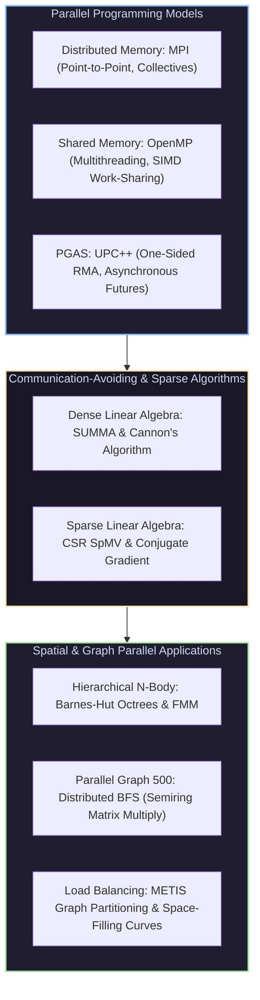

# UC Berkeley CS267: Applications of Parallel Computers

Welcome to the **UC Berkeley CS267 Masterclass Module**. This module covers high-performance parallel computing across distributed-memory Message Passing (MPI), shared-memory multithreading (OpenMP), Partitioned Global Address Space (PGAS UPC++), communication-avoiding dense/sparse linear algebra (SUMMA, Cannon, CSR SpMV), hierarchical N-body algorithms (Barnes-Hut Octrees), Graph 500 parallel graph algorithms, and dynamic load balancing.

---

## 1. Parallel Computing Taxonomy & Software Architecture

---

## 2. Module Navigation Map

| File | Description | Core Topics |
| :--- | :--- | :--- |
| **[`00_cs267_cheatsheet.md`](00_cs267_cheatsheet.md)** | 30-Second Parallel Computing Cheatsheet | Strong vs Weak scaling math, Speedup ($S_P$) & Efficiency ($E_P$), Communication lower bounds $\Omega(W/\sqrt{M})$, CSR memory footprint, MPI collectives complexity, Barnes-Hut octree math. |
| **[`01_mpi_openmp_and_pgas_models.md`](01_parallel_programming_models_mpi_openmp_and_upcxx/01_mpi_openmp_and_pgas_models.md)** | Parallel Programming Models | Distributed MPI primitives, Non-blocking ISend/IRecv, OpenMP work-sharing, PGAS UPC++ RMA model, Complete C++ Hybrid MPI/OpenMP Simulator, Mermaid sequence diagram. |
| **[`02_summa_cannon_and_sparse_matrices.md`](02_communication_avoiding_linear_algebra_and_spmv/02_summa_cannon_and_sparse_matrices.md)** | Communication-Avoiding Linear Algebra | Cannon 2D Torus algorithm, SUMMA matrix multiplication, CSR/CSC sparse matrix layouts, Parallel Conjugate Gradient (CG) solver, Complete C++ SUMMA & CSR SpMV Engine, Mermaid communication grid diagram. |
| **[`03_barnes_hut_graph_bfs_and_partitioning.md`](03_nbody_algorithms_graph500_and_load_balancing/03_barnes_hut_graph_bfs_and_partitioning.md)** | N-Body, Graph 500 & Load Balancing | Barnes-Hut $O(N \log N)$ Octree spatial decomposition, Multipole Acceptance Criterion ($\theta = d/r$), Graph 500 Parallel BFS via linear algebra ($y = A^T x$), Hilbert Space-Filling curves & METIS graph partitioning, Complete C++ 3D Octree Engine, Mermaid diagram. |

---

## 3. Key Parallel Computing Laws

1. **Amdahl's Law (Strong Scaling)**: For a fixed problem size with serial fraction $s$:
   $$S_P = \frac{1}{s + \frac{1 - s}{P}} \le \frac{1}{s}$$
2. **Gustafson's Law (Weak Scaling)**: Scaling problem size proportional to processor count $P$:
   $$S_P = s + P (1 - s) = P - s(P - 1)$$
3. **Communication Lower Bound (Demmel et al.)**: For dense $N \times N$ matrix multiplication on $P$ processors with fast local memory size $M$:
   $$\text{Words Moved per Processor} = \Omega\left( \frac{N^3}{P \sqrt{M}} \right)$$
