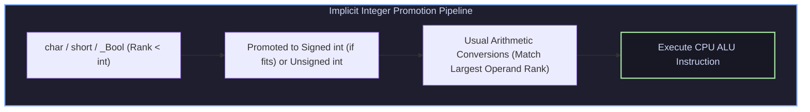

# C Fundamentals, Type Systems, Sequence Points & Linkage Mechanics

## 1. C Type System & Integer Promotions

The C language type system defines explicit rules for representation sizes and implicit type conversions.



### 1.1 Fixed-Width Types (`<stdint.h>`)
To guarantee portable data representations across 32-bit and 64-bit architectures, modern C code uses fixed-width integer types:

```c
#include <stdint.h>
#include <stddef.h>

int8_t   b;  // Exact 8-bit signed integer
uint32_t x;  // Exact 32-bit unsigned integer
uint64_t y;  // Exact 64-bit unsigned integer
size_t   len; // Unsigned integer type for array sizes & sizeof operator
ptrdiff_t dist; // Signed integer type for pointer subtraction
```

---

## 2. Sequence Points & Side Effects

A **side effect** is a change in the execution environment state (e.g., modifying a variable, writing to a file). A **sequence point** is a point in execution where all side effects of previous evaluations are guaranteed to be complete.

### 2.1 Sequence Point Rules (C99 §6.5)
Sequence points occur at:
1. The end of a full expression (at the semicolon `;`).
2. The `&&`, `||`, and ternary `?:` operators (left operand evaluated first).
3. The comma operator `,`.
4. Immediately before a function call starts execution.

```c
// UNDEFINED BEHAVIOR TRAPS:
i = i++ + 1;       // UB! Modifies 'i' twice between sequence points.
a[i] = i++;        // UB! Reads and modifies 'i' without intervening sequence point.
printf("%d %d\n", i++, i++); // UB! Unspecified order of function argument evaluation.
```

---

## 3. Variable-Length Arrays (VLAs) & Compound Literals

C99 introduced **Variable-Length Arrays (VLAs)** where array bounds are evaluated at runtime on the stack:

```c
void ProcessMatrix(size_t rows, size_t cols) {
    double matrix[rows][cols]; // Stack-allocated VLA
    // matrix is allocated dynamically based on runtime parameters
}

// Compound Literal (Creates anonymous array in stack scope)
int *p = (int[]){10, 20, 30, 40};
```

---

## 4. Linkage & Storage Duration

Variable and function identifiers possess **linkage**, governing their visibility across multiple compilation translation units (`.c` files):

```
Identifier Scope & Linkage Rules
1. External Linkage (extern): Visible across ALL translation units in the executable.
2. Internal Linkage (static): Restricts visibility strictly to the CURRENT .c file.
3. No Linkage: Local variables inside block scope.
```

---

## 5. Production C Engine: VLA Matrix Processing & Linkage Safety

The following C program demonstrates C99 Variable-Length Array processing, sequence-point-safe arithmetic, and static internal linkage helpers:

```c
#include <stdio.h>
#include <stdlib.h>
#include <stdint.h>
#include <stddef.h>

// Internal Linkage Utility Function
static void FillVLAMatrix(size_t rows, size_t cols, double matrix[rows][cols]) {
    for (size_t r = 0; r < rows; ++r) {
        for (size_t c = 0; c < cols; ++c) {
            matrix[r][c] = (double)(r * 10 + c);
        }
    }
}

// Compute Row Sums using VLA parameters
static void ComputeRowSums(size_t rows, size_t cols, 
                           const double matrix[rows][cols], 
                           double out_sums[rows]) {
    for (size_t r = 0; r < rows; ++r) {
        double sum = 0.0;
        for (size_t c = 0; c < cols; ++c) {
            sum += matrix[r][c]; // Sequence-point safe
        }
        out_sums[r] = sum;
    }
}

int main(void) {
    size_t rows = 4;
    size_t cols = 5;

    printf("Allocating Stack VLA Matrix (%zu x %zu)...\n", rows, cols);
    double matrix[rows][cols]; // C99 VLA Allocation
    double row_sums[rows];

    FillVLAMatrix(rows, cols, matrix);
    ComputeRowSums(rows, cols, matrix, row_sums);

    printf("VLA Processing Complete. Row Sums:\n");
    for (size_t i = 0; i < rows; ++i) {
        printf("  Row %zu Sum = %.2f\n", i, row_sums[i]);
    }

    return 0;
}
```

---

## 6. Summary & Verification

1. **Fixed-Width Precision**: `<stdint.h>` types eliminate integer truncation errors across 32-bit and 64-bit target systems.
2. **Sequence Point Discipline**: Avoid modifying a variable multiple times in a single statement to prevent compiler Undefined Behavior.
3. **Internal Linkage Enforcement**: Qualify file-scope functions and global variables with `static` to prevent global symbol namespace pollution.
