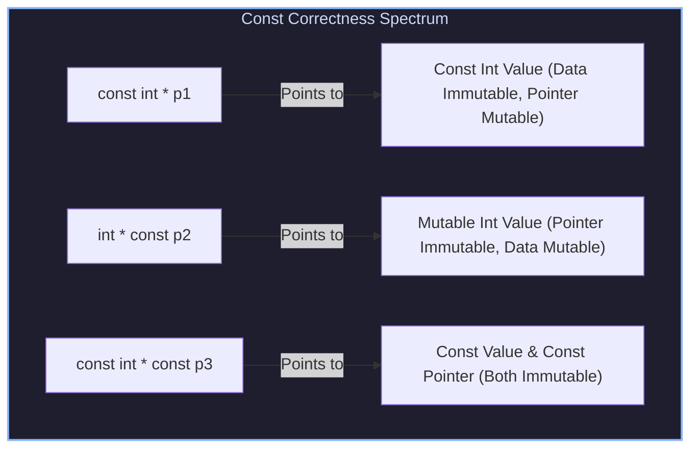
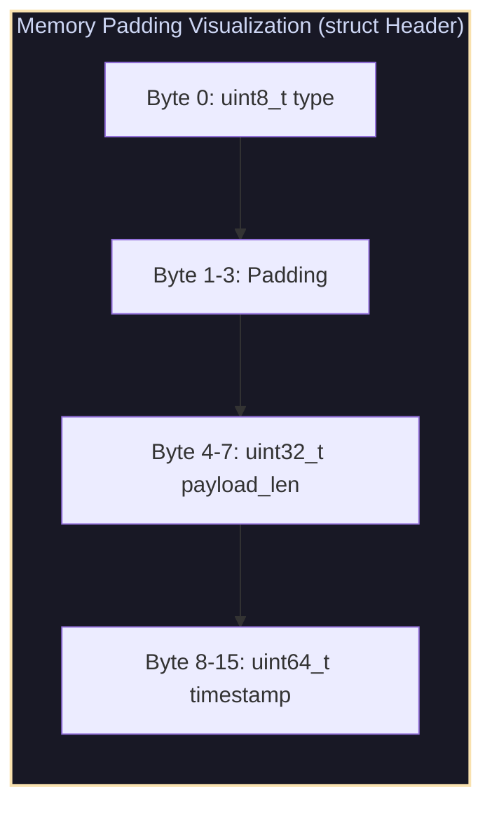

# Pointers, Custom Arena Allocators, Struct Alignment Padding & Bit-Fields

## 1. Pointer Mechanics & Function Pointers

Pointers store raw memory addresses. Understanding pointer types, indirection levels, and const-correctness is fundamental to system-level C programming.



### 1.1 Function Pointers & Callback Registration
Function pointers hold the entry address of executable machine instructions:

```c
typedef void (*EventHandler)(int event_id, void *user_data);

void RegisterCallback(int event_id, EventHandler handler, void *user_data);
```

---

## 2. Custom Arena (Region-Based) Allocators

Standard heap allocation via `malloc` and `free` incurs metadata overhead and risk of memory fragmentation/leaks. **Arena Allocators** allocate a large contiguous block of memory up-front and satisfy allocations via simple pointer increments (bump allocation):

$$\text{Bump Allocation}: \quad \text{ptr}_{\text{allocated}} = \text{arena.current}, \quad \text{arena.current} += \text{align\_up}(\text{size}, \text{align})$$

```
                            Arena Memory Block
+-----------------------+-----------------------+-------------------------------+
| Allocated Chunk 1     | Allocated Chunk 2     | Unallocated Free Memory       |
+-----------------------+-----------------------+-------------------------------+
^                       ^                       ^                               ^
Arena Start             Chunk 2 Start           Current Bump Pointer            Arena End
```

---

## 3. Structure Alignment, Padding & Bit-Fields

Compilers insert hidden **padding bytes** inside `struct` definitions to satisfy CPU hardware alignment constraints.



### 3.1 Bit-Fields & Tagged Unions
Bit-fields pack small integers into specific bit counts:

```c
struct StatusFlags {
    uint32_t is_active : 1;
    uint32_t is_ready  : 1;
    uint32_t error_code: 6;
    uint32_t reserved  : 24;
};
```

---

## 4. Production C Engine: Custom Arena Allocator & Binary Struct Serializer

The following C program implements a alignment-safe Arena Allocator and binary struct packing utility:

```c
#include <stdio.h>
#include <stdlib.h>
#include <stdint.h>
#include <stddef.h>
#include <string.h>
#include <stdbool.h>

// Custom Arena Allocator Structure
typedef struct {
    uint8_t *buffer;
    size_t capacity;
    size_t offset;
} Arena;

static Arena ArenaInit(size_t capacity) {
    Arena a;
    a.buffer = (uint8_t *)malloc(capacity);
    a.capacity = capacity;
    a.offset = 0;
    return a;
}

static void *ArenaAlloc(Arena *a, size_t size, size_t alignment) {
    // Calculate aligned memory address
    uintptr_t current_ptr = (uintptr_t)(a->buffer + a->offset);
    uintptr_t aligned_ptr = (current_ptr + (alignment - 1)) & ~(alignment - 1);
    size_t new_offset = (aligned_ptr - (uintptr_t)a->buffer) + size;

    if (new_offset > a->capacity) {
        fprintf(stderr, "[Arena Error] Out of Memory!\n");
        return NULL;
    }

    a->offset = new_offset;
    return (void *)aligned_ptr;
}

static void ArenaReset(Arena *a) {
    a->offset = 0; // O(1) deallocation of ALL allocated memory!
}

static void ArenaFree(Arena *a) {
    free(a->buffer);
    a->buffer = NULL;
    a->capacity = 0;
    a->offset = 0;
}

// Packed Packet Header Structure
typedef struct {
    uint16_t magic;
    uint8_t  flags;
    uint32_t payload_len;
} PacketHeader;

int main(void) {
    printf("Initializing Custom Arena Allocator (1024 bytes)...\n");
    Arena arena = ArenaInit(1024);

    // Allocate 3 packet headers sequentially using bump allocation
    PacketHeader *hdr1 = (PacketHeader *)ArenaAlloc(&arena, sizeof(PacketHeader), _Alignof(PacketHeader));
    PacketHeader *hdr2 = (PacketHeader *)ArenaAlloc(&arena, sizeof(PacketHeader), _Alignof(PacketHeader));

    hdr1->magic = 0xABCD; hdr1->flags = 0x01; hdr1->payload_len = 128;
    hdr2->magic = 0xABCD; hdr2->flags = 0x02; hdr2->payload_len = 256;

    printf("Header 1 Allocated at Offset %td | Magic: 0x%X\n", 
           (uint8_t *)hdr1 - arena.buffer, hdr1->magic);
    printf("Header 2 Allocated at Offset %td | Magic: 0x%X\n", 
           (uint8_t *)hdr2 - arena.buffer, hdr2->magic);
    printf("Total Arena Memory Used: %zu / %zu bytes\n", arena.offset, arena.capacity);

    printf("\nResetting Arena Memory in O(1) time...\n");
    ArenaReset(&arena);
    printf("Arena Memory Used after Reset: %zu bytes\n", arena.offset);

    ArenaFree(&arena);
    return 0;
}
```

---

## 5. Summary & Key Engineering Principles

1. **Bump Allocation Performance**: Custom Arena Allocators satisfy memory requests in constant $O(1)$ time while providing instant $O(1)$ teardown of all allocated memory.
2. **Alignment Safety**: Always align allocated memory addresses to matching type alignment boundaries (`_Alignof(T)`).
3. **Const Correctness**: Use `const` pointers (`const T *`) for read-only function inputs to enforce compile-time immutability contracts.
