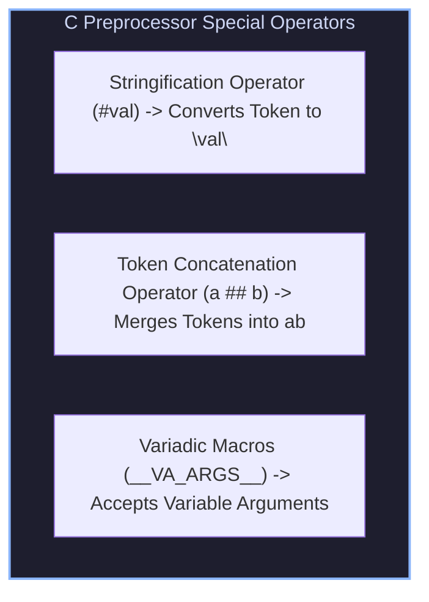

# C Preprocessor Metaprogramming, Standard Library I/O, `memmove` & C11 `_Generic` Features

## 1. Advanced Preprocessor Metaprogramming

The C Preprocessor operates prior to code compilation, manipulating source tokens directly:



### 1.1 Stringification (`#`) and Token Concatenation (`##`)
```c
#define LOG_VAR(var) printf(#var " = %d\n", var)
#define DECLARE_SETTER(type, name) void set_##name(type val) { name = val; }

#define DEBUG_LOG(fmt, ...) fprintf(stderr, "[DEBUG] " fmt "\n", ##__VA_ARGS__)
```

---

## 2. Standard Library Memory & File I/O Safety

### 2.1 `memcpy` vs `memmove` Safety Rule
* **`memcpy(dest, src, n)`**: Fast memory copy. **Requires that memory regions DO NOT overlap**. If regions overlap, behavior is undefined!
* **`memmove(dest, src, n)`**: Safe memory copy. Correctly handles overlapping memory regions by copying backwards if `dest > src`.

```
Overlapping Copy Hazard (Shift Array Elements Right by 1 Position):
Array: [ A, B, C, D, E ]
memcpy(arr + 1, arr, 4 * sizeof(elem))  --> UNDEFINED BEHAVIOR!
memmove(arr + 1, arr, 4 * sizeof(elem)) --> SAFE! Yields [ A, A, B, C, D ]
```

---

## 3. C99 & C11 Modern Language Features

### 3.1 C99 Designated Initializers
Explicitly initializes specific struct fields or array indices by name:

```c
struct Configuration config = {
    .host = "127.0.0.1",
    .port = 8080,
    .timeout_ms = 5000
};
```

### 3.2 C99 `restrict` Pointers
Qualifying a pointer with `restrict` guarantees to the compiler that no other pointer will access the target memory region during function execution, enabling aggressive loop vectorization and register caching:

```c
void VectorAdd(float * restrict dst, const float * restrict src1, const float * restrict src2, size_t n);
```

### 3.3 C11 `_Generic` Type-Generic Macros
Provides compile-time type-based function dispatch without C++ template overhead:

```c
#define PrintVal(x) _Generic((x), \
    int: PrintInt, \
    double: PrintDouble, \
    const char*: PrintString \
)(x)
```

---

## 4. Production C Engine: `_Generic` Type Dispatcher & Safe Memory Processor

The following C program demonstrates C11 `_Generic` type-generic macro dispatch, safe overlapping `memmove` processing, and variadic preprocessor logging:

```c
#include <stdio.h>
#include <stdlib.h>
#include <string.h>
#include <stdint.h>

// Variadic Debug Logging Macro with Stringification
#define LOG_INFO(fmt, ...) printf("[INFO %s:%d] " fmt "\n", __FILE__, __LINE__, ##__VA_ARGS__)

// Type-Generic Print Dispatcher using C11 _Generic
static void PrintIntVal(int x) { printf("Type: int | Value: %d\n", x); }
static void PrintDoubleVal(double x) { printf("Type: double | Value: %.4f\n", x); }
static void PrintStringVal(const char *x) { printf("Type: string | Value: \"%s\"\n", x); }

#define PrintTyped(X) _Generic((X), \
    int: PrintIntVal, \
    double: PrintDoubleVal, \
    char*: PrintStringVal, \
    const char*: PrintStringVal \
)(X)

// Safe Memory Shift Function using memmove
static void ShiftArrayRight(int *arr, size_t len, size_t shift_amount) {
    if (shift_amount >= len) return;
    // Overlapping memory regions MUST use memmove, NOT memcpy!
    memmove(arr + shift_amount, arr, (len - shift_amount) * sizeof(int));
}

int main(void) {
    LOG_INFO("Demonstrating C11 _Generic Type-Generic Macro Dispatch:");
    PrintTyped(42);
    PrintTyped(3.14159);
    PrintTyped("C Programming: A Modern Approach");

    printf("\nTesting Overlapping Memory Copy via memmove...\n");
    int numbers[6] = {10, 20, 30, 40, 0, 0};

    printf("Original Array : [ ");
    for (size_t i = 0; i < 6; ++i) printf("%d ", numbers[i]);
    printf("]\n");

    ShiftArrayRight(numbers, 6, 2);

    printf("Shifted Array  : [ ");
    for (size_t i = 0; i < 6; ++i) printf("%d ", numbers[i]);
    printf("]\n");

    return 0;
}
```

---

## 5. Summary & Key Engineering Takeaways

1. **Overlapping Copy Safety**: Always use `memmove` instead of `memcpy` when source and destination memory buffers overlap.
2. **`restrict` Vectorization**: Use C99 `restrict` pointers to guarantee non-aliasing memory for aggressive loop auto-vectorization.
3. **C11 `_Generic` Polymorphism**: Employs compile-time type matching to provide clean type-safe interfaces without runtime performance penalties.
