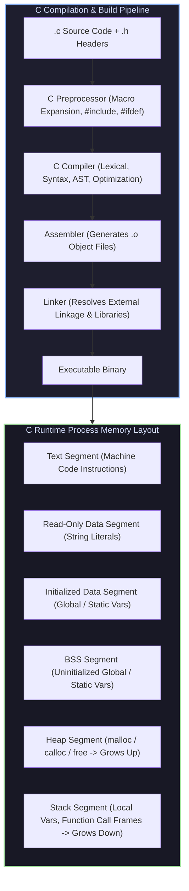

# C Programming: A Modern Approach (2nd Edition) — K. N. King

Welcome to the **C Programming: A Modern Approach Masterclass Module**. This module covers deep C programming across C89, C99, and C11 standards based on K. N. King's definitive textbook. Topics include fundamental types (`<stdint.h>`), sequence points, side effects, Variable-Length Arrays (VLAs), storage classes and linkage (`static` vs `extern`), pointers and pointer arithmetic, function pointers, custom Arena/Region allocators, structure padding and alignment (`offsetof`), bit-fields, preprocessor macros (`#`, `##`, `__VA_ARGS__`), `<stdio.h>` buffered file I/O, `<string.h>` (`memcpy` vs `memmove`), C99 designated initializers, `restrict` pointers, and C11 `_Generic` type-generic macros.

---

## 1. C Compilation Pipeline & Memory Layout

---

## 2. Module Navigation Map

| File | Description | Core Topics |
| :--- | :--- | :--- |
| **[`00_c_king_cheatsheet.md`](00_c_king_cheatsheet.md)** | 30-Second C Engineering Cheatsheet | Operator precedence table, pointer arithmetic rules, Undefined Behavior catalog, struct alignment padding math, macro preprocessor cheat table, C89 vs C99 vs C11 matrix. |
| **[`01_types_expressions_vlas_and_linkage.md`](01_c_fundamentals_control_arrays_and_functions/01_types_expressions_vlas_and_linkage.md)** | Types, Expressions, VLAs & Linkage | Fixed-width types (`<stdint.h>`), sequence points, integer promotion, C99 Variable-Length Arrays (VLAs), Storage classes (`static`, `extern`, `inline`), Production C VLA Engine, Mermaid stack frame diagram. |
| **[`02_pointers_arena_allocators_padding_and_bitfields.md`](02_pointers_dynamic_memory_structs_and_bit_fields/02_pointers_arena_allocators_padding_and_bitfields.md)** | Pointers, Arena Allocators & Structs | Pointer arithmetic, function pointers (`void (*fn)()` ), `malloc`/`calloc`/`realloc`/`free`, custom Arena Allocator, struct alignment & `offsetof`, bit-fields, tagged unions, Production C Arena Allocator Engine, Mermaid memory layout diagram. |
| **[`03_macros_file_io_memmove_generic_and_atomics.md`](03_preprocessor_stdio_string_and_c99_c11_features/03_macros_file_io_memmove_generic_and_atomics.md)** | Preprocessor, Standard Library & C99/C11 | Preprocessor (`#`, `##`, `__VA_ARGS__`), `<stdio.h>` file streams, `memcpy` vs `memmove` overlapping safety, `<errno.h>`, C99 designated initializers, `restrict`, C11 `_Generic` macros, Production C File Stream & Generic Engine, Mermaid state diagram. |

---

## 3. Fundamental Rules of C Programming (K. N. King)

1. **Undefined Behavior (UB) Avoidance**: Never dereference null/dangling pointers, overflow signed integers, perform out-of-bounds array access, or modify a variable multiple times between sequence points.
2. **Explicit Memory Lifetime & Ownership**: Every byte allocated via `malloc` or an Arena allocator must have an explicit owner responsible for its lifetime and deallocation.
3. **Alignment-Conscious Structure Design**: Order structure members by descending size (`int64_t` $\to$ `int32_t` $\to$ `int16_t` $\to$ `char`) to minimize compiler alignment padding bytes.
