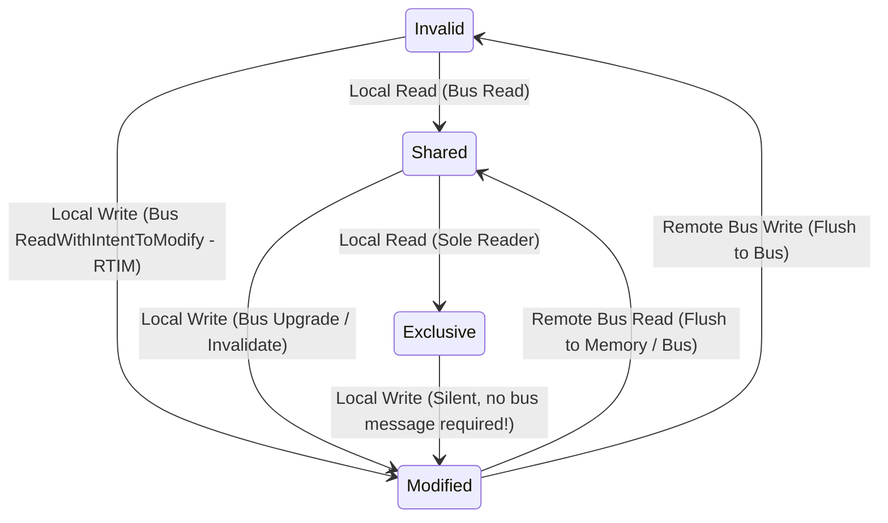
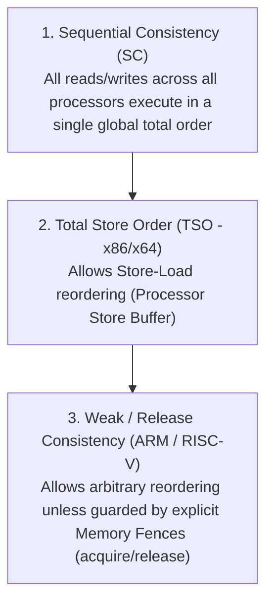

# 00. CMU 15-418 Cheatsheet & State Transition Matrix

A high-density reference guide summarizing parallel programming models, cache coherence protocols (MESI/MOESI), and memory consistency models from CMU 15-418/618.

---

## 📋 Parallel Programming Models Comparison

| Model | Target Hardware | Parallel Abstraction | Memory Space | Key Parameter / Construct |
| :--- | :--- | :--- | :--- | :--- |
| **OpenMP** | Shared Memory Multi-Core | Pragmas & Thread Pool | Shared Memory Space | `#pragma omp parallel for` |
| **CUDA (SIMT)** | NVIDIA GPUs | Grid -> Thread Block -> Warp | Dedicated Global / Shared / Local | `__global__ void kernel()`, `__syncthreads()` |
| **MPI** | Distributed Cluster Nodes | Explicit Message Passing | Private Isolated Memory | `MPI_Send()`, `MPI_Recv()`, `MPI_Bcast()` |
| **Cilk** | Multi-Core Task Parallelism | Work-Stealing Task Queue | Shared Memory Space | `cilk_spawn`, `cilk_sync` |
| **ISPC** | CPU SIMD / Vector Units | Single Program Multiple Data | Shared Memory Space | `foreach (i = 0 ... count)` (AVX-512) |

---

## 🔄 MESI Cache Coherence Protocol State Matrix

| State | Line Valid? | Memory Updated? | Other Caches Have Copy? | Local Read | Local Write |
| :--- | :--- | :--- | :--- | :--- | :--- |
| **M (Modified)** | Yes | **No** (Dirty in cache) | No | Cache Hit | Cache Hit (Silent) |
| **O (Owner - MOESI)**| Yes | **No** (Dirty, serving reads) | Yes (In S state) | Cache Hit | Cache Hit (Broadcast Invalidate) |
| **E (Exclusive)** | Yes | Yes (Clean) | No | Cache Hit | Cache Hit $\rightarrow$ Transition to M |
| **S (Shared)** | Yes | Yes (Clean) | **Yes** | Cache Hit | Bus Upgrade $\rightarrow$ Transition to M |
| **I (Invalid)** | **No** | N/A | N/A | Bus Read | Bus RTIM |

---

## 🧠 Memory Consistency Models Hierarchy

| Memory Model | Read-Read Reorder | Read-Write Reorder | Write-Write Reorder | Write-Read Reorder | Example Hardware |
| :--- | :--- | :--- | :--- | :--- | :--- |
| **Sequential Consistency (SC)**| Forbidden | Forbidden | Forbidden | Forbidden | MIPS R10000 |
| **Total Store Order (TSO)** | Forbidden | Forbidden | Forbidden | **Allowed** | Intel x86, AMD64 |
| **Release Consistency** | **Allowed** | **Allowed** | **Allowed** | **Allowed** | ARMv8, RISC-V |
