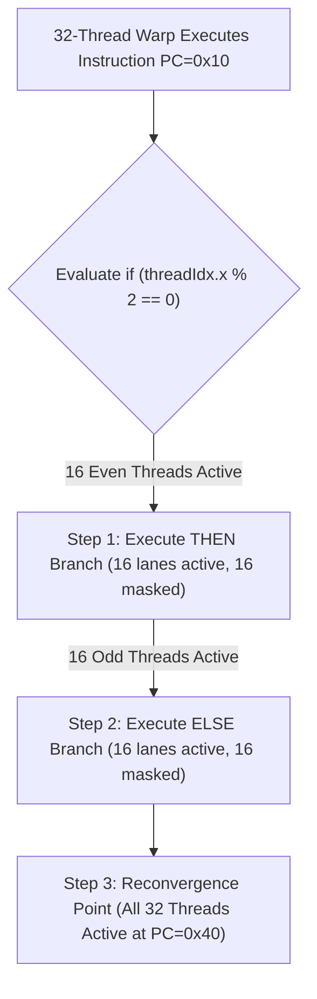
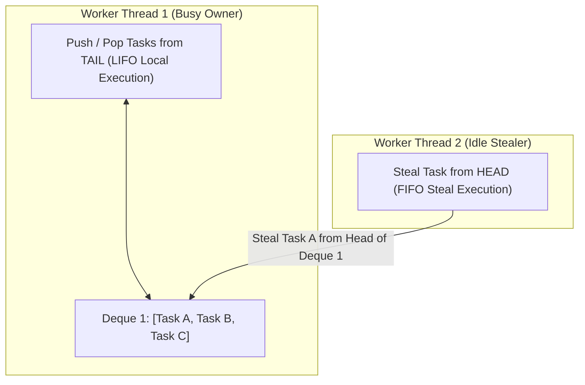

# 01. SIMD Vector Execution, GPU SIMT & Work-Stealing

This chapter covers parallel hardware execution models: SIMD (Single Instruction Multiple Data) vector execution, GPU SIMT (Single Instruction Multiple Threads) execution, branch divergence, and work-stealing task schedulers.

---

## ⚡ SIMT GPU Architecture & Branch Divergence

NVIDIA GPUs execute threads in groups of 32 called **Warps**. All 32 threads in a warp execute the exact same instruction on different data lanes.

### 🔀 Branch Divergence in a Warp

When an `if (threadIdx.x % 2 == 0)` condition diverges, the warp **serializes** execution paths by masking out inactive threads:



---

## 🤹 Cilk Work-Stealing Task Scheduler

Work-Stealing dynamically balances irregular task trees across $P$ worker threads using double-ended queues (Deques).



---

## 💻 Production C++ Implementation: SIMD Vector Execution & CUDA Kernel Simulator

```cpp
#include <iostream>
#include <vector>
#include <cmath>
#include <chrono>
#include <omp.h>

/**
 * SIMD Vector Processing Engine simulating AVX-512 vector lane operations.
 */
class SimdVectorEngine {
public:
    static void addArraysSimd(const float* a, const float* b, float* c, int n) {
        #pragma omp simd
        for (int i = 0; i < n; ++i) {
            c[i] = a[i] + b[i];
        }
    }

    static void multiplyAddVectorized(const float* a, const float* b, float scale, float* result, int n) {
        #pragma omp parallel for simd schedule(static)
        for (int i = 0; i < n; ++i) {
            result[i] = std::fma(a[i], b[i], scale); // Fused Multiply-Add (FMA)
        }
    }
};

/**
 * CUDA SIMT Thread Block Execution Simulator.
 */
class CudaBlockSimulator {
private:
    int blockDimX;
    int gridDimX;

public:
    CudaBlockSimulator(int blockDimX, int gridDimX) : blockDimX(blockDimX), gridDimX(gridDimX) {}

    // Simulates CUDA thread block kernel execution
    template<typename KernelFunc>
    void launchKernel(KernelFunc kernel) {
        #pragma omp parallel for collapse(2)
        for (int blockIdxX = 0; blockIdxX < gridDimX; ++blockIdxX) {
            for (int threadIdxX = 0; threadIdxX < blockDimX; ++threadIdxX) {
                int globalThreadId = blockIdxX * blockDimX + threadIdxX;
                kernel(blockIdxX, threadIdxX, globalThreadId);
            }
        }
    }
};

int main() {
    const int N = 1000000;
    std::vector<float> a(N, 2.0f);
    std::vector<float> b(N, 3.0f);
    std::vector<float> c(N, 0.0f);

    auto start = std::chrono::high_resolution_clock::now();

    // Launch SIMD Vector Addition
    SimdVectorEngine::addArraysSimd(a.data(), b.data(), c.data(), N);

    auto end = std::chrono::high_resolution_clock::now();
    std::chrono::duration<double, std::milli> duration = end - start;

    std::cout << "[SIMD] Executed " << N << " vector lane additions in " << duration.count() << " ms." << std::endl;
    std::cout << "[SIMD] Sample Result c[0] = " << c[0] << std::endl;

    // Simulate CUDA SIMT Kernel Launch: 256 threads per block across 10 blocks
    CudaBlockSimulator cudaSim(256, 10);
    cudaSim.launchKernel([](int blockIdx, int threadIdx, int globalId) {
        if (globalId == 0) {
            std::cout << "[CUDA SIMT] Kernel executed on Block " << blockIdx << ", Thread " << threadIdx << std::endl;
        }
    });

    return 0;
}
```
