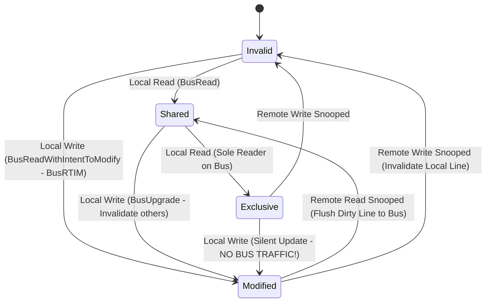
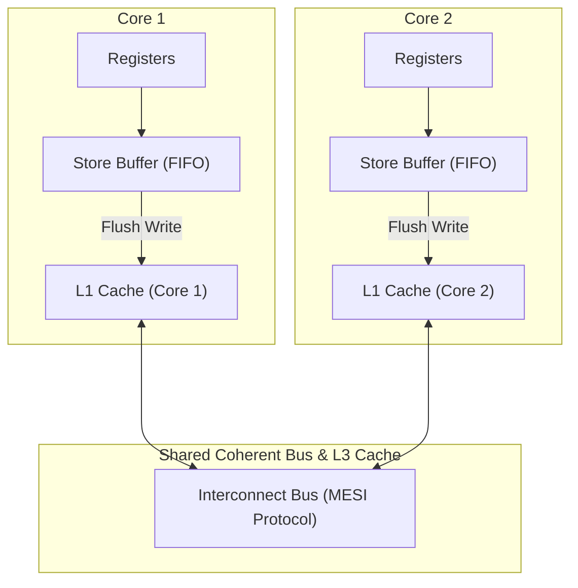

# 02. MESI/MOESI Cache Coherence & Memory Consistency Models

This chapter details hardware cache coherence protocols (MESI / MOESI), false sharing mitigation, and memory consistency models (Sequential Consistency, TSO, Acquire-Release semantics).

---

## 🔄 MESI Cache Coherence Protocol FSM

To ensure multi-core processors maintain a coherent view of memory, hardware implements the **MESI** (or MOESI) protocol over a snooping bus or directory mesh.



---

## 🧠 Total Store Order (TSO) Memory Consistency Model

x86-64 architectures implement **Total Store Order (TSO)**. TSO inserts a **Store Buffer** between each core and the L1 cache, allowing stores to buffer asynchronously and causing **Store-Load reordering**.



> **Why Store-Load Reordering Occurs**: Core 1 writes `X = 1` into its local Store Buffer and immediately reads `Y`. Because `Y` is read from L1 cache before the Store Buffer flushes `X = 1` to L1, Core 2 may observe `Y` before seeing `X = 1`.
> **Fix**: Insert a Memory Fence (`std::atomic_thread_fence(std::memory_order_seq_cst)` or `mfence` instruction).

---

## 💻 Production C++ Implementation: False Sharing Benchmark & Atomic Memory Fences

```cpp
#include <iostream>
#include <thread>
#include <vector>
#include <atomic>
#include <chrono>

// Cache line size on modern x86/ARM processors is 64 bytes
constexpr size_t CACHE_LINE_SIZE = 64;

/**
 * Vulnerable to False Sharing: Both threads modify adjacent integers on the SAME 64-byte cache line!
 */
struct FalseSharingStruct {
    uint64_t counterA; // Shared Cache Line
    uint64_t counterB; // Shared Cache Line
};

/**
 * Mitigated using Cache Line Alignment: Ensures counterA and counterB sit on SEPARATE 64-byte cache lines.
 */
struct alignas(CACHE_LINE_SIZE) AlignedStruct {
    uint64_t counterA;
    alignas(CACHE_LINE_SIZE) uint64_t counterB;
};

void runBenchmark() {
    const uint64_t ITERATIONS = 100000000;

    // 1. False Sharing Test
    FalseSharingStruct badStruct{0, 0};
    auto start1 = std::chrono::high_resolution_clock::now();

    std::thread t1([&]() {
        for (uint64_t i = 0; i < ITERATIONS; ++i) badStruct.counterA++;
    });
    std::thread t2([&]() {
        for (uint64_t i = 0; i < ITERATIONS; ++i) badStruct.counterB++;
    });

    t1.join();
    t2.join();

    auto end1 = std::chrono::high_resolution_clock::now();
    std::chrono::duration<double, std::milli> durationFalseSharing = end1 - start1;

    // 2. Aligned (No False Sharing) Test
    AlignedStruct goodStruct{0, 0};
    auto start2 = std::chrono::high_resolution_clock::now();

    std::thread t3([&]() {
        for (uint64_t i = 0; i < ITERATIONS; ++i) goodStruct.counterA++;
    });
    std::thread t4([&]() {
        for (uint64_t i = 0; i < ITERATIONS; ++i) goodStruct.counterB++;
    });

    t3.join();
    t4.join();

    auto end2 = std::chrono::high_resolution_clock::now();
    std::chrono::duration<double, std::milli> durationAligned = end2 - start2;

    std::cout << "[FALSE SHARING BENCHMARK] Unaligned Duration: " << durationFalseSharing.count() << " ms" << std::endl;
    std::cout << "[CACHE ALIGNED BENCHMARK] Aligned Duration:   " << durationAligned.count() << " ms" << std::endl;
    std::cout << "[SPEEDUP] Alignment improved performance by " << (durationFalseSharing.count() / durationAligned.count()) << "x!" << std::endl;
}

/**
 * Acquire-Release Memory Synchronization Example.
 */
class AcquireReleaseLock {
private:
    std::atomic<bool> flag{false};

public:
    void lock() {
        // Spin until flag becomes false, then set to true with acquire semantics
        while (flag.exchange(true, std::memory_order_acquire)) {
            #if defined(__x86_64__) || defined(_M_X64)
            __builtin_ia32_pause(); // Low-power CPU spin pause
            #endif
        }
    }

    void unlock() {
        // Release semantics guarantee all memory writes before unlock are visible to next lock acquire
        flag.store(false, std::memory_order_release);
    }
};

int main() {
    runBenchmark();
    return 0;
}
```
