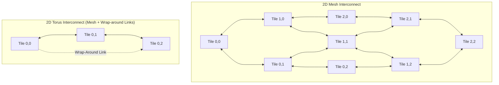
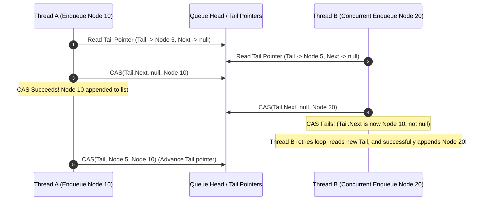

# 03. Interconnect Topologies & Lock-Free Data Structures

This chapter covers Network-on-Chip (NoC) interconnect topologies, bisection bandwidth math, hardware atomic primitives (CAS, LL/SC), and lock-free data structures (Michael-Scott Lock-Free Queue).

---

## 🕸️ Network-on-Chip (NoC) Interconnect Topologies

Interconnects connect multi-core CPU/GPU tiles, L3 caches, and memory controllers.



### 📊 Interconnect Metrics Comparison

| Topology | Node Degree | Diameter | Bisection Bandwidth | Use Case |
| :--- | :--- | :--- | :--- | :--- |
| **Bus** | 1 (Shared) | $O(1)$ | $O(1)$ (Constant) | Small 2–4 core systems |
| **Crossbar Switch** | $2N$ | $1$ | $O(N)$ | Small high-bandwidth switches ($N \le 16$) |
| **Ring** | 2 | $N / 2$ | $O(1)$ (Fixed 2 links) | Intel Skylake / Coffee Lake CPUs (10–12 cores) |
| **2D Mesh** | 4 | $2(\sqrt{N} - 1)$ | $O(\sqrt{N})$ | Intel Xeon Scalable (Mesh Architecture) |
| **2D Torus** | 4 | $\sqrt{N}$ | $O(\sqrt{N})$ | High-Performance Computing (Cray supercomputers) |
| **Fat-Tree** | $K$ (Switch dependent) | $2 \log_K N$ | $O(N)$ (Constant bisection per level) | Infiniband data center switches |

---

## 🔓 Michael-Scott Lock-Free Queue Execution Workflow

Lock-free data structures guarantee that **at least one thread makes progress** in a finite number of steps, eliminating thread starvation and deadlock risk.



---

## 💻 Production C++ Implementation: Lock-Free Michael-Scott Queue

```cpp
#include <iostream>
#include <atomic>
#include <memory>
#include <thread>
#include <vector>

/**
 * Production Michael-Scott Lock-Free Queue using std::atomic and Compare-And-Swap (CAS).
 */
template<typename T>
class LockFreeQueue {
private:
    struct Node {
        T data;
        std::atomic<Node*> next;

        Node() : next(nullptr) {}
        Node(T val) : data(val), next(nullptr) {}
    };

    std::atomic<Node*> head;
    std::atomic<Node*> tail;

public:
    LockFreeQueue() {
        Node* dummy = new Node();
        head.store(dummy);
        tail.store(dummy);
    }

    ~LockFreeQueue() {
        while (Node* oldHead = head.load()) {
            head.store(oldHead->next);
            delete oldHead;
        }
    }

    /**
     * Lock-free Enqueue operation using Compare-And-Swap.
     */
    void enqueue(T value) {
        Node* newNode = new Node(value);
        while (true) {
            Node* curTail = tail.load();
            Node* tailNext = curTail->next.load();

            // Check if tail pointer is consistent
            if (curTail == tail.load()) {
                if (tailNext == nullptr) {
                    // Try CAS linking new node at end of list
                    if (curTail->next.compare_exchange_weak(tailNext, newNode)) {
                        // CAS success: Advance tail pointer
                        tail.compare_exchange_strong(curTail, newNode);
                        return;
                    }
                } else {
                    // Tail was lagging behind: Help advance tail pointer
                    tail.compare_exchange_strong(curTail, tailNext);
                }
            }
        }
    }

    /**
     * Lock-free Dequeue operation using Compare-And-Swap.
     */
    bool dequeue(T& result) {
        while (true) {
            Node* curHead = head.load();
            Node* curTail = tail.load();
            Node* headNext = curHead->next.load();

            if (curHead == head.load()) {
                if (curHead == curTail) {
                    if (headNext == nullptr) {
                        return false; // Queue is EMPTY
                    }
                    // Tail lagging behind: Help advance tail
                    tail.compare_exchange_strong(curTail, headNext);
                } else {
                    // Read data before CAS
                    result = headNext->data;
                    // Try CAS advancing head pointer
                    if (head.compare_exchange_weak(curHead, headNext)) {
                        delete curHead; // Reclaim dummy node
                        return true;
                    }
                }
            }
        }
    }
};

int main() {
    LockFreeQueue<int> q;

    // Concurrent Multi-Threaded Test
    std::vector<std::thread> threads;
    for (int t = 0; t < 4; ++t) {
        threads.emplace_back([&q, t]() {
            for (int i = 0; i < 1000; ++i) {
                q.enqueue(t * 1000 + i);
            }
        });
    }

    for (auto& th : threads) {
        th.join();
    }

    int count = 0;
    int val;
    while (q.dequeue(val)) {
        count++;
    }

    std::cout << "[LOCK-FREE QUEUE] Successfully enqueued & dequeued " << count << " items concurrently!" << std::endl;
    return 0;
}
```
