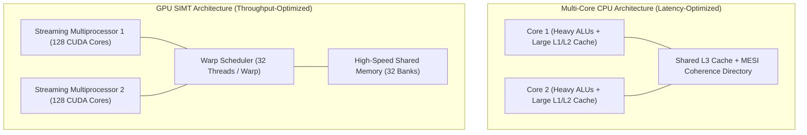

# CMU 15-418 / 618 — Parallel Computer Architecture & Programming

A masterclass on parallel computer architecture, GPU SIMT execution, cache coherence protocols (MESI/MOESI), memory consistency models, interconnect topologies, and lock-free data structures. Based on Carnegie Mellon University's course *CMU 15-418 / 618* taught by Professor Kayvon Fatahalian and Professor Nathan Beckmann.

---

## 📐 Table of Contents

| Section | Subject | Key Concepts |
| :--- | :--- | :--- |
| **00. Cheatsheet** | [CMU 15-418 Cheatsheet](00_cmu15418_cheatsheet.md) | Parallel Models Matrix (OpenMP, CUDA, MPI, Cilk), MESI/MOESI State Transitions, Memory Models Hierarchy |
| **01. Hardware & Execution Models** | [SIMD, GPU SIMT & Work-Stealing](01_hardware_and_execution_models/01_simd_gpu_simt_and_work_stealing.md) | SIMD Vector Execution (AVX-512), GPU CUDA SIMT Architecture (Warps, Thread Blocks, Divergence), Cilk Work-Stealing |
| **02. Cache Coherence & Consistency** | [MESI/MOESI & Memory Models](02_cache_coherence_and_memory_consistency/02_mesi_moesi_protocols_and_memory_models.md) | Bus-Snooping vs Directory Coherence, MESI & MOESI FSM, False Sharing, Sequential Consistency (SC) vs TSO vs Acquire-Release |
| **03. Interconnects & Lock-Free Structures** | [Interconnect Topologies & Lock-Free Queues](03_interconnects_and_lock_free_structures/03_interconnect_topologies_and_lock_free_queues.md) | NoC Topologies (Crossbar, Ring, 2D Mesh, 2D Torus, Fat-Tree), Bisection Bandwidth, Hardware CAS/LL-SC, Michael-Scott Lock-Free Queue |

---

## 🏗️ Parallel Hardware Architecture Taxonomy

---

## ⚡ Amdahl's Law vs Gustafson's Law

### 1. Amdahl's Law (Fixed Workload Size)
Measures theoretical speedup $S(p)$ when parallelizing a fixed problem size across $p$ processors:
$$S(p) = \frac{1}{(1 - s) + \frac{s}{p}}$$
Where $s$ is the parallelizable fraction of the code. If $5\%$ of the code is inherently sequential ($s=0.95$), the maximum speedup on infinite processors is $\frac{1}{0.05} = 20\times$.

### 2. Gustafson's Law (Scaled Workload Size)
Measures speedup when expanding problem size to match parallel hardware scaling:
$$S(p) = (1 - s) + s \times p = p - s(p - 1)$$
