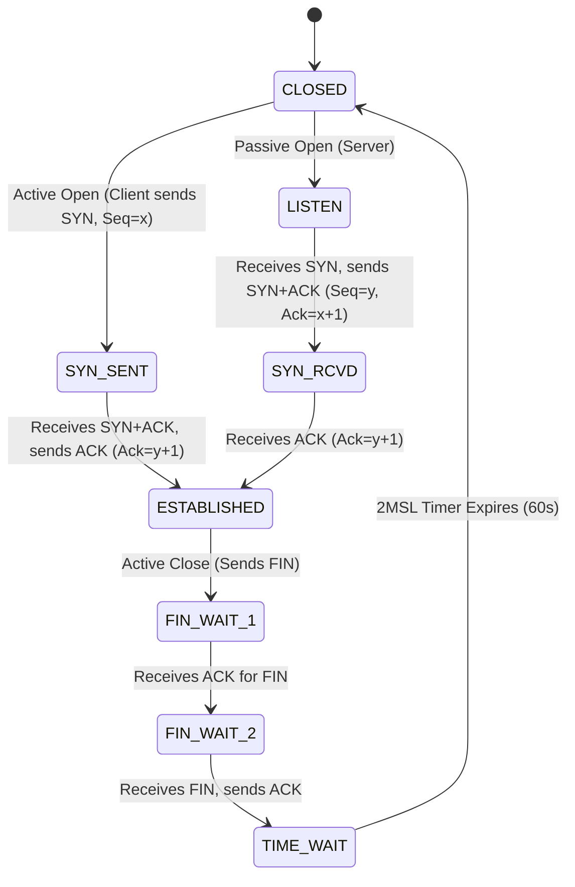

# Computer Networks 30-Second Interview Cheatsheet

---

## ⚡ Core Networking Equations & Quick Reference

### 1. CIDR Subnetting Formulas
$$\text{Total Addresses} = 2^{32 - \text{Prefix Length}}$$
$$\text{Usable Host Addresses} = 2^{32 - \text{Prefix Length}} - 2 \quad \text{(Excluding Network ID and Broadcast ID)}$$

#### Subnet Mask Quick Reference Table

| Subnet Prefix | Netmask | Total IP Addresses | Usable Host IPs |
|---|---|---|---|
| `/24` | `255.255.255.0` | 256 | 254 |
| `/25` | `255.255.255.128` | 128 | 126 |
| `/26` | `255.255.255.192` | 64 | 62 |
| `/27` | `255.255.255.224` | 32 | 30 |
| `/28` | `255.255.255.240` | 16 | 14 |
| `/30` | `255.255.255.252` | 4 | 2 (Point-to-Point Link) |
| `/32` | `255.255.255.255` | 1 | 1 (Single Host Loopback) |

---

## 📊 TCP 3-Way Handshake & Teardown State Diagram

---

## 🧠 Transport Layer Congestion Control Summary

$$\text{Effective Window Size} = \min(\text{Congestion Window } cwnd, \text{Receive Window } rwnd)$$

- **Slow Start**: $cwnd$ doubles every RTT ($cwnd = cwnd \times 2$) until $cwnd \ge ssthresh$.
- **Congestion Avoidance (AIMD)**: Additive Increase ($cwnd = cwnd + 1$ per RTT).
- **Multiplicative Decrease**: On packet loss:
  - **Triple Duplicate ACK (Fast Retransmit)**: Set $ssthresh = cwnd / 2$, $cwnd = ssthresh + 3$ (TCP Reno).
  - **Timeout Event**: Set $ssthresh = cwnd / 2$, $cwnd = 1$ MSS (TCP Tahoe).
