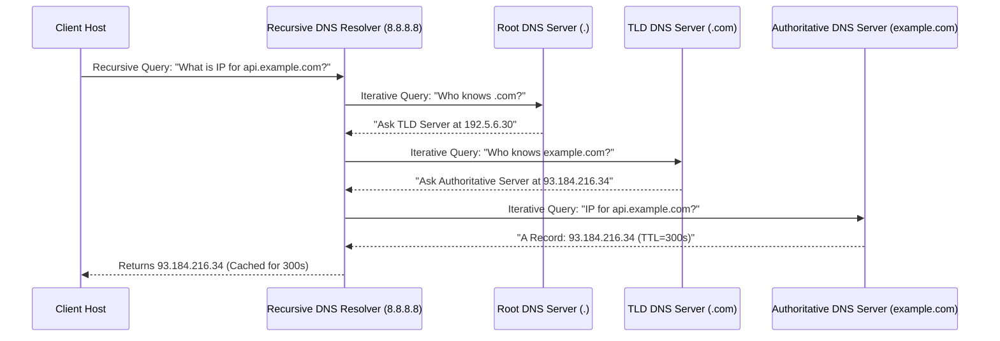

# Layer 5: Application Layer — HTTP, DNS & Socket API

The **Application Layer** provides network services directly to end-user applications.

---

## 📌 HTTP Protocol Evolution: HTTP/1.1 vs HTTP/2 vs HTTP/3 (QUIC)

```mermaid
flowchart TD
    subgraph HTTP/1.1 (TCP)
        H1["Multiple Parallel TCP Connections Required\n- Head-of-Line (HOL) Blocking\n- Verbose Text Headers"]
    end

    subgraph HTTP/2 (TCP + TLS)
        H2["Single TCP Connection with Binary Framing\n- Multiplexed Streams over 1 TCP Conn\n- HPACK Header Compression\n- Server Push"]
    end

    subgraph HTTP/3 (QUIC over UDP)
        H3["QUIC Transport Layer over UDP\n- Independent Streams (No TCP HOL Blocking!)\n- 0-RTT Connection Establishment\n- Connection Migration (IP Change Resilience)"]
    end

    H1 --> H2
    H2 --> H3
```

---

## 📌 DNS Hierarchy & Resolution Sequence



---

## 📌 Socket Programming API in Python

### 1. TCP Concurrent Server (`socket.SOCK_STREAM`)
```python
import socket
import threading

def handle_client(client_socket, addr):
    print(f"[+] Accepted connection from {addr}")
    request = client_socket.recv(1024)
    print(f"[*] Received: {request.decode('utf-8')}")
    client_socket.send(b"HTTP/1.1 200 OK\r\nContent-Length: 13\r\n\r\nHello World!\n")
    client_socket.close()

def main():
    server = socket.socket(socket.AF_INET, socket.SOCK_STREAM)
    server.setsockopt(socket.SOL_SOCKET, socket.SO_REUSEADDR, 1)
    server.bind(("0.0.0.0", 8080))
    server.listen(128)
    print("[*] TCP Listening on 0.0.0.0:8080...")

    while True:
        client_sock, addr = server.accept()
        client_handler = threading.Thread(target=handle_client, args=(client_sock, addr))
        client_handler.start()

if __name__ == "__main__":
    main()
```

### 2. UDP Echo Server (`socket.SOCK_DGRAM`)
```python
import socket

def main():
    server = socket.socket(socket.AF_INET, socket.SOCK_DGRAM)
    server.bind(("0.0.0.0", 9999))
    print("[*] UDP Listening on 0.0.0.0:9999...")

    while True:
        data, addr = server.recvfrom(2048)
        print(f"[*] Received {len(data)} bytes from {addr}")
        server.sendto(data, addr) # Echo back to sender!

if __name__ == "__main__":
    main()
```
