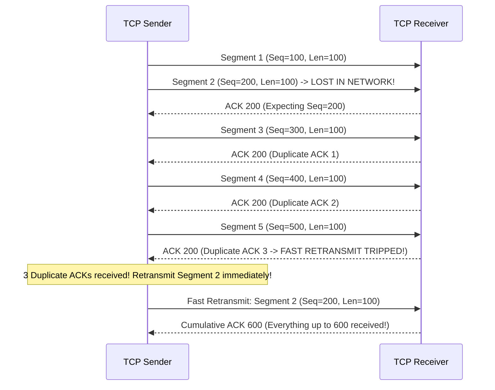
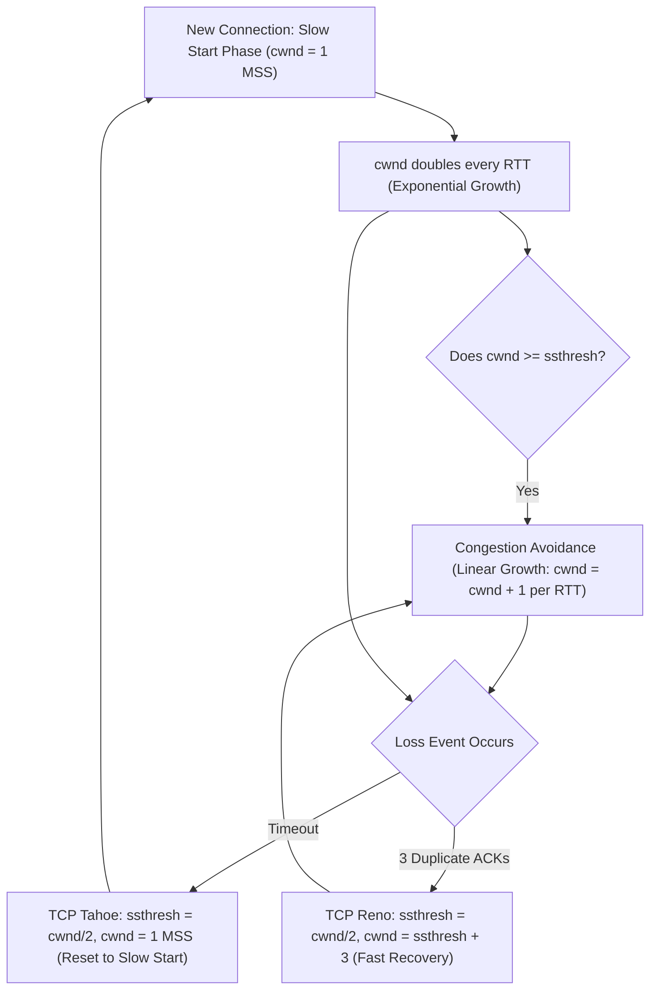

# Layer 4: Transport Layer — TCP, UDP, Flow & Congestion Control

The **Transport Layer** provides logical end-to-end communication between processes running on different hosts.

---

## 📌 TCP vs UDP Header Comparison

### TCP Segment Header (20 Bytes Overhead)
```
 0                   1                   2                   3
 0 1 2 3 4 5 6 7 8 9 0 1 2 3 4 5 6 7 8 9 0 1 2 3 4 5 6 7 8 9 0 1
+-+-+-+-+-+-+-+-+-+-+-+-+-+-+-+-+-+-+-+-+-+-+-+-+-+-+-+-+-+-+-+-+
|          Source Port          |       Destination Port        |
+-+-+-+-+-+-+-+-+-+-+-+-+-+-+-+-+-+-+-+-+-+-+-+-+-+-+-+-+-+-+-+-+
|                        Sequence Number                        |
+-+-+-+-+-+-+-+-+-+-+-+-+-+-+-+-+-+-+-+-+-+-+-+-+-+-+-+-+-+-+-+-+
|                     Acknowledgment Number                     |
+-+-+-+-+-+-+-+-+-+-+-+-+-+-+-+-+-+-+-+-+-+-+-+-+-+-+-+-+-+-+-+-+
| Data |Reserved|N|C|E|U|A|P|R|S|F|            Window             |
| Offset|        |S|W|C|R|C|S|S|Y|I|            (rwnd)             |
+-+-+-+-+-+-+-+-+-+-+-+-+-+-+-+-+-+-+-+-+-+-+-+-+-+-+-+-+-+-+-+-+
|           Checksum            |         Urgent Pointer        |
+-+-+-+-+-+-+-+-+-+-+-+-+-+-+-+-+-+-+-+-+-+-+-+-+-+-+-+-+-+-+-+-+
```

---

## 📌 Reliable Data Transfer (RDT 3.0) & Sliding Window

To handle lossy networks, TCP uses **Sequence Numbers**, **Cumulative ACKs**, and **Retransmission Timers**.



---

## 📌 TCP Congestion Control Dynamics (AIMD, Tahoe, Reno)

TCP dynamically adjusts its **Congestion Window ($cwnd$)** to prevent network buffer overflow.


