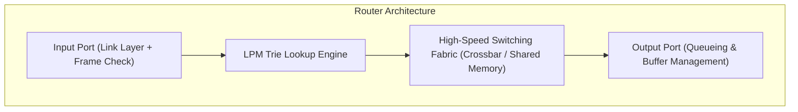
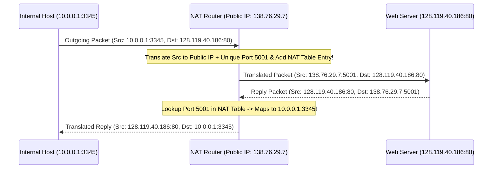

# Layer 3: Network Layer (Data Plane) — IP, Subnetting & NAT

The **Data Plane** determines how datagrams arriving at router input ports are forwarded to router output ports via **Longest Prefix Match (LPM)**.

---

## 📌 Router Architecture & Longest Prefix Match (LPM)

### Forwarding Table Trie Example
If a router forwarding table has:
- `192.168.0.0/16` $\to$ Interface 1
- `192.168.1.0/24` $\to$ Interface 2
- `192.168.1.128/25` $\to$ Interface 3

A datagram for `192.168.1.135` matches **all three**, but Interface 3 is selected because `/25` is the **Longest Prefix Match**!

---

## 📌 CIDR Subnetting Math & Calculation Walkthrough

Given IP `172.16.45.100/22`:
1. **Subnet Mask**: 22 ones $\to$ `11111111.11111111.11111100.00000000` = `255.255.252.0`.
2. **Network Address**: Bitwise AND of IP and Mask:
   - `45` in binary: `00101101`
   - `252` in binary: `11111100`
   - Bitwise AND: `00101100` = `44`
   - **Network ID**: `172.16.44.0`
3. **Broadcast Address**: Set all host bits (10 bits) to 1:
   - `00101111` = `47`, `11111111` = `255`
   - **Broadcast ID**: `172.16.47.255`
4. **Host Range**: `172.16.44.1` to `172.16.47.254` (1,022 usable hosts).

---

## 📌 Network Address Translation (NAT)

NAT maps private local IP addresses (`10.0.0.0/8`, `192.168.0.0/16`) to a single public WAN IP address using port numbers.

