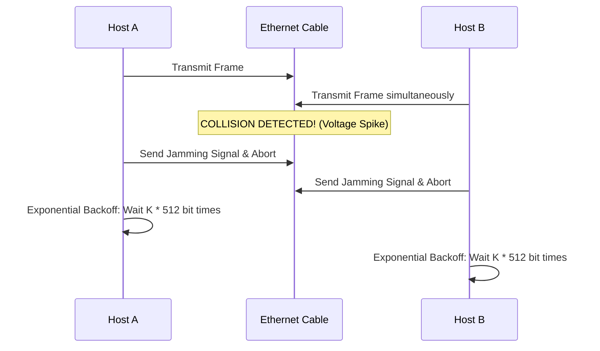
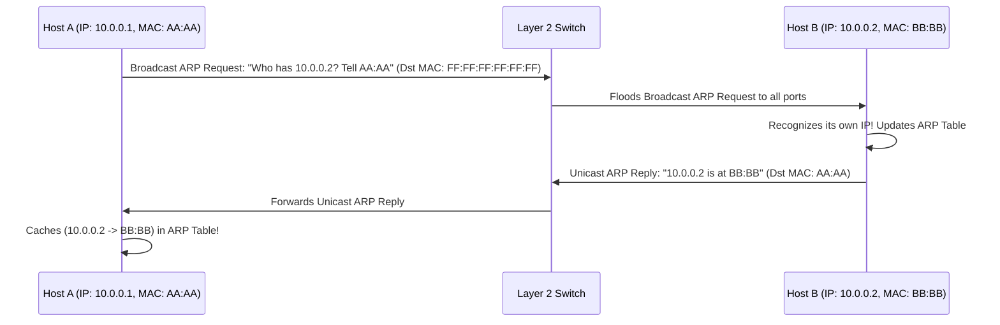

# Layers 1-2: Link & Physical Layer — Ethernet, WiFi, ARP & Switches

The **Link Layer** moves frames across individual physical links connecting neighboring network nodes.

---

## 📌 Multiple Access Protocols: CSMA/CD vs CSMA/CA

### 1. CSMA/CD (Carrier Sense Multiple Access / Collision Detection — Wired Ethernet)
- **Carrier Sense**: Listen before transmitting.
- **Collision Detection**: If two hosts transmit simultaneously, detect voltage spike, stop immediately, send jamming signal, and wait using **Binary Exponential Backoff** ($K \times 512$ bit times).

### 2. CSMA/CA (Collision Avoidance — 802.11 Wireless WiFi)
Wireless signals cannot detect collisions while transmitting (transmitter drowns out incoming signals). Uses **RTS/CTS (Request to Send / Clear to Send)** reservation frames.

---

## 📌 Address Resolution Protocol (ARP)

ARP translates IP addresses (Layer 3) to MAC addresses (Layer 2).

---

## 📌 CRC Error Detection (Polynomial Long Division)

Given Data $D = 101001$ and Generator Polynomial $G = 1101$ ($r = 3$ bits):
1. Append $r=3$ zeros to $D$: $D' = 101001000$.
2. Divide $D'$ by $G$ using modulo-2 arithmetic (XOR subtraction):
   - $101001000 \oplus 1101 = \dots \implies \text{Remainder } R = 011$.
3. Transmitted Frame = $D \cdot 2^r \oplus R = 101001011$.
4. Receiver divides Frame by $G$. If remainder is $000$, no bit errors occurred!
