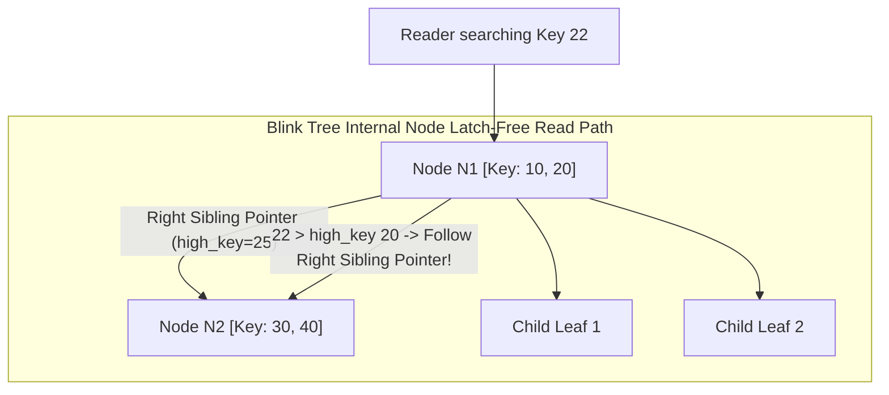
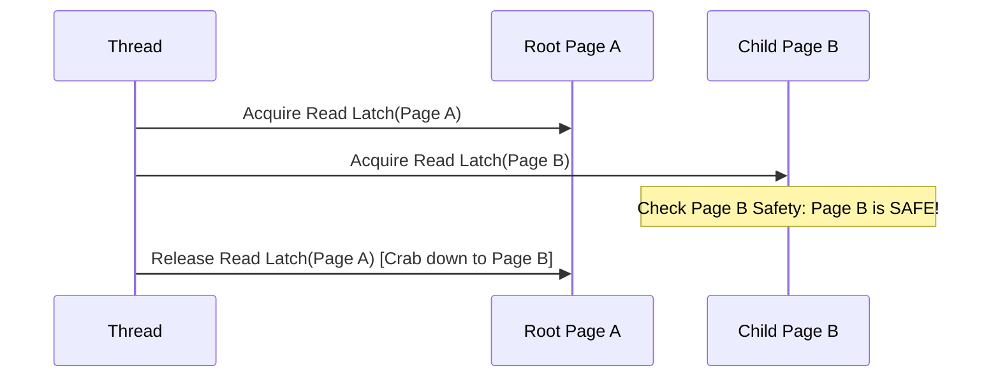

# Part I: Storage Engines — B-Tree Variants & Page Layouts

Storage engines manage binary page layouts, record pointers, and page latching for high-concurrency access.

---

## 📌 $B^+$ Tree vs $B^*$ Tree vs $B^{\text{link}}$ Tree

- **$B^+$ Tree**: Data pointers reside exclusively in leaves; leaf nodes linked in a singly/doubly linked list.
- **$B^*$ Tree**: Delays node splits by redistributing keys among neighboring sibling nodes. Nodes are kept at least $\frac{2}{3}$ full (compared to $\frac{1}{2}$ for standard B+ Trees).
- **$B^{\text{link}}$ Tree (Lehman-Yao Tree)**: Adds a **right-sibling pointer** to every node (both internal and leaf nodes). Allows readers to traverse without acquiring read latches!



---

## 📌 Latching Crabbing (Coupled Latching)

To prevent structural modification operations (e.g. node splits) from corrupting concurrent page reads, traversals use **Latching Crabbing**:

1. Latch parent node $P$.
2. Latch child node $C$.
3. If child $C$ is **safe** (will not split on insert, will not merge on delete), release parent latch $P$.



---

## 📌 Slotted Page Binary Layout C++ Representation

```cpp
#include <cstdint>

struct SlottedPageHeader {
    uint16_t lsn;             // Log Sequence Number
    uint16_t num_slots;       // Total number of slots in slot array
    uint16_t free_space_pointer;// Offset to start of free space (grows downward)
    uint16_t flags;           // Flags (Leaf vs Internal node)
};

struct Slot {
    uint16_t offset;          // Byte offset of record from start of page
    uint16_t length;          // Length of record in bytes
};

// Complete Page Layout:
// [ SlottedPageHeader | Slot 0 | Slot 1 | ... | Free Space | Record 1 | Record 0 ]
```
