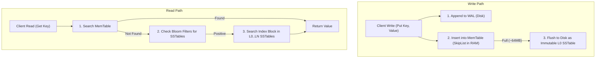
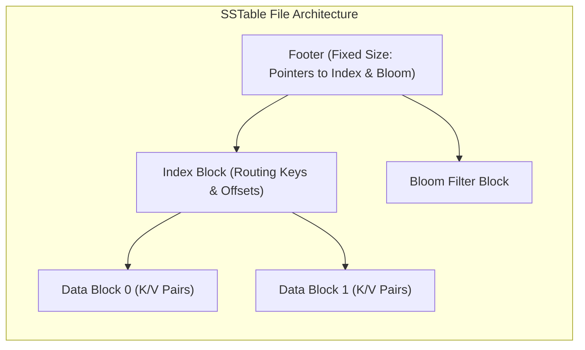
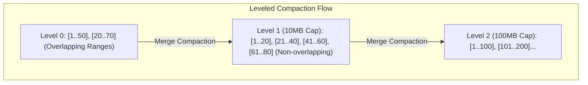

# Part I: Storage Engines — LSM-Trees, MemTables & Compaction

Log-Structured Merge-Trees (LSM-Trees) convert random disk writes into high-throughput sequential appends.

---

## 📌 LSM-Tree Write and Read Data Paths

---

## 📌 SSTable Binary Layout

An **SSTable (Sorted String Table)** is an immutable disk file storing key-value pairs sorted by key.

---

## 📌 Compaction Strategies: Size-Tiered vs Leveled Compaction

Because SSTables are immutable, multiple SSTables can contain duplicate or deleted (tombstone) entries for the same key. **Compaction** merges SSTables in the background to reclaim space and maintain read performance.

### 1. Size-Tiered Compaction (STCS — Cassandra Default)
Accumulates SSTables of similar sizes. When $N$ SSTables of similar size exist, merge them into 1 larger SSTable.
- **Pros**: Fast writes, low write amplification.
- **Cons**: High space amplification (requires up to 50% free disk space for compaction!).

### 2. Leveled Compaction (LCS — RocksDB / LevelDB Default)
Organizes SSTables into discrete levels ($L_0, L_1, L_2, \dots$). Each level has a fixed total size cap ($L_1 = 10\text{MB}, L_2 = 100\text{MB}, L_3 = 1\text{GB}$).
- Key ranges within Level 1..$N$ are **strictly non-overlapping**.
- When Level $N$ exceeds its size cap, select an SSTable and merge-sort it with overlapping key-range SSTables in Level $N+1$.

