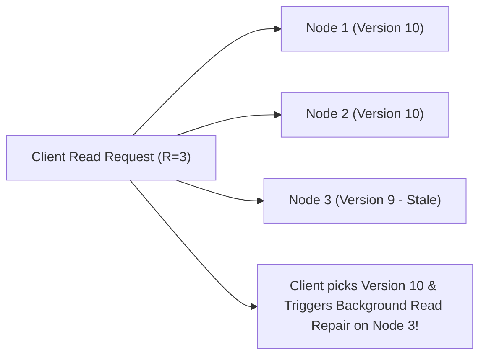
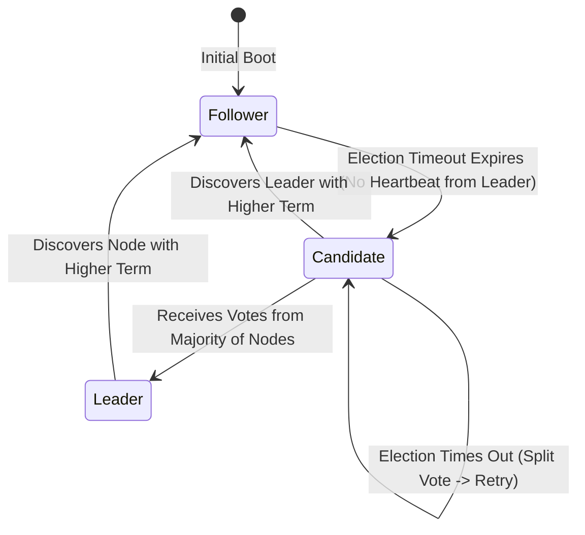
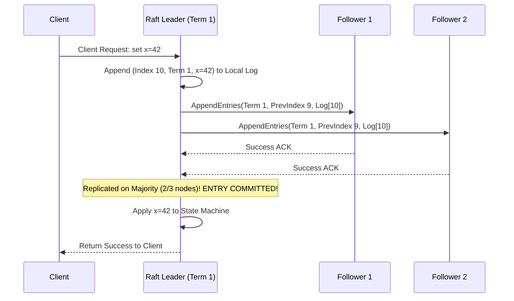

# Part II: Distributed Storage — Replication, Quorums & Raft Consensus

Distributed storage engines replicate state across multiple nodes for fault tolerance and high availability.

---

## 📌 Quorum Consistency ($R + W > N$)

In Dynamo-style leaderless replication (Cassandra, Amazon Dynamo):
- $N$ = Total number of replica nodes.
- $W$ = Number of replicas that must acknowledge a write before it succeeds.
- $R$ = Number of replicas that must respond to a read query.

> **Strong Consistency Rule**: If $R + W > N$, the read quorum $R$ and write quorum $W$ are guaranteed to overlap on at least one node, ensuring reads always see the latest write.

---

## 📌 Raft Consensus Algorithm Deep Dive

Raft decomposes consensus into 3 sub-problems: **Leader Election**, **Log Replication**, and **Safety**.

### Raft Node State Transitions

### Raft Log Replication Sequence
1. Leader receives command from client.
2. Leader appends entry to its local log.
3. Leader sends `AppendEntries` RPC to all follower nodes.
4. Once entry is replicated to a **majority of nodes**, Leader commits entry and applies it to its state machine.
5. Leader notifies followers of commit in subsequent `AppendEntries` RPCs.

