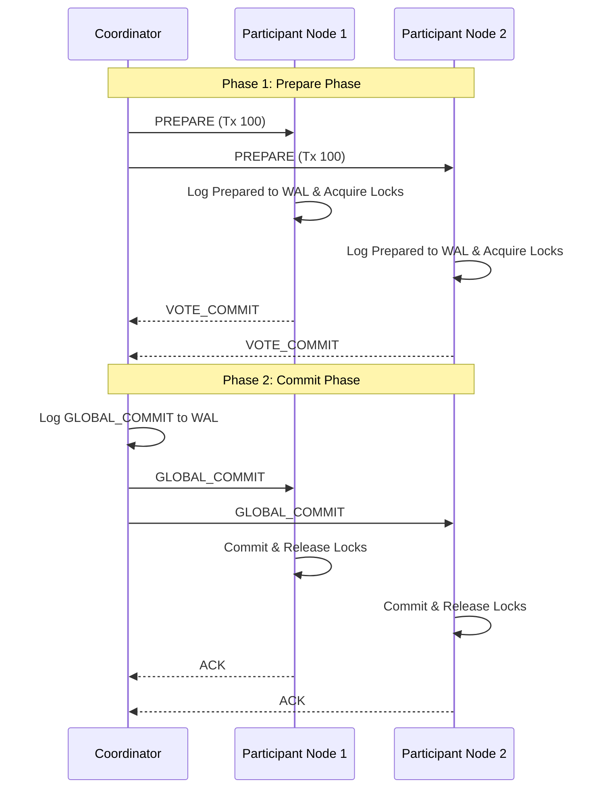
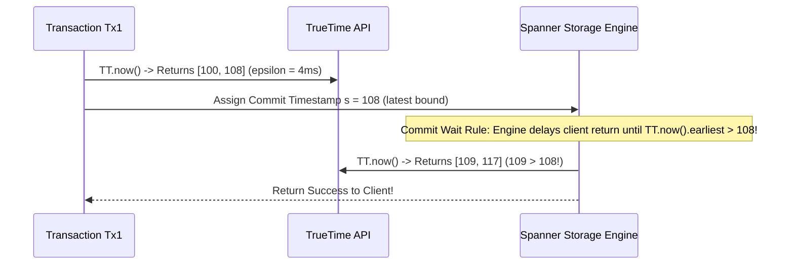
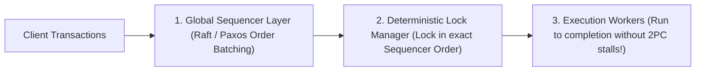

# Part III: Distributed Transactions & Google Spanner

Executing transactions across multiple sharded nodes without sacrificing serializability or consistency.

---

## 📌 Two-Phase Commit (2PC) Protocol

2PC guarantees that all participant nodes in a distributed transaction either commit or abort together.

---

## 📌 Google Spanner & TrueTime API

Google Spanner achieves **External Consistency (Strict Serializability)** globally across data centers without central lock coordination by utilizing the **TrueTime API**.

### TrueTime API & Atomic Clocks
TrueTime exposes time as a bounded interval $[t_{\text{earliest}}, t_{\text{latest}}]$ where $t_{\text{latest}} - t_{\text{earliest}} = 2\epsilon$ ($\epsilon \approx 1\text{ to } 7\text{ ms}$ via synchronized GPS and Atomic clocks in every datacenter).

> **Commit Wait Rule**: The coordinator delays returning the commit result until $TT.now().earliest > s$. This guarantees that any subsequent transaction $Tx_2$ anywhere in the world will get a timestamp $s_2 > s_1$!

---

## 📌 Deterministic Transactions (Calvin Engine Architecture)

Traditional 2PC holds locks across network roundtrips during the Prepare phase, stalling throughput.

**Calvin** eliminates 2PC overhead by using a **Global Sequencer** to order transactions *before* acquiring locks. Because transaction ordering is deterministic, replica nodes execute transactions concurrently without lock negotiation!

