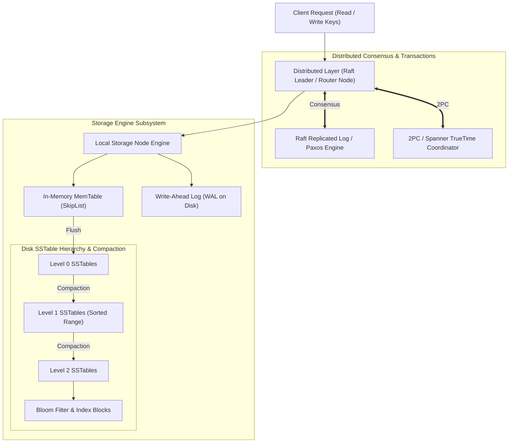

# Database Internals — Deep Dive & Reference Guide

A comprehensive, production-grade reference based on Alex Petrov's landmark textbook ***Database Internals: A Deep Dive into How Distributed Data Systems Work***.

This module explores low-level storage engine mechanics ($B^{\text{link}}$ Trees, Latching Crabbing, LSM-Trees, SkipLists, SSTables, Bloom Filters, Compaction) alongside distributed consensus & transaction engines (Raft, Paxos, Quorums, 2PC, Spanner TrueTime, Calvin) with production C++/Java algorithms and **rich Mermaid diagrams**.

---

## 📂 Chapter Index & Roadmap

| Part | Module / Topic | Core Concepts | Location |
|---|---|---|---|
| **Cheatsheet** | Quick Reference | B+ vs LSM Amplification, Bloom Filters, Raft RPCs, Spanner | [`00_internals_cheatsheet.md`](./00_internals_cheatsheet.md) |
| **Part I** | 01. B-Tree Variants & Page Layout | Slotted Pages, Binary Headers, $B^+$ Trees, $B^*$ Trees, $B^{\text{link}}$ Trees, Latching Crabbing | [`01_storage_engines/`](./01_storage_engines/01_b_tree_variants_and_page_layout.md) |
| | 02. LSM-Trees & Compaction | MemTable SkipList, WAL, SSTable Format, Bloom Filters, Size-Tiered vs Leveled Compaction | [`01_storage_engines/`](./01_storage_engines/02_lsm_trees_memtables_and_compaction.md) |
| **Part II** | 03. Replication & Raft Consensus | Leader/Leaderless Replication, Quorums ($R+W>N$), Vector Clocks, HLC, Raft Consensus Deep Dive | [`02_distributed_storage/`](./02_distributed_storage/03_replication_quorums_and_raft_consensus.md) |
| **Part III** | 04. Distributed Transactions | 2PC, 3PC, Distributed Snapshot Isolation, Google Spanner TrueTime, Calvin Deterministic Engine | [`03_distributed_transactions/`](./03_distributed_transactions/04_distributed_transactions_and_spanner.md) |

---

## 🎨 Visual Overview: Storage Engine vs Distributed Infrastructure Architecture

