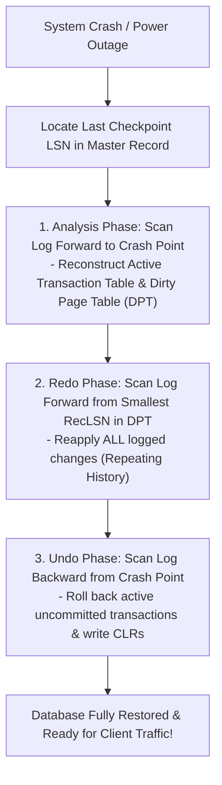

# Database System Concepts 30-Second Interview Cheatsheet

---

## ⚡ Core Database Equations & Quick References

### 1. B+ Tree Capacity & Height Math
- **Order $M$ of B+ Tree**: Maximum number of pointers/children per internal node.
- **Node Capacity**: Internal node has between $\lceil M/2 \rceil$ and $M$ children.
- **Leaf Capacity**: Leaf node has between $\lceil (L)/2 \rceil$ and $L$ data records/pointers.
- **Tree Height $H$**: $H \le \lceil \log_{\lceil M/2 \rceil} (N) \rceil$ (where $N$ is number of indexed keys).

### 2. Normalization Rules Summary

| Normal Form | Condition / Constraint Rule |
|---|---|
| **1NF** | Atomic values only (no multivalued attributes or nested tables). |
| **2NF** | In 1NF + No partial dependencies (non-key attributes depend on *entire* candidate key). |
| **3NF** | In 2NF + No transitive dependencies ($X \to A$, where $X$ is candidate key or $A$ is prime). |
| **BCNF** | For *every* FD $X \to A$, $X$ must be a Super Key (stricter than 3NF). |
| **4NF** | In BCNF + No non-trivial Multivalued Dependencies ($X \twoheadrightarrow Y$). |

---

## 📊 Join Algorithms Complexity & Memory Matrix

| Join Algorithm | Time Complexity | I/O Cost (Pages) | RAM Required | Best Use Case |
|---|---|---|---|---|
| **Nested Loop Join** | $O(M \times N)$ | $M + (M \times N)$ | 2 pages | Tiny outer table |
| **Block Nested Loop Join** | $O(M + N)$ | $M + \left(\lceil \frac{M}{B-2} \rceil \times N\right)$ | $B$ pages | Medium tables without indexes |
| **Index Nested Loop Join** | $O(M \log N)$ | $M + (\text{Tuples}_M \times \text{Cost}_{\text{Index}})$ | 2 pages | Inner table indexed on join key |
| **Sort-Merge Join** | $O(M \log M + N \log N)$ | $3(M + N)$ | $\sqrt{\max(M,N)}$ | Already sorted tables / Range queries |
| **Grace Hash Join** | $O(M + N)$ | $3(M + N)$ | $\approx \sqrt{M}$ | Large unsorted tables (Equi-joins) |

---

## 🛡️ ACID Properties & Transaction Engine Guarantees

- **Atomicity**: All operations in transaction complete or none do (Enforced by **WAL / Rollback Logs**).
- **Consistency**: Database transitions from one valid state to another (Enforced by **Constraints & Application**).
- **Isolation**: Concurrent transactions execute as if sequential (Enforced by **2PL Locks / MVCC**).
- **Durability**: Committed updates survive system crashes (Enforced by **WAL & ARIES Redo**).

---

## 🧠 ARIES 3-Phase Crash Recovery Overview

