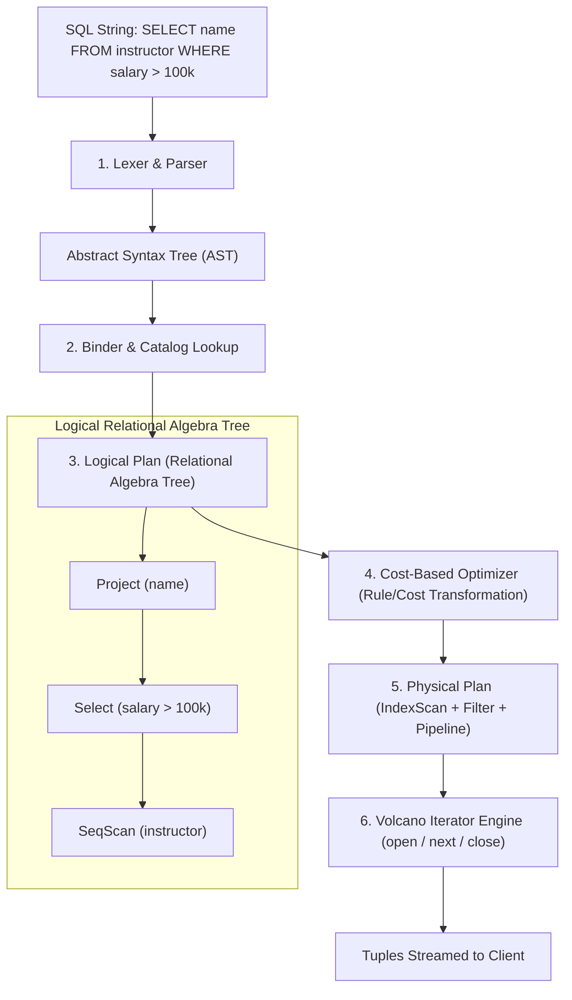

# Part I: Relational Model, Relational Algebra & SQL Execution

The **Relational Model** organizes data into mathematical relations (tables) composed of tuples (rows) and attributes (columns).

---

## 📌 Fundamental Relational Algebra Operators

Relational Algebra is a procedural query language consisting of operations that take one or two relations as input and produce a new relation as output.

| Operator | Mathematical Symbol | Description | Example |
|---|---|---|---|
| **Select** | $\sigma_{\text{predicate}}(R)$ | Filters tuples satisfying predicate. | $\sigma_{\text{salary} > 100000}(\text{Instructor})$ |
| **Project** | $\pi_{A_1, A_2}(R)$ | Selects specific columns, eliminating duplicates. | $\pi_{\text{name, dept\_name}}(\text{Instructor})$ |
| **Cartesian Product** | $R \times S$ | Combines every tuple of $R$ with every tuple of $S$. | $\text{Instructor} \times \text{Teaches}$ |
| **Natural Join** | $R \bowtie S$ | Combines tuples matching on common attribute names. | $\text{Instructor} \bowtie \text{Teaches}$ |
| **Union** | $R \cup S$ | Returns tuples present in $R$, $S$, or both (compatible schemas). | $\pi_{\text{name}}(\text{Student}) \cup \pi_{\text{name}}(\text{Instructor})$ |
| **Set Difference** | $R \setminus S$ | Returns tuples in $R$ but not in $S$. | $\pi_{\text{id}}(\text{Student}) \setminus \pi_{\text{id}}(\text{Takes})$ |
| **Rename** | $\rho_{x}(E)$ | Renames relation $E$ to $x$. | $\rho_{\text{Emp1}}(\text{Employee})$ |

---

## 📌 SQL Execution Pipeline Architecture



---

## 📌 Triggers & Integrity Constraints

Integrity constraints maintain database consistency:
- **Primary Key Constraint**: Unique & Non-null identifier.
- **Foreign Key Constraint**: Referential integrity (`ON DELETE CASCADE / SET NULL`).
- **Domain Constraint**: Valid values check (`CHECK (age >= 18)`).

### SQL Trigger Example (Auditing Salary Changes)
```sql
CREATE TRIGGER salary_audit_trigger
AFTER UPDATE ON instructor
FOR EACH ROW
WHEN (OLD.salary <> NEW.salary)
BEGIN
    INSERT INTO salary_audit_log (instructor_id, old_salary, new_salary, updated_at)
    VALUES (OLD.id, OLD.salary, NEW.salary, CURRENT_TIMESTAMP);
END;
```
