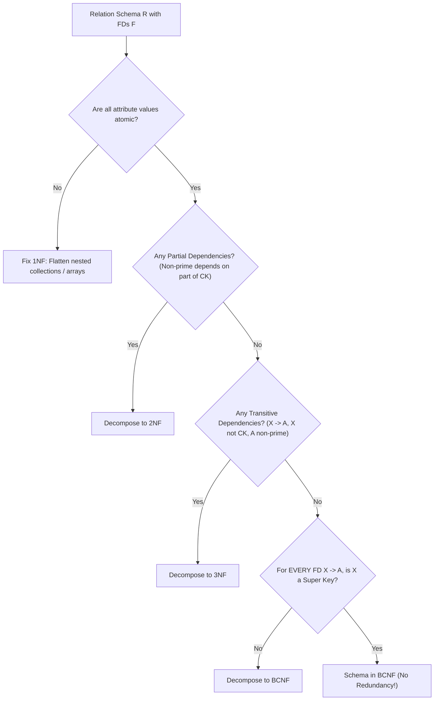

# Part II: Database Design & Normalization

Normalization decomposes relations to eliminate data redundancy, update anomalies, insertion anomalies, and deletion anomalies while preserving functional dependencies and lossless joins.

---

## 📌 Functional Dependencies & Closure ($F^+$)

A **Functional Dependency** $X \to Y$ holds on relation schema $R$ if, for any two tuples $t_1$ and $t_2$ in $R$, $t_1[X] = t_2[X] \implies t_1[Y] = t_2[Y]$.

### Armstrong's Axioms
1. **Reflexivity**: If $Y \subseteq X$, then $X \to Y$.
2. **Augmentation**: If $X \to Y$, then $XZ \to YZ$.
3. **Transitivity**: If $X \to Y$ and $Y \to Z$, then $X \to Z$.

---

## 📌 Normalization Decision Tree (1NF $\to$ BCNF)

---

## 📌 Normal Forms Breakdown

### 1. First Normal Form (1NF)
All column values must be atomic (no arrays, sets, or nested sub-tables).

### 2. Second Normal Form (2NF)
In 1NF and every non-prime attribute is **fully functionally dependent** on the primary key (no partial dependencies).

### 3. Third Normal Form (3NF)
In 2NF and for every non-trivial FD $X \to A$, either:
- $X$ is a **Super Key**, OR
- $A$ is a **Prime Attribute** (part of a candidate key).

### 4. Boyce-Codd Normal Form (BCNF)
For *every* non-trivial FD $X \to A$, **$X$ MUST be a Super Key**. BCNF eliminates ALL redundancy based on FDs.

---

## 📌 Lossless-Join Decomposition Proof

A decomposition of relation $R$ into $R_1$ and $R_2$ is **lossless-join** if and only if:

$$R_1 \cap R_2 \to R_1 \quad \text{OR} \quad R_1 \cap R_2 \to R_2$$

*(The common attributes must contain a candidate key for at least one of the decomposed relations).*
