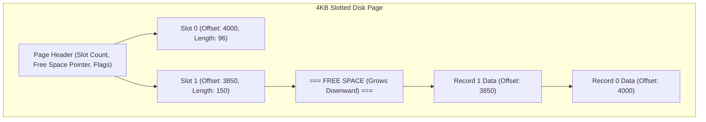

# Part III: Storage Engine, Buffer Pool & B+ Tree Indexing

Storage engines organize data on non-volatile media, manage in-memory page caching via buffer pools, and provide fast B+ Tree search indexes.

---

## 📌 Slotted-Page Page Architecture

Fixed-size pages (e.g. 4KB / 8KB) store variable-length records using the **Slotted-Page** design to avoid fragmentation.



---

## 📌 Buffer Pool Manager (Clock / LRU Eviction)

The **Buffer Pool Manager** maintains an array of in-memory page frames (`Frame[]`) and a hash table mapping `page_id` $\to$ `frame_id`.

```cpp
// Production Buffer Pool Manager C++ Struct
struct FrameHeader {
    int page_id = -1;
    int pin_count = 0;   // Active queries reading page (cannot evict if pin_count > 0!)
    bool is_dirty = false; // Must write back to disk before eviction if true!
    bool clock_bit = false;
};
```

---

## 📌 B+ Tree Indexing Internals

A **B+ Tree** is a self-balancing $M$-way search tree optimized for systems that read and write large blocks of memory.
- All data records/pointers reside **exclusively in Leaf Nodes**.
- Internal nodes contain only routing keys and child node page pointers.
- Leaf nodes are doubly linked into a sequential list for fast range scans.

```mermaid
flowchart TD
    subgraph B+ Tree Index (Order M=3)
        Root["Internal Root Node [13 | 27]"]
        
        Root --> Child1["Internal Node [7]"]
        Root --> Child2["Internal Node [19]"]
        Root --> Child3["Internal Node [31 | 45]"]
        
        Child1 --> Leaf1["Leaf [2, 5, 7] <--> "]
        Child1 --> Leaf2["Leaf [9, 11, 13] <--> "]
        
        Child2 --> Leaf3["Leaf [15, 17, 19] <--> "]
        Child2 --> Leaf4["Leaf [21, 23, 27] <--> "]
    end

    Leaf1 <== Doubly Linked Range Scan ==> Leaf2
    Leaf2 <== Doubly Linked Range Scan ==> Leaf3
    Leaf3 <== Doubly Linked Range Scan ==> Leaf4
```

### B+ Tree Node Splitting Algorithm (Insertion)
When an insertion into a leaf node causes it to overflow ($N > M-1$ keys):
1. Split leaf into two leaves, each holding $\lceil N/2 \rceil$ keys.
2. Copy up the smallest key of the right leaf to the parent internal node.
3. If parent internal node overflows, split parent and **push up** middle key to grand-parent.
