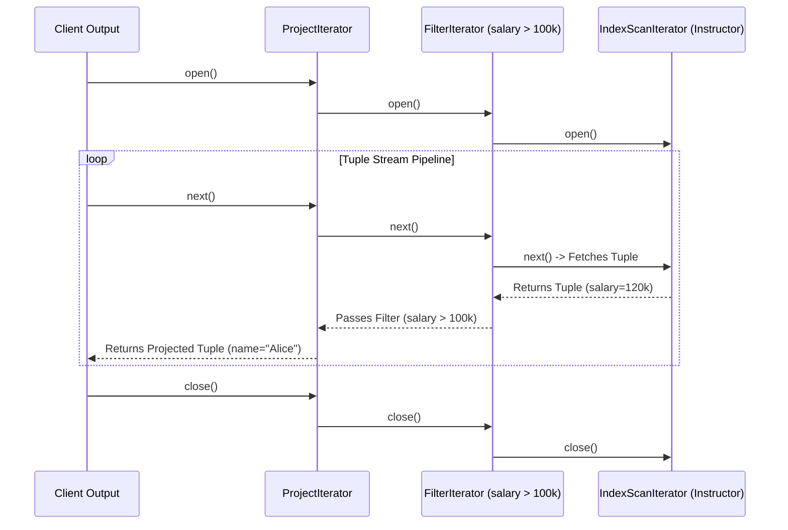
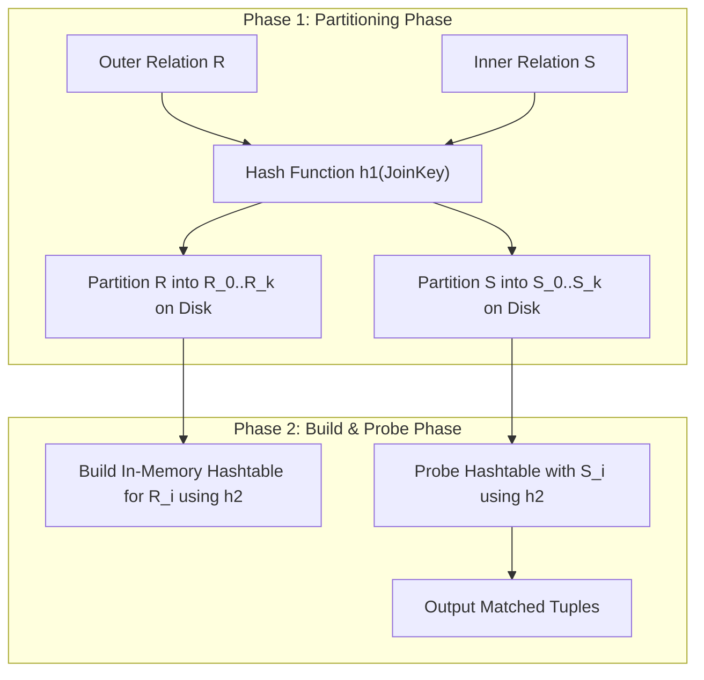

# Part IV: Query Processing & Cost-Based Optimization

Query processing translates SQL queries into efficient physical execution plans, evaluating joins and sort operations using minimal I/O.

---

## 📌 Volcano / Iterator Execution Model

The **Volcano Model** (Iterator Model) evaluates physical query plans tuple-at-a-time via `open()`, `next()`, and `close()`.

---

## 📌 Join Algorithms Deep Dive

### 1. Grace Hash Join
Ideal for large equijoins ($R \bowtie_{R.id = S.id} S$) when neither relation fits in memory.

### 2. External Merge Sort
Used when sorting relations larger than available RAM.
- **Pass 0**: Read $B$ pages into RAM, sort in-memory, write out $\lceil N/B \rceil$ sorted runs to disk.
- **Pass 1..N**: Perform $(B-1)$-way merge of sorted runs until 1 single sorted run remains.

---

## 📌 System R Cost-Based Dynamic Programming Optimizer

The Query Optimizer converts a Logical Query Plan into the cheapest Physical Plan using dynamic programming (Selinger Optimizer):

1. **Single-Relation Access Paths**: Determine cost of Sequential Scan vs Index Scan for every relation.
2. **2-Way Joins**: Evaluate all pairs of relations using Nested Loop, Hash Join, and Sort-Merge Join.
3. **K-Way Joins**: Build left-deep processing trees using dynamic programming:
   $$\text{Cost}(R_1 \bowtie R_2 \bowtie R_3) = \min_{S \subset \{1,2,3\}} \left( \text{Cost}(S) + \text{Cost}(\text{Join}(S, \{1,2,3\} \setminus S)) \right)$$
