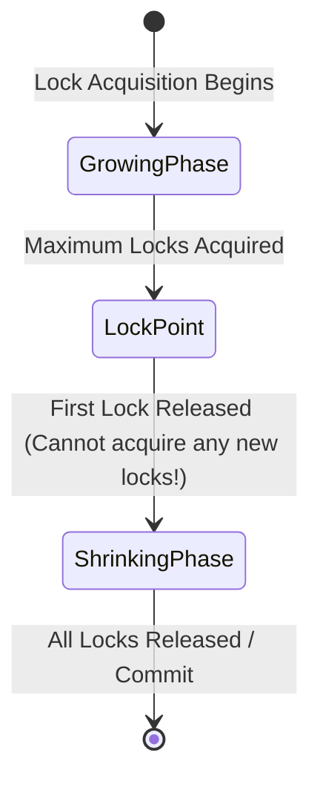
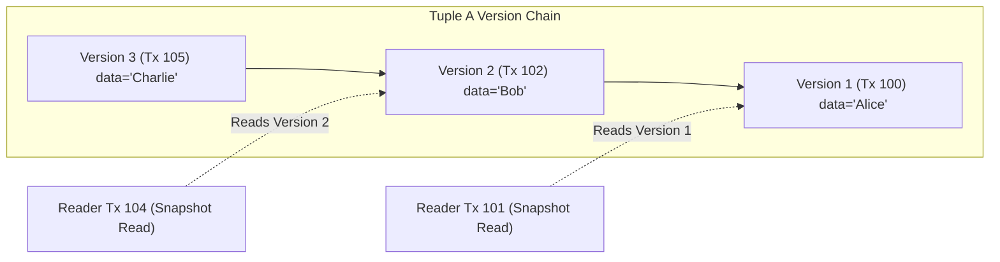
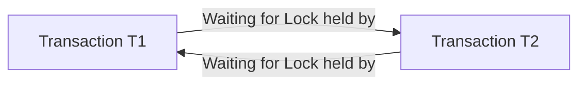

# Part V: Transactions, Concurrency Control & MVCC

Concurrency control ensures that multiple transactions execute concurrently without violating consistency or isolation.

---

## 📌 Conflict Serializability & Precedence Graphs

A schedule is **conflict serializable** if it is conflict equivalent to a serial schedule.

Two operations conflict if they belong to different transactions, access the same item, and at least one is a `write`.

### Precedence Graph Testing Algorithm
Create a directed graph $G = (V, E)$ where $V = \text{Transactions}$. Add a directed edge $T_i \to T_j$ if $T_i$ performs an operation that conflicts with a subsequent operation performed by $T_j$.

```mermaid
flowchart LR
    T1["Transaction T1"] -->|w1(X) -> r2(X)| T2["Transaction T2"]
    T2 -->|w2(Y) -> r3(Y)| T3["Transaction T3"]
    
    note["No Cycles! Schedule IS Conflict Serializable"]
```
> **Theorem**: A schedule is conflict serializable if and only if its precedence graph contains **no cycles**.

---

## 📌 Two-Phase Locking (2PL) Protocols

### 1. Standard 2PL Rule
- **Growing Phase**: Transaction acquires locks, cannot release any locks.
- **Shrinking Phase**: Transaction releases locks, cannot acquire any new locks.



### 2. Strict 2PL & Rigorous 2PL
- **Strict 2PL**: Transaction holds all **exclusive (X) locks** until commit/abort (prevents cascading aborts).
- **Rigorous 2PL**: Transaction holds **ALL locks (S & X)** until commit/abort.

---

## 📌 Multiversion Concurrency Control (MVCC)

Instead of blocking readers during writes, **MVCC** creates a new version of a tuple whenever it is updated. Readers read a consistent snapshot of old versions without acquiring locks!



---

## 📌 Deadlock Detection & Wait-For Graph

Deadlocks occur when transactions wait circularly for locks held by each other.


**Resolution**: Run a background thread to detect cycles in the Wait-For Graph and abort the youngest transaction (**Victim Selection**).
