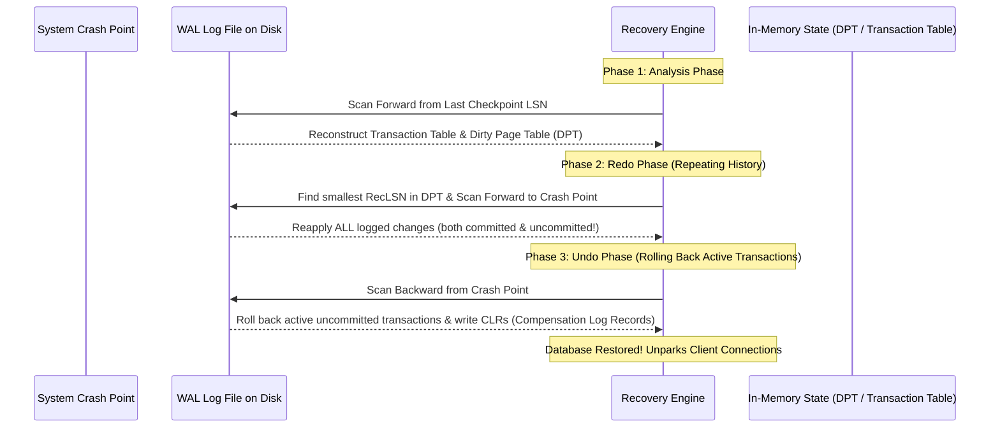

# Part VI: Recovery System & ARIES Algorithm

The recovery engine guarantees Atomicity and Durability (ACID) despite crashes, power outages, or media failures.

---

## 📌 Write-Ahead Logging (WAL) & Buffer Pool Policies

### Buffer Pool Management Policies
- **Steal Policy**: Buffer pool can flush uncommitted dirty pages to disk to free RAM. (Requires **Undo** log capability).
- **Force Policy**: Buffer pool must force all updated pages to disk before transaction commits. (If **No-Force**, requires **Redo** log capability).

Modern production engines (PostgreSQL, InnoDB) use **Steal / No-Force** for maximum throughput.

### The Write-Ahead Logging (WAL) Protocol
> **Log records MUST be written to disk BEFORE the corresponding dirty page is flushed to disk.**
> **A transaction is NOT committed until its COMMIT log record is flushed to disk.**

---

## 📌 ARIES 3-Phase Recovery Algorithm

**ARIES** (Algorithms for Recovery and Isolation Exploiting Semantics) restores the database state in 3 distinct phases following a crash.



---

## 📌 Log Record Format & Compensation Log Records (CLRs)

Every log entry contains a monotonically increasing **Log Sequence Number (LSN)**:

```cpp
struct LogRecord {
    lsn_t lsn;             // Unique Log Sequence Number
    lsn_t prev_lsn;        // Previous LSN written by this transaction (linked list)
    txn_id_t txn_id;       // Transaction Identifier
    LogRecordType type;    // BEGIN, UPDATE, COMMIT, ABORT, CLR
    page_id_t page_id;     // Physical Page ID updated
    uint32_t offset;       // Byte offset inside page
    bytes_t before_image;  // Used during UNDO phase
    bytes_t after_image;   // Used during REDO phase
    lsn_t undo_next_lsn;   // Used ONLY in CLR log records to bypass already-undone actions!
};
```
