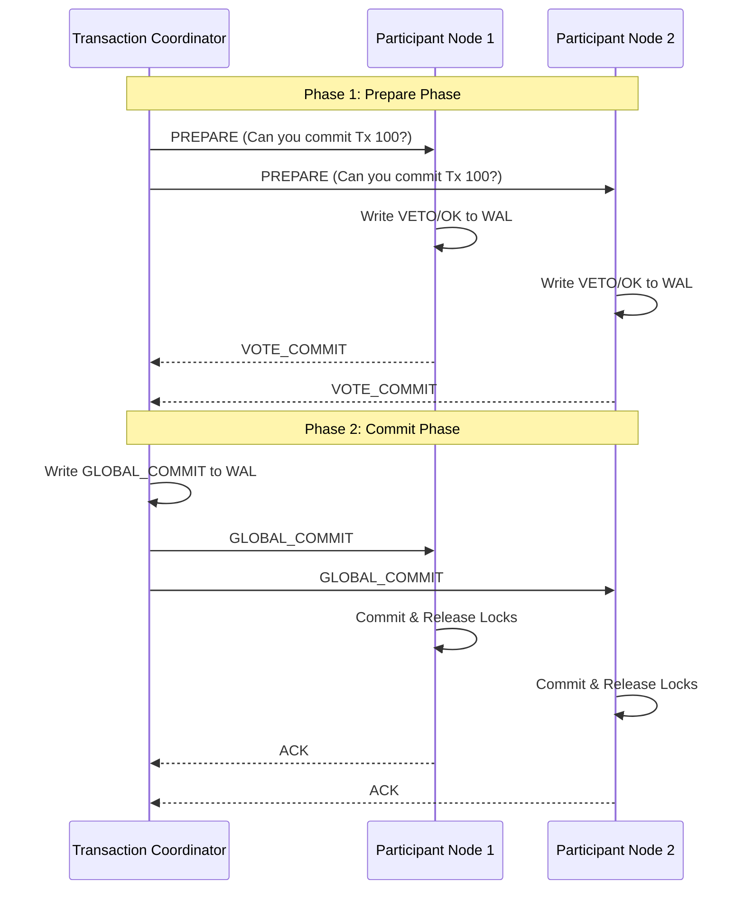
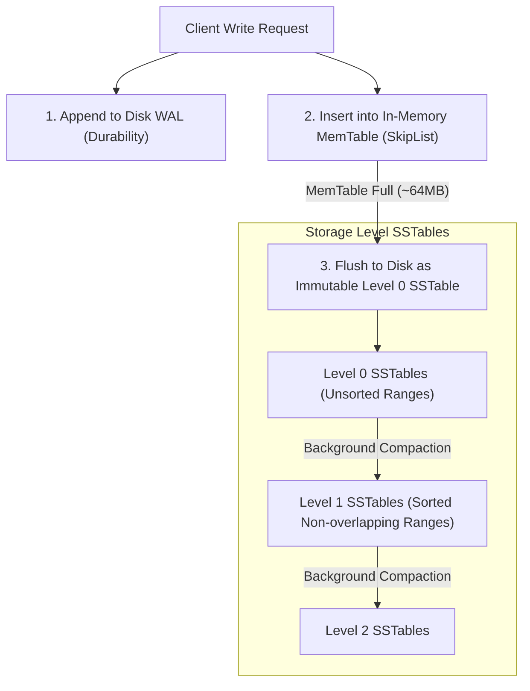

# Part VII: Distributed Transactions, 2PC & LSM-Trees

Architectures for distributed database coordination and modern write-optimized storage engines (LSM-Trees).

---

## 📌 Two-Phase Commit (2PC) Protocol

In a distributed database, a transaction may update data across multiple database nodes (**Participants**). **Two-Phase Commit (2PC)** guarantees atomic commit across all nodes.

---

## 📌 CAP Theorem vs PACELC Theorem

- **CAP Theorem**: In a network partition ($P$), a distributed system can choose **Consistency ($C$)** OR **Availability ($A$)**, but not both.
- **PACELC Theorem**:
  - If **P**artition: Choose between **A**vailability or **C**onsistency.
  - **E**lse (Normal operation): Choose between **L**atency or **C**onsistency.

---

## 📌 LSM-Trees (Log-Structured Merge-Trees) vs B+ Trees

Traditional B+ Trees use in-place updates, causing random I/O bottlenecks under heavy write workloads.
**LSM-Trees** (used in RocksDB, Cassandra, Spanner) convert all writes into sequential memory appends.

### LSM-Tree vs B+ Tree Trade-off Matrix

| Metric | B+ Tree | LSM-Tree |
|---|---|---|
| **Write Throughput** | Low (Random I/O & Page In-Place Overwrites) | High (Sequential Memory Append & Flush) |
| **Read Latency** | Low (Direct Index Lookup $O(\log N)$) | Higher (May check MemTable + Bloom Filters + SSTables) |
| **Space Amplification** | Medium (Fragmented Page Free Space) | Low (Compacted Immutable Blocks) |
| **Write Amplification** | High (Updating 1 Byte writes full 8KB Page) | Medium-High (Repeated Compaction Passes) |
