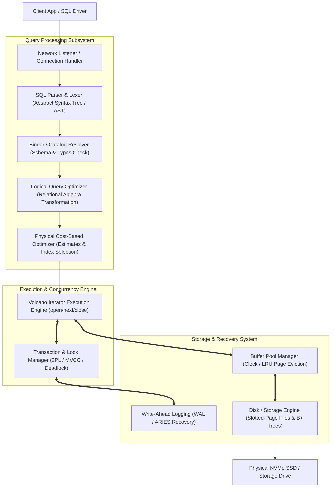

# Database System Concepts (DBSC) — Master Guide & Architecture Reference

A comprehensive, production-grade reference based on Silberschatz, Korth, and Sudarshan's landmark textbook ***Database System Concepts***.

This module organizes the 7 core pillars of database engine internals — **Relational Algebra & SQL Pipelines**, **Database Normalization & FDs**, **Storage & B+ Tree Indexing**, **Query Optimization**, **Transactions & MVCC**, **ARIES Recovery & WAL**, and **Distributed 2PC & LSM-Trees** — with production C++/SQL algorithms and **rich Mermaid diagrams**.

---

## 📂 Chapter Index & Roadmap

| Part | Module / Topic | Core Concepts | Location |
|---|---|---|---|
| **Cheatsheet** | Quick Reference | Algebra Operators, Normal Forms, B+ Tree Math, 2PL, ARIES | [`00_dbms_cheatsheet.md`](./00_dbms_cheatsheet.md) |
| **Part I** | 01. Relational Model & SQL | Relational Algebra ($\sigma, \pi, \bowtie$), AST Parsing, SQL Execution Pipeline | [`01_relational_model_and_sql/`](./01_relational_model_and_sql/01_relational_algebra_and_sql_execution.md) |
| **Part II** | 02. Database Normalization | Functional Dependencies ($F^+$), 1NF–4NF, BCNF, Lossless Join Proofs | [`02_database_design_and_normalization/`](./02_database_design_and_normalization/02_normalization_and_functional_dependencies.md) |
| **Part III** | 03. Storage & Indexing | Slotted-Page Layout, Buffer Pool (LRU/Clock), B+ Tree Node Splitting | [`03_storage_and_indexing/`](./03_storage_and_indexing/03_disk_storage_buffer_pool_and_indexing.md) |
| **Part IV** | 04. Query Processing | External Merge Sort, Hash/Sort-Merge Joins, Volcano Model, Cost Optimizer | [`04_query_processing_and_optimization/`](./04_query_processing_and_optimization/04_query_execution_and_cost_based_optimizer.md) |
| **Part V** | 05. Concurrency Control | Conflict Serializability, Strict 2PL, Intent Locks, MVCC Version Chains | [`05_transactions_and_concurrency/`](./05_transactions_and_concurrency/05_transactions_2pl_mvcc_and_deadlocks.md) |
| **Part VI** | 06. ARIES Recovery | Write-Ahead Logging (WAL), Steal/No-Force, Analysis, Redo, Undo Phases | [`06_recovery_system/`](./06_recovery_system/06_aries_recovery_and_wal.md) |
| **Part VII** | 07. Distributed & Modern DBs | Two-Phase Commit (2PC), CAP Theorem, Raft Replication, LSM-Trees | [`07_distributed_and_modern_databases/`](./07_distributed_and_modern_databases/07_distributed_transactions_2pc_and_lsm_trees.md) |

---

## 🎨 Visual Overview: Database Engine Kernel Architecture

