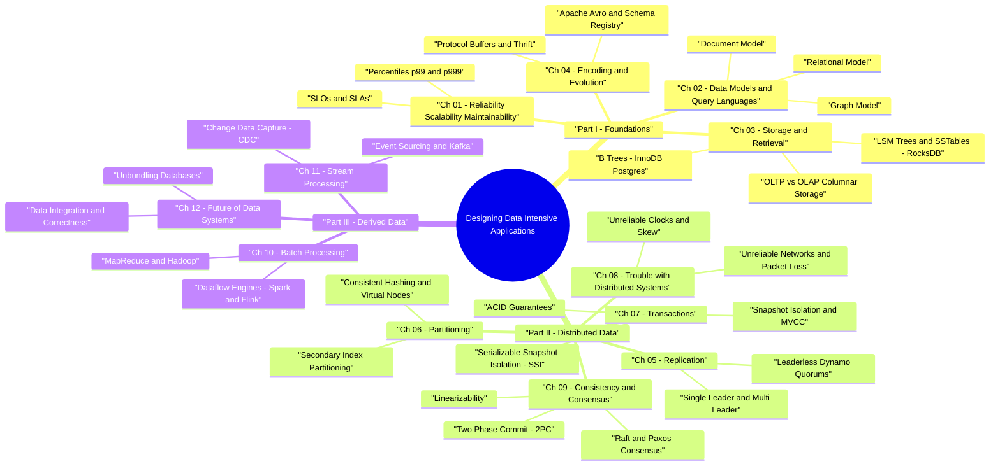

# Designing Data-Intensive Applications — Mind Map & Architecture Guide

> **Book Author:** Martin Kleppmann  
> **Purpose:** Detailed mental model, trade-off matrix, and interview reference guide covering all 12 chapters of DDIA.

---

## 🧠 Interactive DDIA Mind Map (Mermaid Diagram)

---

## 📊 Comprehensive Chapter Summary & Concepts Matrix

| Part | Chapter | Core Problem | Key Technologies / Algorithms | Master Takeaway |
|---|---|---|---|---|
| **Part I** | **Ch 1** | System Guarantees | Percentiles ($p99$, $p999$), Load Parameters, SLOs | Tail latency matters more than average latency for SLA compliance. |
| **Part I** | **Ch 2** | Data Representation | Relational (SQL), Document (JSON), Graph (Cypher) | Document for 1:N data; Relational for N:M data; Graph for deep N:M connections. |
| **Part I** | **Ch 3** | Disk Data Layout | **LSM-Tree + SSTable** vs **B+ Tree**, Column-Store | LSM-Trees maximize write throughput; B-Trees maximize random read performance. |
| **Part I** | **Ch 4** | Serialization Format | Protocol Buffers, Apache Avro, JSON, XML | Binary encodings with schema evolution enable backward/forward compatibility. |
| **Part II** | **Ch 5** | Data Redundancy | Single-Leader, Multi-Leader, Leaderless Quorums ($R+W>N$) | Synchronous replication guarantees consistency; Async replication risks lag. |
| **Part II** | **Ch 6** | Scale Out | Consistent Hashing, Key-Range Sharding, Secondary Indexes | Partitioning enables horizontal scale; Virtual nodes prevent hot spots. |
| **Part II** | **Ch 7** | Concurrency Control | **MVCC**, Snapshot Isolation, 2PL, **SSI** | Read Committed prevents dirty reads; SSI provides true serializability without blocking. |
| **Part II** | **Ch 8** | Network & Clock Truth | NTP Skew, Network Delays, Byzantine Faults | Distributed systems cannot rely on physical clocks; must assume unreliable networks. |
| **Part II** | **Ch 9** | Consensus & Agreement | **Linearizability**, 2PC, **Raft / Paxos** | Atomic Broadcast & Consensus are equivalent to Linearizable storage. |
| **Part III** | **Ch 10** | Offline Data Processing | MapReduce, Unix Pipes, Apache Spark, Flink | Batch processing inputs are immutable; output is derived data (recomputable). |
| **Part III** | **Ch 11** | Real-Time Processing | **CDC (Change Data Capture)**, Event Sourcing, Kafka | Streams treat databases as state logs; CDC streams state mutations in real time. |
| **Part III** | **Ch 12** | Database Unbundling | Data Integration, Dual Writes, End-to-End Correctness | Unbundle databases into specialized components connected by event logs. |
