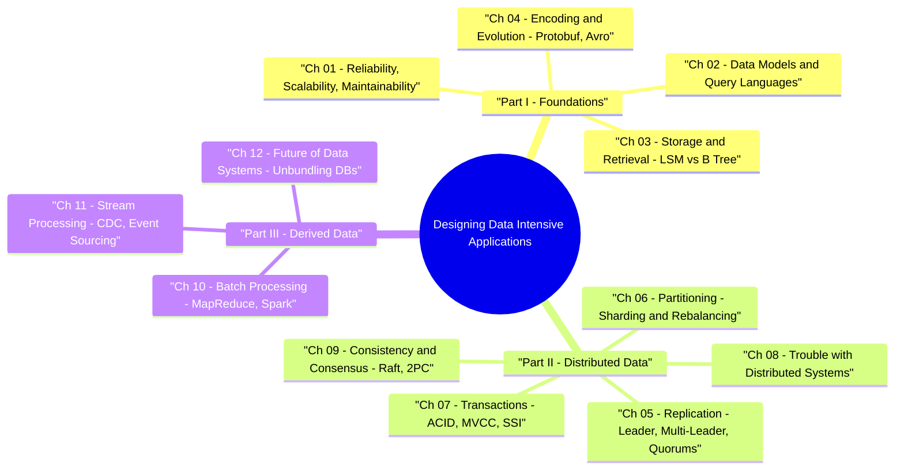

# Designing Data-Intensive Applications (DDIA) — Book Study & Interview Reference

> **Author:** Martin Kleppmann  
> **Goal:** Master the deep technical principles of data systems, storage engines, distributed consensus, transactions, and stream/batch architectures for Staff/Senior SWE System Design interviews.

---

## 🧠 Interactive DDIA Mind Map



👉 **Full Mind Map & Taxonomy Guide:** [`00_DDIA_MindMap.md`](00_DDIA_MindMap.md)  
📚 **Recommended Companion Books & Papers:** [`00_Recommended_Books_and_Resources.md`](00_Recommended_Books_and_Resources.md)

---

## 📁 Repository Structure

```
ddia_book_study/
├── README.md                                         — Main Book Study Hub & Chapter Map
├── 00_DDIA_MindMap.md                                — Mind Map & Architectural Trade-offs Matrix
├── part1_foundations/                                — Part I: Foundations of Data Systems
│   ├── ch01_reliability_scalability_maintainability/ — Ch 1: SLOs/SLAs, Percentiles, Load Parameters
│   ├── ch02_data_models_and_query_languages/         — Ch 2: Relational vs Document vs Graph
│   ├── ch03_storage_and_retrieval/                   — Ch 3: LSM-Trees/SSTables vs B-Trees, OLTP vs OLAP
│   └── ch04_encoding_and_evolution/                  — Ch 4: Protobuf, Thrift, Avro & Schema Evolution
├── part2_distributed_data/                           — Part II: Distributed Data
│   ├── ch05_replication/                             — Ch 5: Single-Leader, Multi-Leader & Dynamo Quorums
│   ├── ch06_partitioning/                            — Ch 6: Range vs Hash Sharding, Secondary Indexes
│   ├── ch07_transactions/                            — Ch 7: ACID, Read Committed, Snapshot Isolation/MVCC, SSI
│   ├── ch08_trouble_with_distributed_systems/        — Ch 8: Unreliable Networks, Clocks & Truth
│   └── ch09_consistency_and_consensus/               — Ch 9: Linearizability, 2PC, Raft & Paxos
└── part3_derived_data/                               — Part III: Derived Data
    ├── ch10_batch_processing/                        — Ch 10: Unix Philosophy, MapReduce, Spark
    ├── ch11_stream_processing/                       — Ch 11: Event Sourcing, Change Data Capture (CDC), Kafka
    └── ch12_future_of_data_systems/                  — Ch 12: Unbundling Databases, Data Integration
```

---

## 📊 Core Architectural Trade-off Summary Matrix

| Chapter / Concept | Primary Metric / Focus | Key Mechanism | System Examples |
|---|---|---|---|
| **Ch 3: Storage** | Write Throughput vs Read Throughput | **LSM-Tree** (Sequential Append) vs **B-Tree** (In-Place Overwrite) | RocksDB / Cassandra vs Postgres / InnoDB |
| **Ch 3: Analytics** | Column-Oriented Storage | Compression, Bitmap Indexes, Vectorized Execution | ClickHouse, Snowflake, Redshift, BigQuery |
| **Ch 5: Replication** | Fault Tolerance & Lag | Single-Leader vs Multi-Leader vs **Leaderless Quorums** ($R + W > N$) | Postgres vs DynamoDB / Cassandra |
| **Ch 6: Partitioning** | Scaling Out & Hotspots | Consistent Hashing with Virtual Nodes | Cassandra, DynamoDB, Riak |
| **Ch 7: Transactions** | Isolation vs Concurrency | **MVCC (Snapshot Isolation)** & **SSI (Serializable Snapshot Isolation)** | Postgres, CockroachDB, Spanner |
| **Ch 9: Consensus** | Fault-Tolerant Agreement | **Raft / Paxos** Leader Election & Log Replication | etcd, Consul, ZooKeeper |
| **Ch 11: Streams** | Real-Time Derived State | **Change Data Capture (CDC)** & Event Sourcing | Debezium, Kafka Streams, Apache Flink |

---

## 📖 Chapter Study Notes Index

### Part I: Foundations of Data Systems
- [Ch 1: Reliability, Scalability, Maintainability](part1_foundations/ch01_reliability_scalability_maintainability/01_Notes.md)
- [Ch 2: Data Models and Query Languages](part1_foundations/ch02_data_models_and_query_languages/02_Notes.md)
- [Ch 3: Storage and Retrieval](part1_foundations/ch03_storage_and_retrieval/03_Notes.md)
- [Ch 4: Encoding and Evolution](part1_foundations/ch04_encoding_and_evolution/04_Notes.md)

### Part II: Distributed Data
- [Ch 5: Replication](part2_distributed_data/ch05_replication/05_Notes.md)
- [Ch 6: Partitioning](part2_distributed_data/ch06_partitioning/06_Notes.md)
- [Ch 7: Transactions](part2_distributed_data/ch07_transactions/07_Notes.md)
- [Ch 8: The Trouble with Distributed Systems](part2_distributed_data/ch08_trouble_with_distributed_systems/08_Notes.md)
- [Ch 9: Consistency and Consensus](part2_distributed_data/ch09_consistency_and_consensus/09_Notes.md)

### Part III: Derived Data
- [Ch 10: Batch Processing](part3_derived_data/ch10_batch_processing/10_Notes.md)
- [Ch 11: Stream Processing](part3_derived_data/ch11_stream_processing/11_Notes.md)
- [Ch 12: The Future of Data Systems](part3_derived_data/ch12_future_of_data_systems/12_Notes.md)
