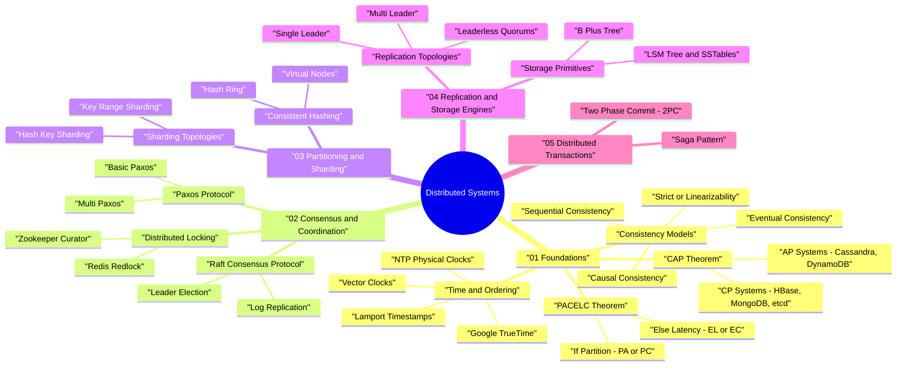

# Distributed Systems Mind Map & Taxonomy Guide

> **Purpose:** Master distributed systems concepts, consensus protocols, time models, and system trade-offs for Google, AWS, and Meta Staff/Senior SWE System Design interviews.

---

## 🧠 Interactive Distributed Systems Mind Map (Mermaid Diagram)



---

## 📊 Distributed Database Trade-off Matrix

| Database / System | Primary Consensus / Replication | CAP Classification | PACELC Classification | Primary Storage Engine | Primary Use Case |
|---|---|---|---|---|---|
| **Google Spanner** | Paxos + TrueTime | **CP** | **PC/EC** | LSM-Tree / SSTable | Global Multi-Region Distributed SQL |
| **Apache Cassandra** | Dynamo Leaderless Quorums ($R+W>N$) | **AP** | **PA/EL** | LSM-Tree & SSTables | Massive Write Throughput & High Availability |
| **etcd / HashiCorp Consul** | Raft Consensus | **CP** | **PC/EC** | B-Tree / BoltDB | K/V Service Discovery & Configuration |
| **CockroachDB** | Raft Consensus | **CP** | **PC/EC** | RocksDB (LSM-Tree) | Distributed Cloud-Native SQL |
| **Amazon DynamoDB** | Paxos / Leaderless Quorums | **AP / Adjustable** | **PA/EL** | B-Tree & Solid State | Fully Managed Serverless Key-Value |
| **Apache Kafka** | KRaft (Kafka Raft) | **CP** | **PC/EC** | Commit Log Segment Files | Event Streaming & Message Broker |

---

## ⚖️ Consistency Spectrum & Guarantees

```
  STRONGEST CONSISTENCY                                                       WEAKEST CONSISTENCY
  ┌──────────────────┬─────────────────┬──────────────┬──────────────┬──────────────────┐
  │ Linearizability  │  Sequential     │    Causal    │  Read-Your-  │     Eventual     │
  │ (External Order) │ (Global Stream) │ (Cause/Effect│   Writes     │  (Convergence)   │
  └──────────────────┴─────────────────┴──────────────┴──────────────┴──────────────────┘
   • Google Spanner    • Single-Leader   • Vector       • User Session • Cassandra        
   • Raft (ReadIndex)    Replication      Clocks         Sticky Router   (Background Repair)
```

---

## 📂 Category & Module Roadmap Structure

```
distributed-systems/
├── README.md                                 <-- Main Roadmap & Papers List
├── 00_MindMap_and_Taxonomy.md                <-- You are here
├── 01_foundations/
│   ├── cap_theorem/                          <-- CAP & PACELC proofs & DB mappings
│   ├── consistency_models/                   <-- Linearizability vs Eventual Consistency
│   └── time_and_ordering/                    <-- Lamport & Vector Clocks
├── 02_consensus_and_coordination/
│   ├── raft/                                 <-- Raft Leader Election & Log Replication
│   ├── paxos/                                <-- Basic & Multi-Paxos
│   └── distributed_locks/                    <-- Redlock vs Zookeeper Fencing Tokens
├── 03_partitioning_and_sharding/
│   ├── consistent_hashing/                   <-- Consistent Hashing with Virtual Nodes
│   └── range_vs_hash_sharding/               <-- Range vs Hash Sharding
├── 04_replication_and_storage/
│   ├── leader_follower/                      <-- Quorums (R+W > N), Multi-Leader
│   └── lsm_tree_vs_b_tree/                   <-- LSM-Tree (RocksDB) vs B+ Tree
└── 05_distributed_transactions/
    ├── two_phase_commit_2pc/                 <-- 2PC & 3PC Protocols
    └── saga_pattern/                         <-- Orchestration vs Choreography Sagas
```
