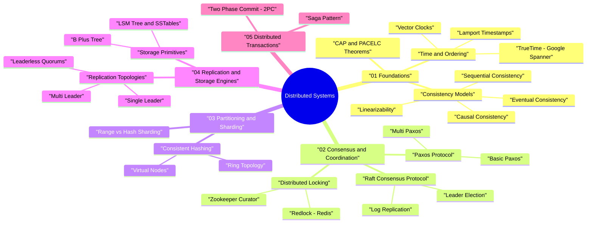

# Distributed Systems — Staff & Senior SWE Roadmap

> **Goal:** Master foundational concepts, consensus protocols, distributed storage, partitioning strategies, and fault-tolerant architectures for Google, AWS, Meta, and Staff/Senior Software Engineering interviews.

---

## 🧠 Interactive Distributed Systems Mind Map



👉 **Full Mind Map & Taxonomy Guide:** [`00_MindMap_and_Taxonomy.md`](00_MindMap_and_Taxonomy.md)

---

## 📁 Repository Structure & Modules Map

```
distributed-systems/
├── 00_MindMap_and_Taxonomy.md               — Interactive Mind Map, Trade-off Matrix & Decision Trees
├── 01_foundations/                          — Foundational Theorems & Time Models
│   ├── cap_theorem/                         — CAP vs PACELC Theorem Deep-Dive & DB Classifications
│   ├── consistency_models/                  — Linearizability vs Eventual Consistency Benchmarks
│   └── time_and_ordering/                   — Physical Clocks, Lamport Timestamps & Vector Clocks
├── 02_consensus_and_coordination/           — Distributed Agreement Protocols
│   ├── raft/                                — Raft Consensus Protocol (State Machine Replication)
│   ├── paxos/                               — Basic Paxos & Multi-Paxos Deep-Dive
│   └── distributed_locks/                   — Distributed Locks (Redis Redlock vs Zookeeper Curator)
├── 03_partitioning_and_sharding/            — Scalable Data Layouts
│   ├── consistent_hashing/                  — Consistent Hashing Ring with Virtual Nodes
│   └── range_vs_hash_sharding/              — Range-based vs Hash Sharding & Resharding
├── 04_replication_and_storage/              — Storage Engines & High Availability
│   ├── leader_follower/                     — Single-Leader, Multi-Leader & Leaderless Quorums (R+W > N)
│   └── lsm_tree_vs_b_tree/                  — Write-Optimized (LSM/SSTable) vs Read-Optimized (B+ Tree)
└── 05_distributed_transactions/             — Multi-Node Atomicity & Saga Workflows
    ├── two_phase_commit_2pc/                — 2PC Coordinator Protocol & Blocking Limitations
    └── saga_pattern/                        — Orchestration vs Choreography Saga Compensating Transactions
```

---

## 🗺️ Learning Roadmap (Phase-by-Phase)

```
┌──────────────────────────────────────────────────────────────────────────────────┐
│ PHASE 1: FOUNDATIONS (Weeks 1–2)                                                 │
│ • Master CAP & PACELC Theorems                                                   │
│ • Understand Physical vs Logical Time (Lamport & Vector Clocks)                 │
│ • Learn Consistency Models (Linearizability vs Eventual Consistency)            │
└──────────────────────────────────────────────────────────────────────────────────┘
                                         │
                                         ▼
┌──────────────────────────────────────────────────────────────────────────────────┐
│ PHASE 2: CONSENSUS & COORDINATION (Weeks 3–5)                                    │
│ • Deep-dive Raft Consensus (Leader Election, Log Replication, Term Safety)      │
│ • Understand Basic & Multi-Paxos                                                 │
│ • Implement Distributed Locks (Redis Redlock / Zookeeper Fencing Tokens)         │
└──────────────────────────────────────────────────────────────────────────────────┘
                                         │
                                         ▼
┌──────────────────────────────────────────────────────────────────────────────────┐
│ PHASE 3: PARTITIONING & REPLICATION (Weeks 6–7)                                  │
│ • Master Consistent Hashing with Virtual Nodes                                   │
│ • Compare Leader-Follower, Multi-Leader & Dynamo Leaderless Quorums              │
│ • Analyze Storage Engines: LSM-Trees (RocksDB/Cassandra) vs B+ Trees (Postgres)  │
└──────────────────────────────────────────────────────────────────────────────────┘
                                         │
                                         ▼
┌──────────────────────────────────────────────────────────────────────────────────┐
│ PHASE 4: DISTRIBUTED TRANSACTIONS (Weeks 8–9)                                    │
│ • Study Two-Phase Commit (2PC) and 3PC coordinator failure modes                 │
│ • Design Microservice Sagas (Orchestration vs Choreography)                      │
│ • Analyze Google Spanner (TrueTime & External Consistency)                       │
└──────────────────────────────────────────────────────────────────────────────────┘
```

---

## 📚 Master Reading & Paper Reference List

| Topic | Landmark Papers / Literature | Real-World System Implementations |
|---|---|---|
| **Consensus** | *In Search of an Understandable Consensus Algorithm (Raft paper)* | HashiCorp Consul, etcd, Apache Kafka (KRaft) |
| **Storage & Dynamo** | *Dynamo: Amazon's Highly Available Key-Value Store* | Apache Cassandra, Amazon DynamoDB |
| **Distributed SQL** | *Spanner: Google’s Globally-Distributed Database* | Google Spanner, CockroachDB, YugabyteDB |
| **Time & Order** | *Time, Clocks, and the Ordering of Events in a Distributed System (Lamport)* | Vector Clocks in Riak, Google TrueTime |
| **LSM Storage** | *The Log-Structured Merge-Tree (LSM-Tree)* | RocksDB, LevelDB, Apache Cassandra |

---

## 🎯 Architectural Decision Framework

```
                 Do you need strict ACID transactions across nodes?
                                  │
                       ┌──────────┴──────────┐
                      YES                   NO
                       │                     │
                       ▼                     ▼
          Do you need global scale?       Is write throughput primary concern?
               │                                      │
        ┌──────┴──────┐                        ┌──────┴──────┐
       YES           NO                       YES           NO
        │             │                        │             │
        ▼             ▼                        ▼             ▼
   Google Spanner   2PC / CockroachDB    Cassandra/ScyllaDB  MongoDB / Postgres
   (TrueTime)        (Raft / Paxos)       (Dynamo Quorums)   (Leader-Follower)
```
