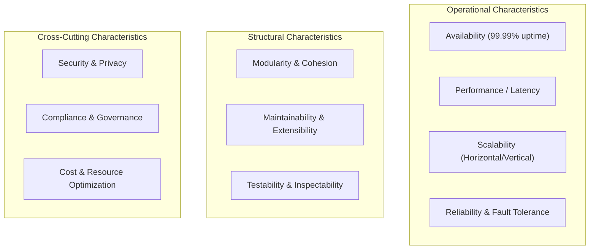

# 00. Software Architecture Cheatsheet & Styles Matrix

A high-density reference guide summarizing software architecture styles, architectural characteristics ("-ilities"), coupling metrics, and trade-off formulas.

---

## 🏛️ Architecture Styles Comparison Matrix

| Architecture Style | Topology | Agility | Deployability | Performance | Scalability | Fault Tolerance | Cost | Primary Use Case |
| :--- | :--- | :--- | :--- | :--- | :--- | :--- | :--- | :--- |
| **Layered (N-Tier)** | Monolithic | Low | Low | Medium | Low | Low | Low | Small/Medium CRUD apps, rapid prototyping |
| **Pipeline (Pipe & Filter)** | Monolithic | Low | Low | High | Medium | Low | Low | Data transformations, compilers, ETL tools |
| **Microkernel (Plugin)** | Monolithic | High | Medium | High | Low | Low | Low | IDEs (VS Code, Eclipse), CLI tools, workflow engines |
| **Service-Based** | Hybrid | Medium | Medium | Medium | Medium | Medium | Medium | Enterprise monolith refactoring, domain-grouped services |
| **Event-Driven (Broker)** | Distributed | High | High | High | High | High | Medium | High-throughput async processing, reactive systems |
| **Event-Driven (Mediator)**| Distributed | High | High | Medium | High | High | Medium | Complex workflow orchestration with state |
| **Space-Based (In-Memory)**| Distributed | High | High | High | High | High | High | Variable extreme traffic spikes (ticketing, auctions) |
| **Microservices** | Distributed | High | High | Medium | High | High | High | Highly decoupled domain-driven systems (DDD) |

---

## 📏 Coupling & Main Sequence Formulas (Robert C. Martin / Neal Ford)

### 1. Afferent Coupling ($C_a$)
The number of classes/modules outside this package that depend on classes within this package (Incoming Dependencies).

### 2. Efferent Coupling ($C_e$)
The number of classes/modules inside this package that depend on classes outside this package (Outgoing Dependencies).

### 3. Instability Metric ($I$)
$$I = \frac{C_e}{C_a + C_e}$$
- $I = 0$: Maximally Stable (Hard to change, highly depended upon).
- $I = 1$: Maximally Unstable (Easy to change, depends on many external modules).

### 4. Abstractness Metric ($A$)
$$A = \frac{N_a}{N_c}$$
Where $N_a$ is the number of abstract classes/interfaces and $N_c$ is the total number of classes in the package.

### 5. Distance from the Main Sequence ($D$)
$$D = |A + I - 1|$$
- $D = 0$: Perfectly balanced package (Sits on the Main Sequence).
- Zone of Pain ($A \approx 0, I \approx 0$): Highly concrete, highly stable. Extremely difficult to extend or refactor.
- Zone of Uselessness ($A \approx 1, I \approx 1$): Highly abstract, highly unstable. Interfaces with no concrete implementation or callers.

---

## 📋 Architecture Characteristics Taxonomy ("-ilities")

