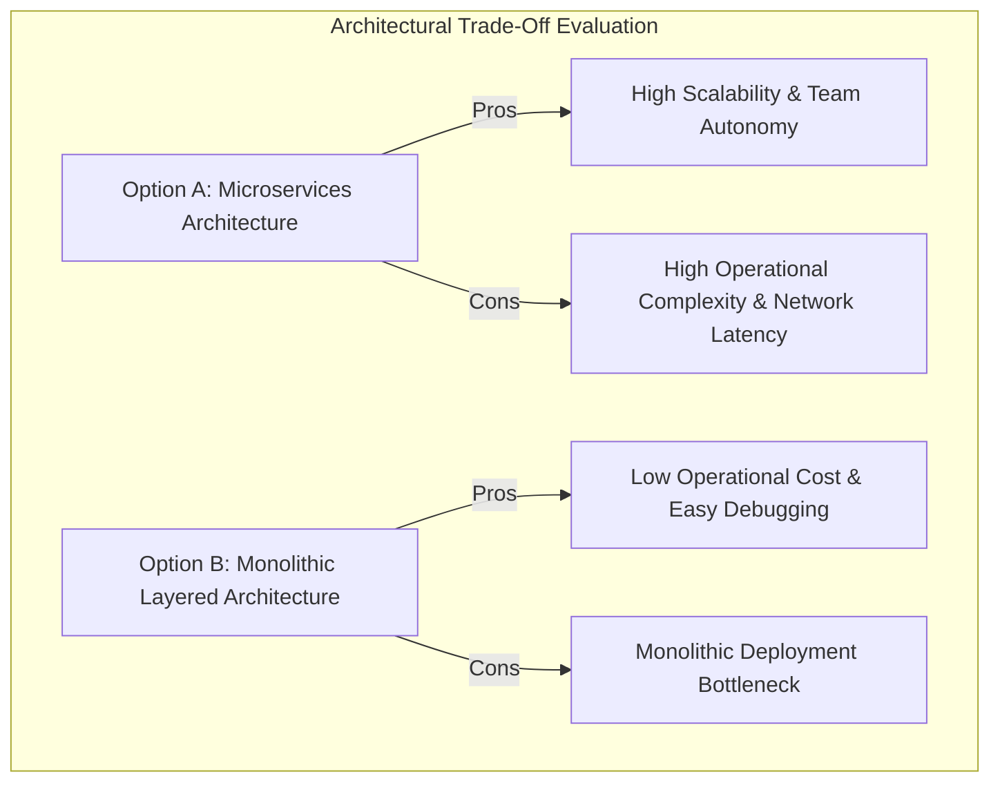

# 01. Architectural Thinking & Architecture Characteristics

This chapter examines the core mindset of a software architect: thinking in trade-offs, identifying and defining architectural characteristics ("-ilities"), and mathematically measuring code coupling and stability metrics.

---

## 🧠 Architectural Thinking & Trade-Off Analysis

> **First Law of Software Architecture**: Everything in software architecture is a trade-off.
> **Second Law of Software Architecture**: *Why* is more important than *how*.



---

## 📉 Distance from the Main Sequence & Coupling Math

```mermaid
quadrantChart
    title Main Sequence: Abstractness vs Instability
    x-axis Instability (0 = Stable, 1 = Unstable)
    y-axis Abstractness (0 = Concrete, 1 = Abstract)
    quadrant-1 Zone of Uselessness
    quadrant-2 Main Sequence (Ideal Balance)
    quadrant-3 Zone of Pain
    quadrant-4 Main Sequence (Ideal Balance)
    "Abstract Interfaces": [0.1, 0.9]
    "Concrete Monolith Core": [0.05, 0.05]
    "Ideal Balanced Component": [0.5, 0.5]
```

---

## ☕ Production Java Implementation: Coupling & Instability Metric Calculator

```java
package com.example.architecture.metrics;

import java.util.*;

/**
 * Calculates Package Afferent (Ca), Efferent (Ce), Instability (I),
 * Abstractness (A), and Distance from the Main Sequence (D).
 */
public class ArchitectureMetricCalculator {

    public record PackageStats(
        String packageName,
        int totalClasses,
        int abstractClasses,
        int afferentCoupling, // Ca (Incoming)
        int efferentCoupling  // Ce (Outgoing)
    ) {
        public double instability() {
            if (afferentCoupling + efferentCoupling == 0) return 0.0;
            return (double) efferentCoupling / (afferentCoupling + efferentCoupling);
        }

        public double abstractness() {
            if (totalClasses == 0) return 0.0;
            return (double) abstractClasses / totalClasses;
        }

        /**
         * Calculates Distance from Main Sequence: D = |A + I - 1|
         */
        public double distance() {
            return Math.abs(abstractness() + instability() - 1.0);
        }

        public boolean isInZoneOfPain() {
            return abstractness() < 0.2 && instability() < 0.2;
        }

        public boolean isInZoneOfUselessness() {
            return abstractness() > 0.8 && instability() > 0.8;
        }
    }

    public static PackageStats analyzePackage(
            String packageName,
            int totalClasses,
            int abstractClasses,
            Set<String> incomingDependencies,
            Set<String> outgoingDependencies) {

        int ca = incomingDependencies.size();
        int ce = outgoingDependencies.size();

        return new PackageStats(packageName, totalClasses, abstractClasses, ca, ce);
    }
}
```
