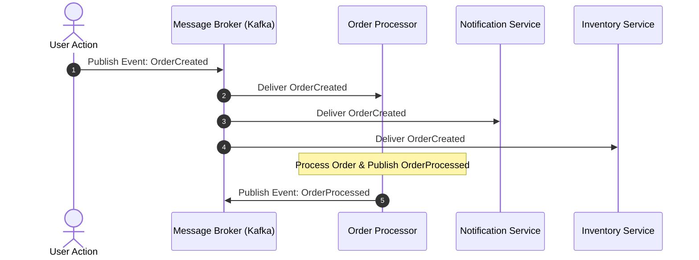
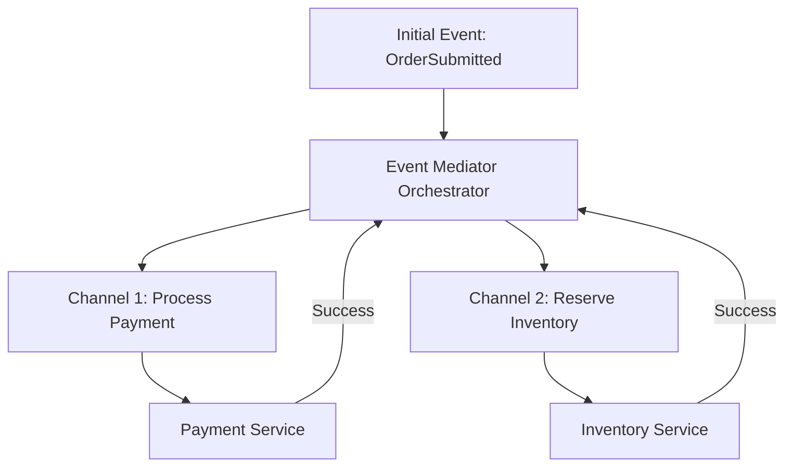

# 02. Monolithic, Event-Driven & Microservices Architectural Styles

This chapter explores monolithic and distributed architectural styles, comparing trade-offs across Layered, Microkernel, Event-Driven (Broker vs Mediator), Space-Based, and Microservices topologies.

---

## 🔄 Event-Driven Architecture: Broker vs Mediator Topology

Event-Driven Architecture (EDA) decouples producers from consumers using asynchronous messaging.

### 1. Broker Topology (Decentralized, High Performance)
Events are published directly to a message broker (e.g. Kafka/RabbitMQ) without a central orchestrator. Handlers act independently.



### 2. Mediator Topology (Centralized Orchestration)
A central Event Mediator orchestrates complex workflows requiring step coordination and error handling.



---

## ☕ Production Java Implementation: Microkernel (Plugin) Architecture Engine

In a **Microkernel Architecture**, the core system provides minimal processing logic, while specialized domain features are dynamically loaded as isolated plugins via interfaces.

```java
package com.example.architecture.microkernel;

import java.util.*;
import java.util.concurrent.ConcurrentHashMap;

public class MicrokernelEngine {

    /**
     * Contract interface that all external plugins must implement.
     */
    public interface Plugin {
        String getPluginId();
        void initialize();
        PluginResult execute(PluginContext context);
    }

    public record PluginContext(Map<String, Object> parameters) {}
    public record PluginResult(boolean success, String message, Object payload) {}

    private final Map<String, Plugin> pluginRegistry = new ConcurrentHashMap<>();

    public void registerPlugin(Plugin plugin) {
        plugin.initialize();
        pluginRegistry.put(plugin.getPluginId(), plugin);
        System.out.println("[MICROKERNEL] Registered Plugin: " + plugin.getPluginId());
    }

    public void unregisterPlugin(String pluginId) {
        pluginRegistry.remove(pluginId);
        System.out.println("[MICROKERNEL] Unregistered Plugin: " + pluginId);
    }

    public PluginResult executePlugin(String pluginId, PluginContext context) {
        Plugin plugin = pluginRegistry.get(pluginId);
        if (plugin == null) {
            throw new IllegalArgumentException("Plugin not found: " + pluginId);
        }
        return plugin.execute(context);
    }

    public Set<String> getRegisteredPluginIds() {
        return Collections.unmodifiableSet(pluginRegistry.keySet());
    }
}
```
